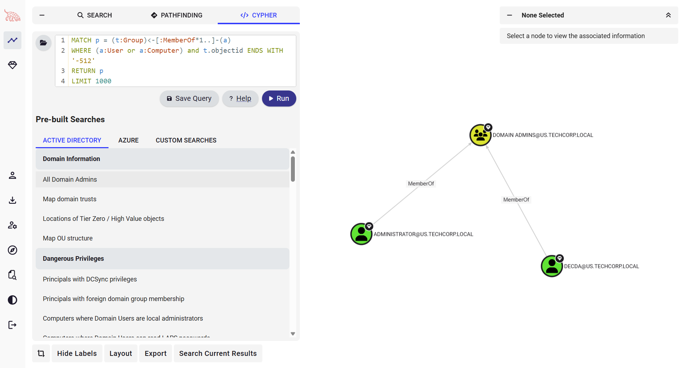
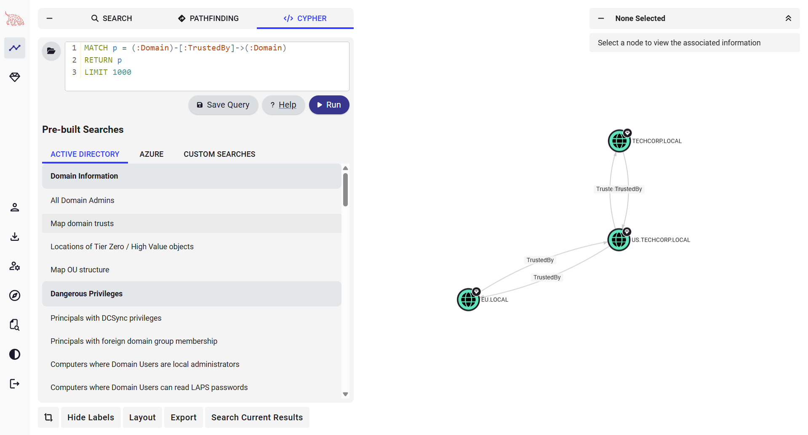

# Domain Enumeration

## Users, Computers, Groups, Admins, Kerberos Policy

### Lab: Hands-On #01

#### Tasks

Enumerate the following for the `us.techcorp.local` domain:
- Users
- Computers
- Domain Administrators
- Enterprise Administrators
- Kerberos Policy

#### Solution

We can use the Microsoft's ActiveDirectory module, BloodHound, PowerView or SharpView for enumerating the domain. Please note that all the enumeration can be done with any other tool of your choice as well.

**BloodHound**

Run the following commands to gather data and information from the current domain.

```
PS C:\AD\Tools> C:\AD\Tools\BloodHound-master\Collectors\sharphound-v2.6.0\SharpHound.exe --CollectionMethods All

2025-04-23T06:06:29.3305762-07:00|INFORMATION|This version of SharpHound is compatible with the 5.0.0 Release of BloodHound

[SNIP]

2025-04-23T06:07:18.6987696-07:00|INFORMATION|Saving cache with stats: 226 ID to type mappings.
 176 name to SID mappings.
 22 machine sid mappings.
 8 sid to domain mappings.
 0 global catalog mappings.
2025-04-23T06:07:18.7143917-07:00|INFORMATION|SharpHound Enumeration Completed at 6:07 AM on 4/23/2025! Happy Graphing!
```

We can upload/drag-and-drop the zip archive to BloodHound application for analysis.
You can run Pre-Built or Custom queries after uploading the data.





**AD Module**

Let's start a PowerShell session using InvisiShell to avoid verbose logging.

```
PS C:\AD\Tools> C:\AD\Tools\InviShell\RunWithRegistryNonAdmin.bat

[SNIP]
```

```
PS C:\AD\Tools> Import-Module C:\AD\Tools\ADModule-master\Microsoft.ActiveDirectory.Management.dll

PS C:\AD\Tools> Import-Module C:\AD\Tools\ADModule-master\ActiveDirectory\ActiveDirectory.psd1
```

- Users

```
PS C:\AD\Tools> Get-ADUser -Filter *

[SNIP]

DistinguishedName : CN=Administrator,CN=Users,DC=us,DC=techcorp,DC=local
Enabled           : True
GivenName         :
Name              : Administrator
ObjectClass       : user
ObjectGUID        : 6065fe62-0dcb-4a5e-bcad-e99f2dec4cdd
SamAccountName    : Administrator
SID               : S-1-5-21-210670787-2521448726-163245708-500
Surname           :
UserPrincipalName :

[SNIP]

DistinguishedName : CN=studentuser51,CN=Users,DC=us,DC=techcorp,DC=local
Enabled           : True
GivenName         : student51
Name              : studentuser51
ObjectClass       : user
ObjectGUID        : 2765d147-caa0-4573-af7c-dd1c1b27ab57
SamAccountName    : studentuser51
SID               : S-1-5-21-210670787-2521448726-163245708-19121
Surname           :
UserPrincipalName : student51@us.techcorp.local

[SNIP]
```

```
PS C:\AD\Tools> Get-ADUser -Filter * | Select -ExpandProperty samaccountname

Administrator
Guest
krbtgt
TECHCORP$
emptest
adconnect
mgmtadmin
helpdeskadmin
dbservice
atauser
exchangeadmin
HealthMailbox3bd1057

[SNIP]

exchangemanager
exchangeuser
pawadmin
jwilliams
webmaster
EU$
serviceaccount
devuser
testda
decda
appsvc
provisioningsvc
Support51user

[SNIP]

studentuser51

[SNIP]
```

- Computers

```
PS C:\AD\Tools> Get-ADComputer –Filter * | select –expand name

[SNIP]

US-DC
US-EXCHANGE
US-MGMT
US-HELPDESK
US-MSSQL
US-MAILMGMT
US-WEB
US-ADCONNECT
STUDENT51

[SNIP]

us-jump3
```

- Domain Administrators

```
PS C:\AD\Tools> Get-ADGroup -Identity 'Domain Admins' -Properties *

adminCount                      : 1
CanonicalName                   : us.techcorp.local/Users/Domain Admins
CN                              : Domain Admins
Created                         : 7/5/2019 12:49:17 AM
createTimeStamp                 : 7/5/2019 12:49:17 AM
Deleted                         :
Description                     : Designated administrators of the domain
DisplayName                     :
DistinguishedName               : CN=Domain Admins,CN=Users,DC=us,DC=techcorp,DC=local
dSCorePropagationData           : {7/30/2019 5:35:19 AM, 7/10/2019 9:53:40 AM, 7/10/2019 9:00:03 AM, 7/6/2019 9:11:13 PM...}
GroupCategory                   : Security
GroupScope                      : Global
groupType                       : -2147483646
HomePage                        :
instanceType                    : 4
isCriticalSystemObject          : True
isDeleted                       :
LastKnownParent                 :
ManagedBy                       :
member                          : {CN=decda,CN=Users,DC=us,DC=techcorp,DC=local, CN=Administrator,CN=Users,DC=us,DC=techcorp,DC=local}
MemberOf                        : {CN=Denied RODC Password Replication Group,CN=Users,DC=us,DC=techcorp,DC=local, CN=Administrators,CN=Builtin,DC=us,DC=techcorp,DC=local}
Members                         : {CN=decda,CN=Users,DC=us,DC=techcorp,DC=local, CN=Administrator,CN=Users,DC=us,DC=techcorp,DC=local}
Modified                        : 7/19/2019 12:16:32 PM
modifyTimeStamp                 : 7/19/2019 12:16:32 PM
Name                            : Domain Admins
nTSecurityDescriptor            : System.DirectoryServices.ActiveDirectorySecurity
ObjectCategory                  : CN=Group,CN=Schema,CN=Configuration,DC=techcorp,DC=local
ObjectClass                     : group
ObjectGUID                      : 218cc77d-0e1c-41ed-91b2-730f6279c325
objectSid                       : S-1-5-21-210670787-2521448726-163245708-512
ProtectedFromAccidentalDeletion : False
SamAccountName                  : Domain Admins
sAMAccountType                  : 268435456
sDRightsEffective               : 0
SID                             : S-1-5-21-210670787-2521448726-163245708-512
SIDHistory                      : {}
uSNChanged                      : 282184
uSNCreated                      : 12315
whenChanged                     : 7/19/2019 12:16:32 PM
whenCreated                     : 7/5/2019 12:49:17 AM
```

```
PS C:\AD\Tools> Get-ADGroup -Identity 'Domain Admins' -Properties * | select -expand member

CN=decda,CN=Users,DC=us,DC=techcorp,DC=local
CN=Administrator,CN=Users,DC=us,DC=techcorp,DC=local
```

```
PS C:\AD\Tools> Get-ADGroupMember -Identity 'Domain Admins'

distinguishedName : CN=Administrator,CN=Users,DC=us,DC=techcorp,DC=local
name              : Administrator
objectClass       : user
objectGUID        : 6065fe62-0dcb-4a5e-bcad-e99f2dec4cdd
SamAccountName    : Administrator
SID               : S-1-5-21-210670787-2521448726-163245708-500

distinguishedName : CN=decda,CN=Users,DC=us,DC=techcorp,DC=local
name              : decda
objectClass       : user
objectGUID        : 0dfb0572-730c-432e-9404-769e0584bd95
SamAccountName    : decda
SID               : S-1-5-21-210670787-2521448726-163245708-1289
```

- Enterprise Administrators

```
PS C:\AD\Tools> Get-ADGroupMember -Identity 'Enterprise Admins'

Get-ADGroupMember : Cannot find an object with identity: 'Enterprise Admins' under: 'DC=us,DC=techcorp,DC=local'. ❌

[SNIP]
```

**Note**: Since, our current domain (`us.techcorp.local`) is not a root domain, the above command returns an error.
We need to query the root domain as Enterprise Admins group is present only in the root of a forest.

```
PS C:\AD\Tools> Get-ADGroupMember -Identity 'Enterprise Admins' -Server techcorp.local

distinguishedName : CN=Administrator,CN=Users,DC=techcorp,DC=local
name              : Administrator
objectClass       : user
objectGUID        : a8ee80ca-edc5-4c5d-a210-b58ca11bd055
SamAccountName    : Administrator
SID               : S-1-5-21-2781415573-3701854478-2406986946-500
```

- Kerberos Policy

To find the Kerberos Policy, let's use PowerView.

**PowerView**

```
PS C:\AD\Tools> C:\AD\Tools\InviShell\RunWithRegistryNonAdmin.bat

[SNIP]

PS C:\AD\Tools> Import-Module C:\AD\Tools\PowerView.ps1
```

```
PS C:\AD\Tools> Get-DomainPolicy

Unicode        : @{Unicode=yes}
SystemAccess   : @{MinimumPasswordAge=1; MaximumPasswordAge=42; MinimumPasswordLength=7; PasswordComplexity=1; PasswordHistorySize=24; LockoutBadCount=0; RequireLogonToChangePassword=0; ForceLogoffWhenHourExpire=0;
                 ClearTextPassword=0; LSAAnonymousNameLookup=0}
KerberosPolicy : @{MaxTicketAge=10; MaxRenewAge=7; MaxServiceAge=600; MaxClockSkew=5; TicketValidateClient=1}
Version        : @{signature="$CHICAGO$"; Revision=1}
RegistryValues : @{MACHINE\System\CurrentControlSet\Services\Netlogon\Parameters\DisablePasswordChange=System.Object[]; MACHINE\System\CurrentControlSet\Control\Lsa\NoLMHash=System.Object[]}
Path           : \\us.techcorp.local\sysvol\us.techcorp.local\Policies\{31B2F340-016D-11D2-945F-00C04FB984F9}\MACHINE\Microsoft\Windows NT\SecEdit\GptTmpl.inf
GPOName        : {31B2F340-016D-11D2-945F-00C04FB984F9}
GPODisplayName : Default Domain Policy
```

```
PS C:\AD\Tools> (Get-DomainPolicy).KerberosPolicy

MaxTicketAge         : 10
MaxRenewAge          : 7
MaxServiceAge        : 600
MaxClockSkew         : 5
TicketValidateClient : 1
```

```
PS C:\AD\Tools> (Get-DomainPolicy).SystemAccess

MinimumPasswordAge           : 1
MaximumPasswordAge           : 42
MinimumPasswordLength        : 7
PasswordComplexity           : 1
PasswordHistorySize          : 24
LockoutBadCount              : 0
RequireLogonToChangePassword : 0
ForceLogoffWhenHourExpire    : 0
ClearTextPassword            : 0
LSAAnonymousNameLookup       : 0
```

---
---

## GPOs, OUs

### Lab: Hands-On #02

#### Tasks

Enumerate the following for the `us.techcorp.local` domain:
- Restricted Groups from GPO
- Membership of the Restricted Groups
- List all the OUs
- List all the Computers in a specific OU
- List the GPOs
- Enumerate GPO applied on a specific OU

#### Solution

We can continue using PowerView from InvisiShell for enumerating GPO.

- Restricted Groups from GPO

```
PS C:\AD\Tools> Get-DomainGPOLocalGroup

GPODisplayName : Mgmt 📑
GPOName        : {B78BFC6B-76DB-4AA4-9CF6-26260697A8F9}
GPOPath        : \\us.techcorp.local\SysVol\us.techcorp.local\Policies\{B78BFC6B-76DB-4AA4-9CF6-26260697A8F9}
GPOType        : RestrictedGroups
Filters        :
GroupName      : US\machineadmins 👥
GroupSID       : S-1-5-21-210670787-2521448726-163245708-1118
GroupMemberOf  : {S-1-5-32-544} 👥
GroupMembers   : {}
```

- Membership of the Restricted Groups

Now, to look for membership of the Restricted Group 'machineadmins' we can use `Get-DomainGroupMember` from PowerView or `Get-ADGroupMember` from AD module.

```
PS C:\AD\Tools> Get-DomainGroupMember -Identity machineadmins
```

The group seems to have no members.

- List all the OUs

```
PS C:\AD\Tools> Get-DomainOU

usncreated             : 7925
systemflags            : -1946157056
iscriticalsystemobject : True
gplink                 : [LDAP://CN={6AC1786C-016F-11D2-945F-00C04fB984F9},CN=Policies,CN=System,DC=us,DC=techcorp,DC=local;0]
whenchanged            : 7/5/2019 7:48:21 AM
objectclass            : {top, organizationalUnit}
showinadvancedviewonly : False
usnchanged             : 7925
dscorepropagationdata  : {7/30/2019 12:40:16 PM, 7/30/2019 12:39:53 PM, 7/30/2019 12:39:00 PM, 7/30/2019 12:35:19 PM...}
name                   : Domain Controllers
description            : Default container for domain controllers
distinguishedname      : OU=Domain Controllers,DC=us,DC=techcorp,DC=local
ou                     : Domain Controllers
whencreated            : 7/5/2019 7:48:21 AM
instancetype           : 4
objectguid             : fc0dd146-a66e-45cc-83ae-9e5a0c39ed91
objectcategory         : CN=Organizational-Unit,CN=Schema,CN=Configuration,DC=techcorp,DC=local

[SNIP]

usncreated            : 36615
displayname           : Mgmt
gplink                : [LDAP://cn={B78BFC6B-76DB-4AA4-9CF6-26260697A8F9},cn=policies,cn=system,DC=us,DC=techcorp,DC=local;0]
whenchanged           : 7/15/2019 10:28:28 AM
objectclass           : {top, organizationalUnit}
usnchanged            : 161066
dscorepropagationdata : {7/30/2019 12:40:16 PM, 7/30/2019 12:39:53 PM, 7/30/2019 12:39:00 PM, 7/30/2019 12:35:19 PM...}
name                  : Mgmt
distinguishedname     : OU=Mgmt,DC=us,DC=techcorp,DC=local
ou                    : Mgmt 📑
whencreated           : 7/7/2019 4:12:41 AM
instancetype          : 4
objectguid            : 0fa90533-edbd-44a7-800e-41ff4ff46285
objectcategory        : CN=Organizational-Unit,CN=Schema,CN=Configuration,DC=techcorp,DC=local

[SNIP]
```

```
PS C:\AD\Tools> Get-DomainOU | select -expand ou

Domain Controllers
Mgmt
MailMgmt
PAW
Students
```

```
PS C:\AD\Tools> Get-DomainOU | select -expand distinguishedname

OU=Domain Controllers,DC=us,DC=techcorp,DC=local
OU=Mgmt,DC=us,DC=techcorp,DC=local
OU=MailMgmt,DC=us,DC=techcorp,DC=local
OU=PAW,DC=us,DC=techcorp,DC=local
OU=Students,DC=us,DC=techcorp,DC=local
```

- List all the Computers in a specific OU

**PowerView**

```
PS C:\AD\Tools> (Get-DomainOU -Identity Students).distinguishedname | %{Get-DomainComputer -SearchBase $_} | select name

name
----
STUDENT51
STUDENT52
STUDENT53

[SNIP]

STUDENT70
```

```
PS C:\AD\Tools> (Get-DomainOU -Identity Mgmt).distinguishedname | %{Get-DomainComputer -SearchBase $_} | select name

name
----
US-MGMT 🖥️
```

**AD Module**

```
PS C:\AD\Tools> Get-ADOrganizationalUnit -Identity 'OU=Students,DC=us,DC=techcorp,DC=local' | %{Get-ADComputer -SearchBase $_ -Filter *} | select name

name
----
STUDENT51
STUDENT52
STUDENT53

[SNIP]

STUDENT70
```

- List the GPOs

```
PS C:\AD\Tools> Get-DomainGPO

usncreated               : 7793
systemflags              : -1946157056
displayname              : Default Domain Policy
gpcmachineextensionnames : [{35378EAC-683F-11D2-A89A-00C04FBBCFA2}{53D6AB1B-2488-11D1-A28C-00C04FB94F17}{D02B1F72-3407-48AE-BA88-E8213C6761F1}][{827D319E-6EAC-11D2-A4EA-00C04F79F83A}{803E14A0-B4FB-11D0-A0D0-00A0C90F5
                           74B}][{B1BE8D72-6EAC-11D2-A4EA-00C04F79F83A}{53D6AB1B-2488-11D1-A28C-00C04FB94F17}]
whenchanged              : 7/20/2019 11:35:15 AM
objectclass              : {top, container, groupPolicyContainer}
gpcfunctionalityversion  : 2
showinadvancedviewonly   : True
usnchanged               : 329583
dscorepropagationdata    : {7/30/2019 12:35:19 PM, 7/10/2019 4:00:03 PM, 7/10/2019 4:00:03 PM, 7/7/2019 4:11:13 AM...}
name                     : {31B2F340-016D-11D2-945F-00C04FB984F9}
flags                    : 0
cn                       : {31B2F340-016D-11D2-945F-00C04FB984F9}
iscriticalsystemobject   : True
gpcfilesyspath           : \\us.techcorp.local\sysvol\us.techcorp.local\Policies\{31B2F340-016D-11D2-945F-00C04FB984F9}
distinguishedname        : CN={31B2F340-016D-11D2-945F-00C04FB984F9},CN=Policies,CN=System,DC=us,DC=techcorp,DC=local
whencreated              : 7/5/2019 7:48:21 AM
versionnumber            : 6
instancetype             : 4
objectguid               : d0907c7b-9e3e-42e9-ba50-ac23ea8bb598
objectcategory           : CN=Group-Policy-Container,CN=Schema,CN=Configuration,DC=techcorp,DC=local

[SNIP]

usncreated               : 161060
displayname              : Mgmt
gpcmachineextensionnames : [{827D319E-6EAC-11D2-A4EA-00C04F79F83A}{803E14A0-B4FB-11D0-A0D0-00A0C90F574B}]
whenchanged              : 7/15/2019 10:29:13 AM
objectclass              : {top, container, groupPolicyContainer}
gpcfunctionalityversion  : 2
showinadvancedviewonly   : True
usnchanged               : 161076
dscorepropagationdata    : {7/30/2019 12:35:19 PM, 1/1/1601 12:00:00 AM}
name                     : {B78BFC6B-76DB-4AA4-9CF6-26260697A8F9}
flags                    : 0
cn                       : {B78BFC6B-76DB-4AA4-9CF6-26260697A8F9}
gpcfilesyspath           : \\us.techcorp.local\SysVol\us.techcorp.local\Policies\{B78BFC6B-76DB-4AA4-9CF6-26260697A8F9}
distinguishedname        : CN={B78BFC6B-76DB-4AA4-9CF6-26260697A8F9},CN=Policies,CN=System,DC=us,DC=techcorp,DC=local
whencreated              : 7/15/2019 10:28:28 AM
versionnumber            : 2
instancetype             : 4
objectguid               : 6dfdcad7-ecfa-46ca-91ad-869112490e8f
objectcategory           : CN=Group-Policy-Container,CN=Schema,CN=Configuration,DC=techcorp,DC=local

usncreated               : 330304
displayname              : StudentPolicies
gpcmachineextensionnames : [{35378EAC-683F-11D2-A89A-00C04FBBCFA2}{D02B1F72-3407-48AE-BA88-E8213C6761F1}][{827D319E-6EAC-11D2-A4EA-00C04F79F83A}{803E14A0-B4FB-11D0-A0D0-00A0C90F574B}]
whenchanged              : 7/20/2019 2:17:57 PM
objectclass              : {top, container, groupPolicyContainer}
gpcfunctionalityversion  : 2
showinadvancedviewonly   : True
usnchanged               : 338463
dscorepropagationdata    : {7/30/2019 12:35:19 PM, 1/1/1601 12:00:00 AM}
name                     : {FCE16496-C744-4E46-AC89-2D01D76EAD68}
flags                    : 0
cn                       : {FCE16496-C744-4E46-AC89-2D01D76EAD68}
gpcfilesyspath           : \\us.techcorp.local\SysVol\us.techcorp.local\Policies\{FCE16496-C744-4E46-AC89-2D01D76EAD68}
distinguishedname        : CN={FCE16496-C744-4E46-AC89-2D01D76EAD68},CN=Policies,CN=System,DC=us,DC=techcorp,DC=local
whencreated              : 7/20/2019 11:48:51 AM
versionnumber            : 4
instancetype             : 4
objectguid               : b9bb82a1-5cc2-4264-b4f4-bdf6a238817b
objectcategory           : CN=Group-Policy-Container,CN=Schema,CN=Configuration,DC=techcorp,DC=local
```

- Enumerate GPO applied on a specific OU

```
PS C:\AD\Tools> (Get-DomainOU -Identity Students).gplink

[LDAP://cn={FCE16496-C744-4E46-AC89-2D01D76EAD68},cn=policies,cn=system,DC=us,DC=techcorp,DC=local;0]
```

```
PS C:\AD\Tools> Get-DomainGPO -Identity '{FCE16496-C744-4E46-AC89-2D01D76EAD68}'

usncreated               : 330304
displayname              : StudentPolicies
gpcmachineextensionnames : [{35378EAC-683F-11D2-A89A-00C04FBBCFA2}{D02B1F72-3407-48AE-BA88-E8213C6761F1}][{827D319E-6EAC-11D2-A4EA-00C04F79F83A}{803E14A0-B4FB-11D0-A0D0-00A0C90F574B}]
whenchanged              : 7/20/2019 2:17:57 PM
objectclass              : {top, container, groupPolicyContainer}
gpcfunctionalityversion  : 2
showinadvancedviewonly   : True
usnchanged               : 338463
dscorepropagationdata    : {7/30/2019 12:35:19 PM, 1/1/1601 12:00:00 AM}
name                     : {FCE16496-C744-4E46-AC89-2D01D76EAD68}
flags                    : 0
cn                       : {FCE16496-C744-4E46-AC89-2D01D76EAD68}
gpcfilesyspath           : \\us.techcorp.local\SysVol\us.techcorp.local\Policies\{FCE16496-C744-4E46-AC89-2D01D76EAD68}
distinguishedname        : CN={FCE16496-C744-4E46-AC89-2D01D76EAD68},CN=Policies,CN=System,DC=us,DC=techcorp,DC=local
whencreated              : 7/20/2019 11:48:51 AM
versionnumber            : 4
instancetype             : 4
objectguid               : b9bb82a1-5cc2-4264-b4f4-bdf6a238817b
objectcategory           : CN=Group-Policy-Container,CN=Schema,CN=Configuration,DC=techcorp,DC=local
```

```
PS C:\AD\Tools> (Get-DomainOU -Identity Mgmt).gplink

[LDAP://cn={B78BFC6B-76DB-4AA4-9CF6-26260697A8F9},cn=policies,cn=system,DC=us,DC=techcorp,DC=local;0]
```

```
PS C:\AD\Tools> Get-DomainGPO -Identity '{B78BFC6B-76DB-4AA4-9CF6-26260697A8F9}'

usncreated               : 161060
displayname              : Mgmt
gpcmachineextensionnames : [{827D319E-6EAC-11D2-A4EA-00C04F79F83A}{803E14A0-B4FB-11D0-A0D0-00A0C90F574B}]
whenchanged              : 7/15/2019 10:29:13 AM
objectclass              : {top, container, groupPolicyContainer}
gpcfunctionalityversion  : 2
showinadvancedviewonly   : True
usnchanged               : 161076
dscorepropagationdata    : {7/30/2019 12:35:19 PM, 1/1/1601 12:00:00 AM}
name                     : {B78BFC6B-76DB-4AA4-9CF6-26260697A8F9}
flags                    : 0
cn                       : {B78BFC6B-76DB-4AA4-9CF6-26260697A8F9}
gpcfilesyspath           : \\us.techcorp.local\SysVol\us.techcorp.local\Policies\{B78BFC6B-76DB-4AA4-9CF6-26260697A8F9}
distinguishedname        : CN={B78BFC6B-76DB-4AA4-9CF6-26260697A8F9},CN=Policies,CN=System,DC=us,DC=techcorp,DC=local
whencreated              : 7/15/2019 10:28:28 AM
versionnumber            : 2
instancetype             : 4
objectguid               : 6dfdcad7-ecfa-46ca-91ad-869112490e8f
objectcategory           : CN=Group-Policy-Container,CN=Schema,CN=Configuration,DC=techcorp,DC=local
```

---
---

## ACLs

### Lab: Hands-On #03

#### Tasks

Enumerate following for the `us.techcorp.local` domain:
- ACLs for the Domain Admins group
- All modify rights/permissions for the `studentuser51`

#### Solution

To enumerate ACLs, we can use `Get-ObjectACL` from PowerView or `Get-ACL` with `AD:\` PSProvider using the ActiveDirectory module.

- ACLs for the Domain Admins group

**PowerView**

```
PS C:\AD\Tools> Get-DomainObjectAcl -Identity "Domain Admins" -ResolveGUIDs -Verbose

AceQualifier           : AccessAllowed
ObjectDN               : CN=Domain Admins,CN=Users,DC=us,DC=techcorp,DC=local
ActiveDirectoryRights  : CreateChild, DeleteChild, ListChildren
ObjectAceType          : ms-Exch-Active-Sync-Devices
ObjectSID              : S-1-5-21-210670787-2521448726-163245708-512
InheritanceFlags       : ContainerInherit
BinaryLength           : 72
AceType                : AccessAllowedObject
ObjectAceFlags         : ObjectAceTypePresent, InheritedObjectAceTypePresent
IsCallback             : False
PropagationFlags       : InheritOnly
SecurityIdentifier     : S-1-5-21-2781415573-3701854478-2406986946-1119
AccessMask             : 7
AuditFlags             : None
IsInherited            : False
AceFlags               : ContainerInherit, InheritOnly
InheritedObjectAceType : inetOrgPerson
OpaqueLength           : 0

[SNIP]

AceType               : AccessAllowed
ObjectDN              : CN=Domain Admins,CN=Users,DC=us,DC=techcorp,DC=local
ActiveDirectoryRights : GenericAll
OpaqueLength          : 0
ObjectSID             : S-1-5-21-210670787-2521448726-163245708-512
InheritanceFlags      : None
BinaryLength          : 20
IsInherited           : False
IsCallback            : False
PropagationFlags      : None
SecurityIdentifier    : S-1-5-18
AccessMask            : 983551
AuditFlags            : None
AceFlags              : None
AceQualifier          : AccessAllowed
```

**AD Module**

```
PS C:\AD\Tools> Get-ACL 'AD:\CN=Domain Admins,CN=Users,DC=us,DC=techcorp,DC=local' | select -ExpandProperty Access

ActiveDirectoryRights : GenericRead
InheritanceType       : None
ObjectType            : 00000000-0000-0000-0000-000000000000
InheritedObjectType   : 00000000-0000-0000-0000-000000000000
ObjectFlags           : None
AccessControlType     : Allow
IdentityReference     : NT AUTHORITY\Authenticated Users
IsInherited           : False
InheritanceFlags      : None
PropagationFlags      : None

ActiveDirectoryRights : GenericAll
InheritanceType       : None
ObjectType            : 00000000-0000-0000-0000-000000000000
InheritedObjectType   : 00000000-0000-0000-0000-000000000000
ObjectFlags           : None
AccessControlType     : Allow
IdentityReference     : NT AUTHORITY\SYSTEM
IsInherited           : False
InheritanceFlags      : None
PropagationFlags      : None

[SNIP]

ActiveDirectoryRights : ReadProperty, WriteProperty
InheritanceType       : None
ObjectType            : bf967a7f-0de6-11d0-a285-00aa003049e2
InheritedObjectType   : 00000000-0000-0000-0000-000000000000
ObjectFlags           : ObjectAceTypePresent
AccessControlType     : Allow
IdentityReference     : US\Cert Publishers
IsInherited           : False
InheritanceFlags      : None
PropagationFlags      : None
```

- All modify rights/permissions for the `studentuser51`

Now, to check for modify rights/permissions for the `studentuser51`, we can use `Find-InterestingDomainACL` from PowerView.

Please note that the below command may take very long to complete.

```
PS C:\AD\Tools> Find-InterestingDomainAcl -ResolveGUIDs | ?{$_.IdentityReferenceName -match "studentuser51"}
```

We don't get any output. This means `studentuser51` has no modify permissions on any object in the domain.

Let's try for the 'StudentUsers' group.

Please note that the below command may take very long to complete.

```
PS C:\AD\Tools> Find-InterestingDomainAcl -ResolveGUIDs | ?{$_.IdentityReferenceName -match "StudentUsers"}

ObjectDN                : CN=Support51User,CN=Users,DC=us,DC=techcorp,DC=local
AceQualifier            : AccessAllowed
ActiveDirectoryRights   : GenericAll
ObjectAceType           : None
AceFlags                : None
AceType                 : AccessAllowed
InheritanceFlags        : None
SecurityIdentifier      : S-1-5-21-210670787-2521448726-163245708-1116
IdentityReferenceName   : studentusers
IdentityReferenceDomain : us.techcorp.local
IdentityReferenceDN     : CN=StudentUsers,CN=Users,DC=us,DC=techcorp,DC=local
IdentityReferenceClass  : group

[SNIP]

ObjectDN                : CN=US-MAILMGMT,OU=MailMgmt,DC=us,DC=techcorp,DC=local
AceQualifier            : AccessAllowed
ActiveDirectoryRights   : ReadProperty, ExtendedRight
ObjectAceType           : ms-Mcs-AdmPwd
AceFlags                : ContainerInherit, Inherited
AceType                 : AccessAllowedObject
InheritanceFlags        : ContainerInherit
SecurityIdentifier      : S-1-5-21-210670787-2521448726-163245708-1116
IdentityReferenceName   : studentusers
IdentityReferenceDomain : us.techcorp.local
IdentityReferenceDN     : CN=StudentUsers,CN=Users,DC=us,DC=techcorp,DC=local
IdentityReferenceClass  : group

ObjectDN                : CN=Windows Virtual Machine,CN=US-MAILMGMT,OU=MailMgmt,DC=us,DC=techcorp,DC=local
AceQualifier            : AccessAllowed
ActiveDirectoryRights   : ReadProperty, ExtendedRight
ObjectAceType           : ms-Mcs-AdmPwd
AceFlags                : ContainerInherit, InheritOnly, Inherited
AceType                 : AccessAllowedObject
InheritanceFlags        : ContainerInherit
SecurityIdentifier      : S-1-5-21-210670787-2521448726-163245708-1116
IdentityReferenceName   : studentusers
IdentityReferenceDomain : us.techcorp.local
IdentityReferenceDN     : CN=StudentUsers,CN=Users,DC=us,DC=techcorp,DC=local
IdentityReferenceClass  : group
```

---
---

## Domains, Forests, Trusts

### Lab: Hands-On #04

#### Tasks

- Enumerate all domains in the `techcorp.local` forest
- Map the trusts of the `us.techcorp.local` domain
- Map external trusts in `techcorp.local` forest
- Identify external trusts of `us.techcorp.local` domain. Can you enumerate trusts for a trusting forest?

#### Solution

Let's enumerate all domains using the ActiveDirectory module from InvisiShell.

- Enumerate all domains in the `techcorp.local` forest

```
PS C:\AD\Tools> (Get-ADForest).Domains

techcorp.local
us.techcorp.local
```

- Map the trusts of the `us.techcorp.local` domain

```
PS C:\AD\Tools> Get-ADTrust -Filter *

Direction               : BiDirectional
DisallowTransivity      : False
DistinguishedName       : CN=techcorp.local,CN=System,DC=us,DC=techcorp,DC=local
ForestTransitive        : False
IntraForest             : True
IsTreeParent            : False
IsTreeRoot              : False
Name                    : techcorp.local
ObjectClass             : trustedDomain
ObjectGUID              : fe8ef343-0882-490d-8ad2-cb4fb9f974ae
SelectiveAuthentication : False
SIDFilteringForestAware : False
SIDFilteringQuarantined : False
Source                  : DC=us,DC=techcorp,DC=local
Target                  : techcorp.local
TGTDelegation           : False
TrustAttributes         : 32
TrustedPolicy           :
TrustingPolicy          :
TrustType               : Uplevel
UplevelOnly             : False
UsesAESKeys             : False
UsesRC4Encryption       : False

Direction               : BiDirectional
DisallowTransivity      : False
DistinguishedName       : CN=eu.local,CN=System,DC=us,DC=techcorp,DC=local
ForestTransitive        : False
IntraForest             : False
IsTreeParent            : False
IsTreeRoot              : False
Name                    : eu.local
ObjectClass             : trustedDomain
ObjectGUID              : 917942a6-ef2d-4c87-8084-35ad6281c89b
SelectiveAuthentication : False
SIDFilteringForestAware : False
SIDFilteringQuarantined : True
Source                  : DC=us,DC=techcorp,DC=local
Target                  : eu.local
TGTDelegation           : False
TrustAttributes         : 4
TrustedPolicy           :
TrustingPolicy          :
TrustType               : Uplevel
UplevelOnly             : False
UsesAESKeys             : False
UsesRC4Encryption       : False
```

- Map external trusts in `techcorp.local` forest

```
PS C:\AD\Tools> (Get-ADForest).Name

techcorp.local
```

```
PS C:\AD\Tools> Get-ADTrust -Filter 'intraForest -ne $True' -Server (Get-ADForest).Name

Direction               : BiDirectional
DisallowTransivity      : False
DistinguishedName       : CN=usvendor.local,CN=System,DC=techcorp,DC=local
ForestTransitive        : True
IntraForest             : False
IsTreeParent            : False
IsTreeRoot              : False
Name                    : usvendor.local
ObjectClass             : trustedDomain
ObjectGUID              : 481a3ade-0e65-4dc5-baf0-fc692a3a10c5
SelectiveAuthentication : False
SIDFilteringForestAware : False
SIDFilteringQuarantined : False
Source                  : DC=techcorp,DC=local
Target                  : usvendor.local
TGTDelegation           : False
TrustAttributes         : 8
TrustedPolicy           :
TrustingPolicy          :
TrustType               : Uplevel
UplevelOnly             : False
UsesAESKeys             : False
UsesRC4Encryption       : False

Direction               : Inbound
DisallowTransivity      : False
DistinguishedName       : CN=bastion.local,CN=System,DC=techcorp,DC=local
ForestTransitive        : True
IntraForest             : False
IsTreeParent            : False
IsTreeRoot              : False
Name                    : bastion.local
ObjectClass             : trustedDomain
ObjectGUID              : aa11321f-6629-4deb-a2fe-2bf79e169904
SelectiveAuthentication : False
SIDFilteringForestAware : False
SIDFilteringQuarantined : False
Source                  : DC=techcorp,DC=local
Target                  : bastion.local
TGTDelegation           : False
TrustAttributes         : 8
TrustedPolicy           :
TrustingPolicy          :
TrustType               : Uplevel
UplevelOnly             : False
UsesAESKeys             : False
UsesRC4Encryption       : False
```

- Identify external trusts of `us.techcorp.local` domain. Can you enumerate trusts for a trusting forest?

**AD Module**

```
PS C:\AD\Tools> (Get-ADForest).Domains | %{Get-ADTrust -Filter '(intraForest -ne $True) -and (ForestTransitive -ne $True)' -Server $_}

Direction               : BiDirectional
DisallowTransivity      : False
DistinguishedName       : CN=eu.local,CN=System,DC=us,DC=techcorp,DC=local
ForestTransitive        : False
IntraForest             : False
IsTreeParent            : False
IsTreeRoot              : False
Name                    : eu.local
ObjectClass             : trustedDomain
ObjectGUID              : 917942a6-ef2d-4c87-8084-35ad6281c89b
SelectiveAuthentication : False
SIDFilteringForestAware : False
SIDFilteringQuarantined : True
Source                  : DC=us,DC=techcorp,DC=local
Target                  : eu.local
TGTDelegation           : False
TrustAttributes         : 4
TrustedPolicy           :
TrustingPolicy          :
TrustType               : Uplevel
UplevelOnly             : False
UsesAESKeys             : False
UsesRC4Encryption       : False
```

**PowerView**

```
PS C:\AD\Tools> Get-ForestDomain -Verbose | Get-DomainTrust | ?{$_.TrustAttributes -eq 'FILTER_SIDS'}

SourceName      : us.techcorp.local
TargetName      : eu.local
TrustType       : WINDOWS_ACTIVE_DIRECTORY
TrustAttributes : FILTER_SIDS
TrustDirection  : Bidirectional
WhenCreated     : 7/13/2019 11:17:35 AM
WhenChanged     : 4/23/2025 5:20:33 AM

SourceName      : us.techcorp.local
TargetName      : eu.local
TrustType       : WINDOWS_ACTIVE_DIRECTORY
TrustAttributes : FILTER_SIDS
TrustDirection  : Bidirectional
WhenCreated     : 7/13/2019 11:17:35 AM
WhenChanged     : 4/23/2025 5:20:33 AM
```

**Note**: we have a bi-directional trust with `eu.local`, in a bi-directional trust or incoming one-way trust from `eu.local` to `us.techcorp.local`, we can extract information from the `eu.local` forest.

**AD Module**

```
PS C:\AD\Tools> Get-ADTrust -Filter * -Server eu.local

Direction               : BiDirectional
DisallowTransivity      : False
DistinguishedName       : CN=us.techcorp.local,CN=System,DC=eu,DC=local
ForestTransitive        : False
IntraForest             : False
IsTreeParent            : False
IsTreeRoot              : False
Name                    : us.techcorp.local
ObjectClass             : trustedDomain
ObjectGUID              : 2d5aff75-d002-4b92-ab1a-8313f9a6205f
SelectiveAuthentication : False
SIDFilteringForestAware : False
SIDFilteringQuarantined : True
Source                  : DC=eu,DC=local
Target                  : us.techcorp.local
TGTDelegation           : False
TrustAttributes         : 4
TrustedPolicy           :
TrustingPolicy          :
TrustType               : Uplevel
UplevelOnly             : False
UsesAESKeys             : False
UsesRC4Encryption       : False

Direction               : BiDirectional
DisallowTransivity      : False
DistinguishedName       : CN=euvendor.local,CN=System,DC=eu,DC=local
ForestTransitive        : True
IntraForest             : False
IsTreeParent            : False
IsTreeRoot              : False
Name                    : euvendor.local
ObjectClass             : trustedDomain
ObjectGUID              : 7f2eb7ca-70bc-4f72-92a7-c04aaaf296c4
SelectiveAuthentication : False
SIDFilteringForestAware : True
SIDFilteringQuarantined : False
Source                  : DC=eu,DC=local
Target                  : euvendor.local
TGTDelegation           : False
TrustAttributes         : 72
TrustedPolicy           :
TrustingPolicy          :
TrustType               : Uplevel
UplevelOnly             : False
UsesAESKeys             : False
UsesRC4Encryption       : False
```

**PowerView**

```
PS C:\AD\Tools> Get-ForestTrust -Forest eu.local

TopLevelNames            : {euvendor.local}
ExcludedTopLevelNames    : {}
TrustedDomainInformation : {euvendor.local}
SourceName               : eu.local
TargetName               : euvendor.local
TrustType                : Forest
TrustDirection           : Bidirectional
```

---
---
